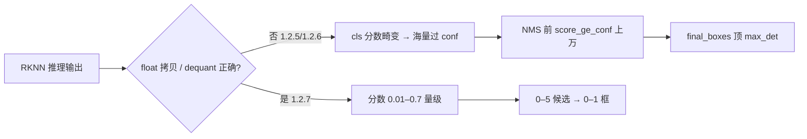

# AI Vision 离线推理问题与解决归档

> **归档日期**：2026-05-25  
> **设备**：rk3566，`adb -s 10.0.1.191:5555`，包名 `com.lasercyber.lws.ui`  
> **测试视频**：`process_videos/27af5be5-1830-477b-a2ff-f5fe49afcd3b.mp4`（424 帧，1920×1080）  
> **关联**：[AI_VISION_OFFLINE_INFERENCE_BOX_FIX.md](AI_VISION_OFFLINE_INFERENCE_BOX_FIX.md)、[AI_VISION_LIBAI_JNI_ALIGNMENT.md](../AI_VISION_LIBAI_JNI_ALIGNMENT.md)、[LENS_GUARD_ROI640_ALIGNMENT.md](LENS_GUARD_ROI640_ALIGNMENT.md)

本文档汇总 2026-05 期间 AI Vision 离线视频推理在真机上的**现象、根因、对照实验与已验证修复**，便于后续换包、回归与 parity 排查。

---

## 1. 问题总览

| # | 现象 | 严重度 | 状态（截至 1.2.7） |
|---|------|--------|-------------------|
| A | 每帧大量检测框（曾 ~80 框）；`score=1.0`；`y2=0` 退化批次 | P0 | **1.2.7 已修复**（分数与 NMS 正常） |
| B | `max_best_score≈1`，`score_ge_conf` 每帧 1.3万–1.8万，NMS 后顶满 `max_det` | P0 | **1.2.7 已修复** |
| C | `video analysis failed: nativeInferVideoAndSave failed code=-2` | P1 | App **fallback** 逐帧；引擎侧 OpenCV 尺寸待修 |
| D | `nativeInferVideoAndSave failed code=-4`（无法创建输出 MP4） | P2 | 逐帧导出叠加 MP4 **可用** |
| E | `use_rknn_io_mem: false` 时 `mj-laser-thread` **SIGSEGV** | P0 | **禁止 false**；1.2.6+ 使用 `true` |
| F | 设备 `config.yaml` / `AIVersion` 与 zip 不一致 | P1 | 部署流程标准化（见 §5） |
| G | App 显示 0 框但 log 仍报 corrupt 80 框 | P2 | App `sanitize` 兜底（见关联文档） |

---

## 2. 对照基线（同视频、同 ROI）

### 2.1 gin RKNN Toolkit（设备 `10.0.1.191`）

| 参数 | 值 |
|------|-----|
| conf / iou | 0.25 / 0.35 |
| 输入 | uint8 RGB **NHWC**，ROI 700@(565,110)→640 |
| 输出 | dequant 为 float 后再 DFL 后处理 |
| 结果 | **424 帧，212 框**（约 0.5 框/帧），分布健康 |

### 2.2 ONNX（PC，`det_raw_head.onnx`）

| conf | 总框数 | 说明 |
|------|--------|------|
| **0.65** | **3** | 仅帧 **326–328**；`max_best_score_max≈0.718` |
| 0.35 | 171 | 调试阈值 |
| 0.25 | 与训练对齐 | parity 用 |

脚本：`lensinspector/check/video_det_stats.py`（仓库外路径以 YOLO 工程为准）。

### 2.3 libai 设备态对比

| 版本 | `max_best_score` | `score_ge_conf`/帧 | `final_boxes` | 备注 |
|------|------------------|-------------------|---------------|------|
| 1.2.5（旧 so/配置） | ≈ **0.999997** | 13k–18k | 常 **5**（顶 `max_det`） | 分数饱和，非 layout nc=61 |
| 1.2.6 | 同上 | 同上 | 35 帧 × 5 = 175 | `max_det=5` 仅封顶显示 |
| **1.2.7** | **0.005–0.61** | **0–5** | **0 或 1** | 2026-05-25 16:01 会话验证 |

**1.2.7 抽样（35 帧逐帧 fallback）**：

- log：`head=raw_dfl nc=1`，`conf=0.25`，`logits=1`，`status=CLEAN`，`cap=5`
- timeline：`17` 框 / `35` 帧；分数 **0.34–0.61**，无 `score=1.0`
- 导出：`ai-vision-inference-...-a5956585....mp4` 成功

---

## 3. 根因分析

### 3.1 多框 / 分数饱和（P0，1.2.5–1.2.6）



| 曾怀疑 | 结论 |
|--------|------|
| `nc=61` / 80 锚点行未 NMS | **排除**（新 log 为 `head=raw_dfl nc=1`） |
| `y2=0` 坐标退化 | 旧 so 批次；1.2.7 未复现 |
| `config` conf 过高 | 设备曾 stale；对齐 **0.25/0.35** 后仍饱和 → **引擎输出**问题 |
| App 未过滤 | `max_det=5` 只限显示；根因在 native |

**结论**：libai 在 RKNN 输出转 float / `use_rknn_io_mem` 路径上与 gin Toolkit **不一致**，导致 cls 分布饱和；**1.2.7 的 `libai.so` 重编**修复该路径（非仅改 yaml）。

### 3.2 `nativeInferVideoAndSave` code=-2

- **现象**：整段视频 native 推理失败，App 打 `code=-2`。
- **原因**：OpenCV `VideoCapture` 对部分 MP4 返回 **0×0** 的 `CAP_PROP_FRAME_WIDTH/HEIGHT`；`lensinspector/src/main.cpp` 中 `inferVideoAndSave` 未用首帧尺寸兜底。
- **App 处理**：捕获失败后 **fallback** `inferJpgToJson` 逐帧 + 本地叠框导出 MP4。
- **根治**：引擎在 `inferVideoAndSave` 内用**首帧**宽高初始化 writer（lensinspector 侧修改）。

### 3.3 `nativeInferVideoAndSave` code=-4

- **现象**：无法创建输出 MP4（路径/编码器/权限）。
- **现状**：逐帧 cache + overlay 导出路径可用；整段 native 写视频仍待环境验证。

### 3.4 SIGSEGV（`use_rknn_io_mem: false`）

- **现象**：`mj-laser-thread` / `mj-laser-thread-rknn`，`SEGV_ACCERR`，栈溢出类故障。
- **处理**：`config.yaml` 中 **`use_rknn_io_mem: true`**；1.2.6 曾用 `false` 复现崩溃后改回 `true` 并重打 zip。
- **注意**：在 legacy `want_float` 栈修复前，**不要**在生产配置中设 `false`。

### 3.5 App 层 corrupt 批次（与引擎问题并行）

- 旧 so 返回固定 **80** 框、`y2=0`、`score=1` → `AiVisionFragment.sanitizeOfflineInferenceBoxes` 整批丢弃。
- 详见 [AI_VISION_OFFLINE_INFERENCE_BOX_FIX.md](AI_VISION_OFFLINE_INFERENCE_BOX_FIX.md)；**不能**替代引擎修复。

---

## 4. 解决方法

### 4.1 引擎 / 配置（根治多框）

1. 使用含修复的 **`libai_v1.2.7.zip`**（或更新版本），确认：
   - `head=raw_dfl`，`nc=1`，`box_first`，`stain_score_mode: logits`
   - `stain_conf_thresh: 0.25`，`stain_nms_thresh: 0.35`，`max_det: 5`
   - **`use_rknn_io_mem: true`**
2. 真机 logcat 验收指标：
   - `max_best_score` **不应**长期 ≥ 0.99
   - `score_ge_conf` **不应** >> 100/帧
   - `final_boxes` 多为 0–1，而非每帧顶满 5
3. 后续：对 **frame 326–328** 做 gin / ONNX / libai 三方 dump parity（ONNX @ conf=0.65 仅 3 框）。

### 4.2 App 层（已存在）

| 能力 | 位置 | 说明 |
|------|------|------|
| corrupt 批次丢弃 | `AiVisionFragment.sanitizeOfflineInferenceBoxes` | 阈值 64 框、退化 y2 比例 0.85 |
| 显示上限 | `OFFLINE_VIDEO_INFERENCE_MAX_DISPLAY_BOXES = 32` | 防满屏 |
| 视频 native 失败 fallback | `AiVisionFragment` 离线推理流程 | `nativeInferVideoAndSave` → 逐帧 `inferJpgToJson` |
| 尺寸回填 | 抽帧 bitmap | `imageWidth` / `imageHeight` |

### 4.3 引擎视频路径（待合入 lensinspector）

- `inferVideoAndSave`：首帧获取宽高，避免 code=-2。
- 验证设备上 OpenCV `VideoWriter` 与输出目录可写，消除 code=-4。

---

## 5. 部署与清缓存（标准操作）

**目标设备**：`ADB_SERIAL=10.0.1.191:5555`

```bash
PKG=com.lasercyber.lws.ui
ADB=10.0.1.191:5555
VER=1.2.7   # 替换为实际版本

# 1) 推送 zip
adb -s $ADB push /path/to/libai_v${VER}.zip /data/local/tmp/

# 2) 清 ai-library 与推理缓存（需 root）
adb -s $ADB shell "su 0 rm -rf /data/data/$PKG/files/bundled-libraries/ai-library/*"
adb -s $ADB shell "su 0 rm -rf /data/data/$PKG/cache/ai-vision-video-inference/"
adb -s $ADB shell "su 0 rm -rf /data/data/$PKG/files/ai-vision-inference-videos/"

# 3) 解压
adb -s $ADB shell "su 0 mkdir -p /data/data/$PKG/files/bundled-libraries/ai-library/$VER"
adb -s $ADB shell "su 0 unzip -o /data/local/tmp/libai_v${VER}.zip -d /data/data/$PKG/files/bundled-libraries/ai-library/$VER/"

# 4) 同步 config（若 zip 内带 lens_guard 模板）
adb -s $ADB shell "su 0 cp /data/data/$PKG/files/bundled-libraries/ai-library/$VER/config.yaml \
  /data/data/$PKG/files/lens_guard/config.yaml"

# 5) 更新 DB 版本（避免 BundledLibraryBootstrap 跳过降级逻辑误判）
adb -s $ADB shell "su 0 sqlite3 /data/data/$PKG/databases/lws_ui \
  \"UPDATE t_device_info SET AIVersion='${VER}';\""

# 6) 重启 App
adb -s $ADB shell am force-stop $PKG
```

**符号验收**：

```bash
adb -s $ADB shell "su 0 find /data/data/$PKG/files/bundled-libraries -name libai.so" \
  | head -1 | xargs -I{} adb -s $ADB shell "su 0 sh -c 'nm -D {} | grep -E nativeInferImageToJson|nativeInferVideoAndSave'"
```

**App 同步安装**（含新 Java 逻辑时）：

```bash
ADB_SERIAL=10.0.1.191:5555 make sync
```

---

## 6. 日志与缓存抓取

### 6.1 logcat（推理会话）

```bash
adb -s 10.0.1.191:5555 logcat -c
# 在 App 内触发 AI Vision 离线推理
adb -s 10.0.1.191:5555 logcat -d -v time | rg -i \
  "ensureLoaded|DetPostprocess|max_best_score|score_ge_conf|final_boxes|\
   LensGuard|nativeInfer|AiVision|sanitized|SIGSEGV|fallback|1\.2\."
```

**健康特征（1.2.7）**：

```text
I/DetPostprocess: ... head=raw_dfl ... conf=0.250000 logits=1 max_best_score=0.554299 score_ge_conf=4
I/DetPostprocess: ... final_boxes=1
I/LensGuard: [OFFLINE] infer json level=0 status=CLEAN boxes=1 total=1 cap=5
```

**异常特征（1.2.5/1.2.6）**：

```text
max_best_score=0.999997 score_ge_conf=15000+
final_boxes=5
```

### 6.2 timeline JSON（需 root）

```bash
adb -s 10.0.1.191:5555 shell "su 0 ls /data/data/com.lasercyber.lws.ui/cache/ai-vision-video-inference/timelines/"
adb -s 10.0.1.191:5555 shell "su 0 cat /data/data/com.lasercyber.lws.ui/cache/ai-vision-video-inference/timelines/<cacheKey>.json"
```

检查：`frames[].boxes` 长度分布、`score` 是否集中在 1.0、`imageWidth/Height`。

---

## 7. 版本演进摘要

| 版本 | 关键配置 / 产物 | 结果 |
|------|-----------------|------|
| 1.2.5 | conf/nms 曾对不齐；旧 so | 饱和多框 |
| 1.2.6 | `max_det=5`，`use_rknn_io_mem: true`（重编）；曾试 `false` → SIGSEGV | 仍饱和；崩溃已避 |
| **1.2.7** | 新 `libai.so`（~9.45MB），配置同 1.2.6 | **分数与框数正常** |

---

## 8. 后续工作（可选）

| 项 | 说明 |
|----|------|
| 全片 424 帧回归 | 对比 gin 212 框总量与帧级分布 |
| frame 326–328 parity | 对齐 ONNX 3 框命中区间 |
| 修复 `inferVideoAndSave` | 消除 code=-2/-4，减少逐帧 440ms 开销 |
| 产线阈值 | parity 用 conf=0.25；产线 `stain_conf_thresh: 0.65` 需按 RKNN 分数重标定 |
| Workers manifest | `make build` 拉取条目指向 **≥1.2.7** 的 ai-library zip |

---

## 9. 相关代码与文档

| 类型 | 路径 |
|------|------|
| 离线 UI / fallback | `app/.../AiVisionFragment.java` |
| JNI | `app/.../NativeBridge.java`、`LensGuardManager.java` |
| 视频 native | `lensinspector/src/main.cpp`（`inferVideoAndSave`） |
| RKNN IO | `lensinspector/src/rknn_runner.cpp`（`use_rknn_io_mem`） |
| 后处理 | `lensinspector/cpp/postprocess/det_postprocess.cpp` |
| App  corrupt 兜底 | [AI_VISION_OFFLINE_INFERENCE_BOX_FIX.md](AI_VISION_OFFLINE_INFERENCE_BOX_FIX.md) |
| JNI / zip 对齐 | [AI_VISION_LIBAI_JNI_ALIGNMENT.md](../AI_VISION_LIBAI_JNI_ALIGNMENT.md) |
| ROI / 坐标 | [LENS_GUARD_ROI640_ALIGNMENT.md](LENS_GUARD_ROI640_ALIGNMENT.md) |
| ONNX 排查（引擎仓） | `lensinspector/docs/ONNX_DET_POSTPROCESS_TROUBLESHOOTING.md` |

---

## 10. 修订记录

| 日期 | 说明 |
|------|------|
| 2026-05-25 | 初稿：多框饱和、code=-2/-4、SIGSEGV、gin/ONNX/libai 对照、1.2.7 验证与部署抓 log 流程 |
