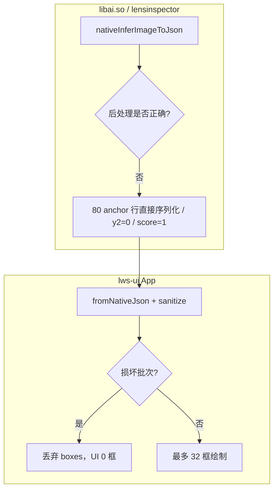
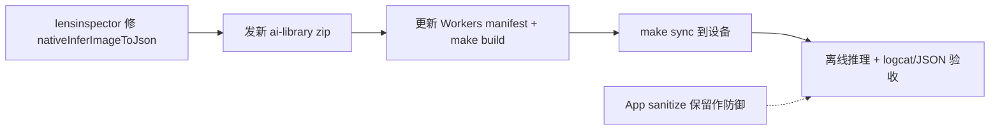

# AI Vision 离线推理检测框异常：原因与修复指南

> **适用**：App 1.0.27+、`nativeInferImageToJson` 已链接但返回无效 `boxes[]`（满屏框 / 全 0 框）。  
> **关联**：[AI_VISION_LIBAI_JNI_ALIGNMENT.md](../AI_VISION_LIBAI_JNI_ALIGNMENT.md)、[LENS_GUARD_ROI640_ALIGNMENT.md](LENS_GUARD_ROI640_ALIGNMENT.md)、[LENS_GUARD_APP_ALIGNMENT_2026-05-19.md](../LENS_GUARD_APP_ALIGNMENT_2026-05-19.md)

---

## 1. 问题现象

### 1.1 用户可见

- AI Vision 选工艺录像做离线推理后，视频上出现 **大量检测框**（曾达每帧约 80 个）。
- 升级 App 过滤后：画面 **无框**，等级显示 **洁净（CLEAN）**，但 logcat 仍报 native 返回损坏批次。

### 1.2 设备实证（rk3566，`10.0.1.191:5555`，2026-05-22）

| 项 | 修复前（旧 timeline 缓存） | 修复后（App sanitize + 新缓存） |
|----|---------------------------|--------------------------------|
| 抽帧分辨率 | 1920×1080 | 1920×1080 |
| 每帧 box 数 | 固定 **80** | **0**（损坏批次被丢弃） |
| `imageWidth` / `imageHeight` | **0** | **1920 / 1080**（App 用 bitmap 回填） |
| 坐标 | `y1=y2=0`，`x2` 约 0–67 | 无有效框写入缓存 |
| `score` | 全为 **1** | — |
| `level` / `status` | 0 / CLEAN | 0 / CLEAN |

logcat 特征（native 仍异常时）：

```text
W AiVisionFragment: AI Vision dropped corrupt native inference boxes count=80 image=1920x1080 (degenerate y2=0 batch from nativeInferImageToJson)
```

---

## 2. 根因分层



| 层级 | 结论 |
|------|------|
| **引擎（设备曾见）** | 旧版 `libai.so` 未走当前 `det_postprocess`（log 曾出现 `head=decoded nc=61`、`final_boxes≈6800`、`y2=0`），与 Step 1/2 parity **不一致**。 |
| **引擎（源码现状）** | `check/det_postprocess.py` 与 `cpp/postprocess/det_postprocess.cpp` 在 raw `[65,33600]`、`box_first`、`nc=1` 下 **亚像素一致**（见 §2.1）。 |
| **App（兜底）** | `sanitizeOfflineInferenceBoxes` 针对上述**旧 so 退化 JSON**；新 so 正常时不应触发。 |

> **版本号 ≠ 能力**：须用 **含当前后处理 + 正确 config 的 libai** 替换设备 `bundled-libraries/ai-library/`。参见 [AI_VISION_LIBAI_JNI_ALIGNMENT.md](../AI_VISION_LIBAI_JNI_ALIGNMENT.md)。

### 2.1 Python / C++ 后处理 parity（2026-05-25，同帧验证）

对照条件：`det_raw_head.onnx`，`syn_fixed_*_0016760ms.jpg`（1920×1080，1 框），raw `[65,33600]`，letterbox `scale=1 pad=0 orig=640`，`conf=0.25` / `iou=0.35`，`logits` + `box_first`，`num_classes=1`。

| 项 | Python | C++ |
|----|--------|-----|
| 有污点帧框数 | 1 | 1 |
| NMS 前 `score_ge_conf` | 2 | 2 |
| NMS 后 | 1 | 1 |
| 640 首框 xyxy / score | 与 C++ ≤0.0003 px | 0.507711 |
| 全图 xyxy（×700/640 + (565,110)） | (1048.4, 418.4, 1081.2, 449.1) | 同左 |

洁净帧 `0016720ms`：双方 **0 框**，`max_best_score≈0.0258`，`early_exit`。

**结论**：NMS、letterbox 640 坐标、ROI 全图还原在源码级已对齐；设备上 80 框 / `y2=0` / `score=1` **不是**当前 `det_postprocess.py` / `.cpp` 行为，而是 **旧 libai.so 未编入或未启用** 该后处理。

**产线阈值注意**：parity 使用 `conf=0.25`；该帧 score≈**0.508** &lt; `stain_conf_thresh: 0.65` 时，即使新 so 上线也会 **0 框**——需按 RKNN 分数分布重标定阈值，或区分「parity 调试阈值」与「产线阈值」。

---

## 3. 已完成的 App 侧防护（lws-ui）

| 位置 | 行为 |
|------|------|
| `AiVisionFragment` | `sanitizeOfflineInferenceBoxes`：损坏批次整批丢弃；过滤 `y2<=y1`、边长 &lt; 8px；最多 **32** 框/帧 |
| `AiVisionFragment` | 抽帧推理时用 `bitmap.getWidth/Height` 回填 `imageWidth/Height` |
| `AiVisionFragment` | 读 timeline 缓存、`parseBoxes` 同样走 sanitize |
| `DetectionOverlayView` | 宽或高 &lt; 2px 不绘制 |

相关常量（`AiVisionFragment.java`）：

- `OFFLINE_VIDEO_INFERENCE_CORRUPT_BOX_COUNT_THRESHOLD = 64`
- `OFFLINE_VIDEO_INFERENCE_CORRUPT_DEGENERATE_RATIO = 0.85f`
- `OFFLINE_VIDEO_INFERENCE_MAX_DISPLAY_BOXES = 32`

**限制**：仅防止满屏乱框与错误缓存；**不能**替代引擎输出合法污渍框。

---

## 4. 根治方案（lensinspector / libai：重编并下发 so）

### 4.1 契约

离线 JSON 与实时回调一致，规范见：

- `openspec/changes/lens-guard-engine-alignment-2026-05-19/specs/native-infer-image-contract/spec.md`
- `openspec/changes/lens-guard-letterbox-det-alignment-2026-05-22/`（全图 xyxy，禁止 App 二次几何）
- [LENS_GUARD_ROI640_ALIGNMENT.md](LENS_GUARD_ROI640_ALIGNMENT.md)

`code == 0` 时示例：

```json
{
  "code": 0,
  "level": 0,
  "status": "CLEAN",
  "message": "洁净",
  "imageWidth": 1920,
  "imageHeight": 1080,
  "boxes": [
    {
      "x1": 120.5,
      "y1": 200.0,
      "x2": 180.0,
      "y2": 260.0,
      "classId": 2,
      "label": "stain",
      "score": 0.72
    }
  ]
}
```

### 4.2 症状 → 引擎检查项

| 现象 | 可能原因 | 修复方向 |
|------|----------|----------|
| 固定 **80** 条 | anchor/head 行未 NMS、未按阈值过滤 | 复用 live `onCheckResult` / `preview_det` 同一后处理 |
| **y2=0** | xy 顺序错误或未做 ROI→全图还原 | 保证 `x1<x2`、`y1<y2`，坐标在 **JPG 全图像素** 空间 |
| **score=1** 全满 | logits 未按 `stain_score_mode` 处理 | 与 `config.yaml` 中 `stain_score_mode: logits` 一致 |
| **imageWidth/Height=0** | 序列化遗漏 | 读 JPG 后写入尺寸字段 |
| level=CLEAN 却有 80 框 | 等级与 boxes 不同步 | 先 mask+窗口算 level，再只输出过阈值的 boxes |

### 4.3 App 禁止事项

- 不得在 App 内对离线框做 **letterbox、中心裁、DFL、NMS、crop 偏移换算**（引擎内已完成 ROI 700→640 与还原）。

### 4.4 引擎自测

```bash
# 符号存在
nm -D libai.so | grep nativeInferImageToJson

# 仪器化（仓库内）
./gradlew :app:connectedDebugAndroidTest \
  -Pandroid.testInstrumentationRunnerArguments.class=com.lasercyber.lws.ui.ai.DetOnlyOpenSpecDeviceTest
```

期望：每帧 **0～少量** 框，`y2 > y1`，`score ∈ (0,1)`（多数 &lt; 1），与全图污点位置一致。

---

## 5. 交付与部署（lws-ui + 设备）

### 5.1 发布新 ai-library

1. lensinspector 打出含修复的 `lens_guard_engine_<version>.zip`（`libai.so`、`libc++_shared.so`、`librknnrt.so` + `config.yaml`）。
2. 更新 Workers **ai-library manifest**（`make build` 拉取条目须指向新 zip；构建日志若 `HTTP 404` 需先修 manifest）。
3. 真机 `nm` 验收（见 §4.4）。

### 5.2 安装到设备

```bash
ADB_SERIAL=10.0.1.191:5555 make sync
# 首次 priv-app 完整流程：
# ADB_SERIAL=10.0.1.191:5555 make deploy
```

若运行时 so 未更新：清除应用数据，或删除 `files/bundled-libraries/ai-library/` 后重装，强制重新导入 bundled zip。

### 5.3 同步 config.yaml

| 路径 | 说明 |
|------|------|
| 模板 | `app/src/main/assets/config.yaml` |
| 运行时 | `/data/data/com.lasercyber.lws.ui/files/lens_guard/config.yaml` |

关键项：`stain_conf_thresh`、`stain_nms_thresh`、`stain_score_mode: logits`、mask **(885,430) r=280**（1920×1080）。  
修改后需 **`nativeDestroy` → `nativeCreate`**（重启 App）。

---

## 6. 验收清单

### 6.1 功能

- [ ] AI Vision 选片 → 强制重新推理（`forceReinfer`）。
- [ ] logcat：**不再**每帧 `dropped corrupt ... count=80`（或仅极少数边缘帧）。
- [ ] timeline JSON：`imageWidth/Height` 正确；有污点时 `boxes` 少量且 `y2>y1`。
- [ ] 画面：有污点时有框且 **全图对准**；洁净时 0 框 + CLEAN。

### 6.2 日志抓取

```bash
# 实时
adb -s 10.0.1.191:5555 logcat -v time -s AiVisionFragment:I AiVisionFragment:W LensGuardManager:I

# 过滤
adb -s 10.0.1.191:5555 logcat -d | grep -E 'AI Vision|inference|corrupt|timeline'
```

### 6.3 缓存 JSON 统计（需 root）

```bash
adb -s 10.0.1.191:5555 shell "su 0 cat /data/data/com.lasercyber.lws.ui/cache/ai-vision-video-inference/timelines/<cacheKey>.json"
```

检查：`frames[].boxes` 长度分布、`imageWidth`/`imageHeight`、首框坐标是否合理。

---

## 7. 修复优先级



| 优先级 | 工作项 | 负责 |
|--------|--------|------|
| P0 | `nativeInferImageToJson` 与 live det 后处理对齐 | lensinspector |
| P1 | Workers manifest + 设备换库 + config 同步 | 发布 / lws-ui |
| P2 | App sanitize 保留或按 libai 版本收紧 | lws-ui（可选） |

---

## 8. 相关代码与文档

| 类型 | 路径 |
|------|------|
| 离线时间轴 | `app/.../AiVisionFragment.java` |
| JNI 封装 | `app/.../LensGuardManager.java`、`NativeBridge.java` |
| 绘制 | `app/.../DetectionOverlayView.java` |
| JNI 对齐 | [AI_VISION_LIBAI_JNI_ALIGNMENT.md](../AI_VISION_LIBAI_JNI_ALIGNMENT.md) |
| ROI / 坐标 | [LENS_GUARD_ROI640_ALIGNMENT.md](LENS_GUARD_ROI640_ALIGNMENT.md) |
| OpenSpec | `openspec/changes/lens-guard-engine-alignment-2026-05-19/`、`openspec/changes/lens-guard-letterbox-det-alignment-2026-05-22/` |
| **问题归档（多框饱和 / 1.2.7 / 部署）** | [AI_VISION_INFERENCE_TROUBLESHOOTING_ARCHIVE.md](AI_VISION_INFERENCE_TROUBLESHOOTING_ARCHIVE.md) |

---

## 9. 修订记录

| 日期 | 说明 |
|------|------|
| 2026-05-22 | 初稿：设备实证、App sanitize、引擎根治与部署验收 |
| 2026-05-25 | 补充：Python/C++ det_postprocess parity 一致；根因修正为旧 libai.so；产线 conf 0.65 与 parity 0.25 区分 |
| 2026-05-25 | 关联 [AI_VISION_INFERENCE_TROUBLESHOOTING_ARCHIVE.md](AI_VISION_INFERENCE_TROUBLESHOOTING_ARCHIVE.md)（RKNN 饱和、版本演进、log 抓取） |
