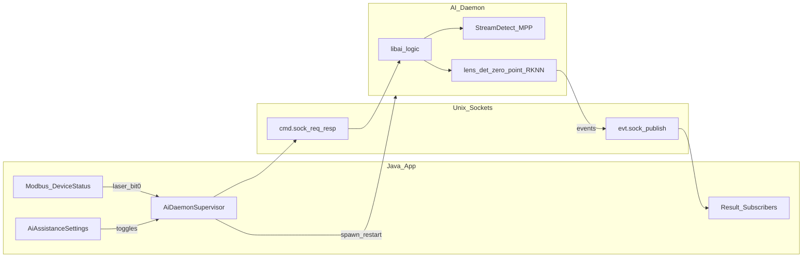
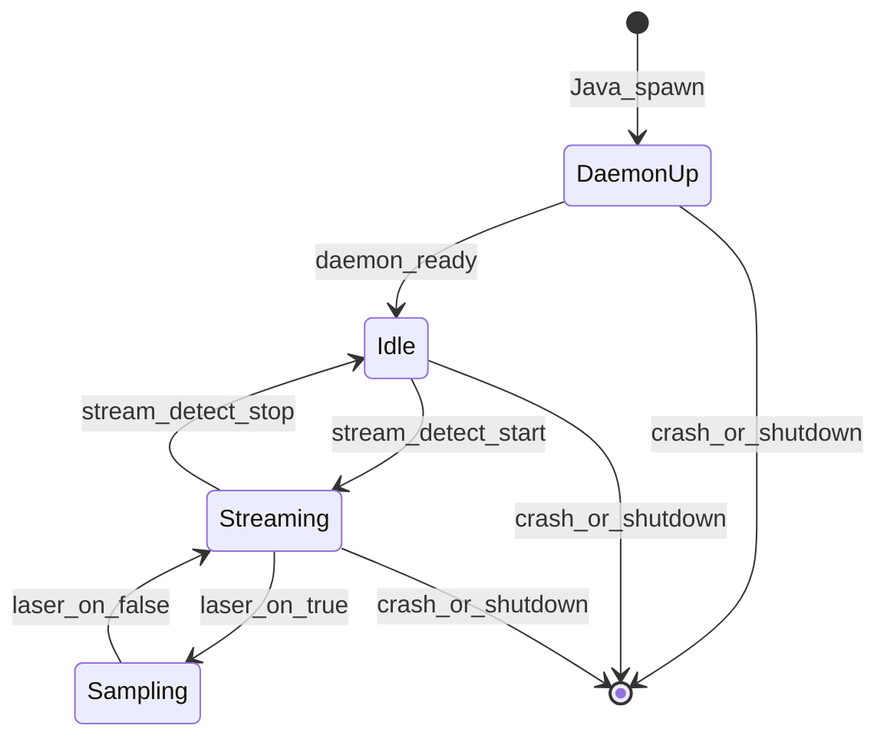

# AI C++ 守护进程 + Unix Socket 交互设计

将整包 AI 能力从进程内 `libai.so` / JNI 收拢为独立 C++ 守护进程，由 Java 负责拉起与崩溃重启；设备状态与设置经 Unix Domain Socket 下发，检测结果经 Socket 发布供 Java 订阅。

**相关文档**

- AI 库结构与热路径（**进程内**优化；边界已对账 daemon）：[`AI_LIBRARY_OPTIMIZATION_DESIGN.md`](AI_LIBRARY_OPTIMIZATION_DESIGN.md)
- Stream detect 管线：[`Native Stream Detection Pipeline.md`](Native%20Stream%20Detection%20Pipeline.md)
- MPP 硬解：[`MPP.md`](MPP.md)
- OpenCV / lens-guard 集成：[`OPENCV_DETECT_APP_INTEGRATION.md`](OPENCV_DETECT_APP_INTEGRATION.md)

**设计日期**：2026-07-14

> **落地状态**：OpenSpec `openspec/changes/archive/2026-07-14-ai-cpp-daemon-unix-socket/` P0–P3 已归档。产品路径经 `AiDaemonSupervisor`；`jniLibs` 默认 `liblws_ai_daemon.so` + 运行时 so。结构/性能内部优化见优化设计文档 §1.0 / §8.2。

---

## 1. 已锁定决策

| 项 | 决策 |
|----|------|
| 范围 | **整包 AI**（直播 StreamDetect、OpenCV lens_det、零点、RKNN、离线/工艺视频一帧推断等）进入守护进程；Java 只做 IPC、产品 UI、告警与上传 |
| 激光状态 | 仅 **`machineStatusSeg1` Bit0**（1=激光开，0=关）；与现 `DeviceStatus.isLaserOn()` 定义一致 |
| 生命周期 | App **冷启动拉起、常驻**；进程退出/崩溃由 Java **监护重启** |
| 与 JNI | **目标态用 Unix socket 替代 JNI**；实现可分阶段，**不长期双轨共存** |

---

## 2. 目标与非目标

### 2.1 目标

1. C++ AI 逻辑 **独立进程**运行，崩溃不拖垮 UI 进程；Java 可按策略重启。
2. Java 从 Modbus 得到的激光 Bit0、高级设置中的 AI 辅助开关，经 **Unix socket** 实时同步到 C++。
3. C++ 执行拉流 / 抽帧 / 算法后，通过 **发布** 将结果送回；Java **订阅** 后做告警、上传、UI 叠层等。
4. 产品路径最终不再 `System.load(libai.so)` + JNI 调算法。

### 2.2 非目标

- 不在 C++ 内实现 Modbus / 控制卡通信。
- 不把 MediaMTX 迁入 AI 守护进程（仍由 Java 侧现有中继管理）。
- 不在设计期引入长期 feature-flag「JNI / 守护进程双跑」。
- 本文档只定义架构与契约；**不**包含可执行二进制与 Java Supervisor 的实现变更。

---

## 3. 现状摘要（基线）

今日热路径（简化）：

```
App 冷启动 → AiManager.start() → 进程内 libai.so
                              → OpenCV / RKNN 会话
焊接/使能等 → NativeStreamDetectCoordinator → JNI → StreamDetectPipeline
Modbus DeviceStatus.isLaserOn() → AiManager → guardedSetLaserOn (RKNN 调度门控)
Live StreamDetect 侧启动时 nativeSetStreamDetectLaserOn(true) 与使能绑定
高级设置 → AiAssistanceSettings → Java Coordinator 门控
结果 → StreamDetectResultBus / JNI callback → UI / 告警 / 上传
```

问题：算法与解码与 UI **同进程**；AI 崩溃等同 App 崩溃；重启 AI 只能杀进程。本方案将算法侧收拢进子进程，用 socket 替代上述 JNI 面。

---

## 4. 目标架构



### 4.1 职责划分

| 归属 | 职责 |
|------|------|
| **Java** | Modbus 与 `DeviceStatus`；高级设置 DB（`AiAssistanceSettings`）；MediaMTX；UI / 告警 / 上传；**守护进程监护**；socket 客户端与结果订阅分发 |
| **C++ 守护进程** | 今日 `libai` 内算法与会话：StreamDetect + MPP、OpenCV lens_det、zero_point、RKNN、离线 NV12 推理等；消费 cmd；发布 evt |

### 4.2 进程与产物

| 项 | 约定 |
|----|------|
| 二进制名 | `lws_ai_daemon`（最终命名实现时可微调，文档以此为准） |
| 打包 | APK 随 native 产物分发（如 `jniLibs/arm64-v8a/` 或可执行 assets，以实现阶段 makefile 为准） |
| 工作目录 | 应用私有目录，例如 `{files}/lens_guard/`（配置与输出沿用现有布局） |
| Socket 目录 | 目标态设计为 `{files}/ai_daemon/` FILESYSTEM socks；**P0 落地**为 abstract namespace `@lws_ai_cmd` / `@lws_ai_evt`（规避 emulator/SELinux 对 filesDir `bind` EACCES） |
| cmd 路径 | abstract `lws_ai_cmd`（Java `Namespace.ABSTRACT`） |
| evt 路径 | abstract `lws_ai_evt` |
| pid / 健康 | Supervisor 记录 pid；daemon 周期性心跳见 §6 |
| 二进制打包（已落地） | `make ai` 写入 `jniLibs/arm64-v8a/liblws_ai_daemon.so`（exec-allowed `nativeLibraryDir`）并备份 `assets/ai_daemon/arm64-v8a/`；workdir `{files}/lens_guard/` |

C++ 不持有协议栈特权；以应用用户身份由 Java `ProcessBuilder` / 等价 API 启动。

### 4.3 MediaMTX / RTSP

- MediaMTX **仍由 Java** 启停与写配置。
- 守护进程只消费 Java 下发的 RTSP URL（例如 `rtsp://127.0.0.1:8554/camera/pr1`），行为对齐现 [`NativeStreamDetectCoordinator`](../app/src/main/java/com/lasercyber/lws/ai/stream/NativeStreamDetectCoordinator.java) + [`MediaMtxRelayUrls`](../app/src/main/java/com/lasercyber/lws/ui/network/mediamtx/MediaMtxRelayUrls.java)。

---

## 5. 生命周期与 Java 监护

### 5.1 启动

1. 对齐今日冷启动 [`LaserApplication.initAiEngine`](../app/src/main/java/com/lasercyber/lws/ui/LaserApplication.java) 时机。
2. `AiDaemonSupervisor`：
   - 确保 socket 目录存在；清理陈旧 sock 文件；
   - 启动 `lws_ai_daemon`（传入 workdir、socket 路径、config 路径等 argv/env）；
   - 连接 `cmd.sock`，订阅 `evt.sock`；
   - 推送初始：`laser_state`、`ai_assist_config`、能力/会话所需配置；
   - 写日志相位，例如 `startup_phase=ai_daemon, outcome=ok|failed`。

### 5.2 常驻与重启

- 守护进程设计为 **常驻**，不因激光 Bit0=0 或使能关闭而退出；Bit0 只影响内部是否抽帧 / 是否开检测模块的行为（由协议状态机定义）。
- Supervisor 检测：
  - 进程退出 / `waitFor`；
  - **心跳超时**（daemon 未按时在 evt 发 `heartbeat`，或 cmd `ping` 失败）；
- 恢复步骤：尽量 SIGTERM → 超时 SIGKILL → 删除陈旧 sock → 重新 spawn → **重推** laser + AI 开关 + 必要 session 配置。
- **崩溃退避**：指数退避 + 上限；连续失败时记录 `daemon_state=error`，避免死循环打爆 CPU；人工或下次 App 冷启动再清计数。

### 5.3 App 退出

- `onTerminate` / 进程结束路径：Supervisor 停守护进程并清理 sock（对齐今日 `AiManager.stop()` 位置）。

---

## 6. Unix Socket 协议

### 6.1 传输

| Socket | 角色 | 模式 |
|--------|------|------|
| `cmd.sock` | Java = client，daemon = server | 请求 / 响应 |
| `evt.sock` | Java = client（订阅方），daemon = server（accept 后持续写） | 单向发布 |

均为 `AF_UNIX` + `SOCK_STREAM`。

**帧格式**：UTF-8 **JSON Lines**（一条 JSON + `\n`）。

公共字段：

| 字段 | 说明 |
|------|------|
| `v` | 协议版本，固定 `1` |
| `type` | 消息类型字符串 |
| `id` | 可选；cmd 请求必填，响应用同 `id` 配对 |
| `ts_ms` | 单调或墙上时钟毫秒（实现约定写在连接握手里，文档默认墙钟 epoch ms） |

### 6.2 激光状态（Bit0）

来源：Modbus → `DeviceStatus.machineStatusSeg1` **Bit0**（与 `isLaserOn()` 相同）。

Java 在 `DeviceStatus` 缓存变更时（或同等 Modbus 刷新点）取 Bit0，经 Supervisor **立即推送**（边沿 + 定时全量兜底建议：边沿必发，连接后先发当前值）。

**cmd 请求示例**

```json
{"v":1,"type":"laser_state","id":"42","ts_ms":1720000000123,"laser_on":true}
```

**成功响应**

```json
{"v":1,"type":"laser_state_ack","id":"42","ts_ms":1720000000124,"ok":true}
```

语义：

- `laser_on=true`：守护进程按现产品规则允许直播抽帧检测（对应今日 StreamDetect `setLaserOn(true)` / RKNN 调度激光门控中「激光开」一侧）。
- `laser_on=false`：停止对帧做检测采样（管线是否保持 RTSP 连接由实现定：**建议**保持连接、仅关门控，以降低 Bit0 抖动重连成本；若需释放解码资源可用另 cmd `stream_detect_stop`）。

**明确**：本字段 **不是** `LaserEnableStateHolder`（激光使能）。直播管线「是否拉起 RTSP 会话」若仍依赖业务屏使能，由 Java 另发 `stream_detect_start` / `stop`（§6.4），与 Bit0 解耦。

### 6.3 AI 辅助开关（高级设置）

来源：Java [`AiAssistanceSettings`](../app/src/main/java/com/lasercyber/lws/ui/common/settings/AiAssistanceSettings.java)

| Java API | Socket 字段 |
|----------|-------------|
| `isLensContaminationDetectionEnabled` | `lens_contamination_enabled` |
| `isZeroPointOffsetDetectionEnabled` | `zero_point_offset_enabled` |

推送时机：开关变更；daemon 每次（再）连接成功后全量推送一次。

```json
{"v":1,"type":"ai_assist_config","id":"43","ts_ms":1720000000200,
 "lens_contamination_enabled":true,"zero_point_offset_enabled":true}
```

C++ 侧：开关为 false 时跳过对应模块推理与结果发布（对齐今日 Coordinator 门控）；Java 侧告警清障逻辑仍可由设置层本地处理。

### 6.4 Cmd 类型一览（目标态）

| `type` | 方向 | 用途 |
|--------|------|------|
| `ping` | J→D | 健康检查 |
| `laser_state` | J→D | Bit0 激光开/关 |
| `ai_assist_config` | J→D | 高级设置 AI 开关 |
| `configure_session` | J→D | OpenCV/零点句柄等价参数：输出目录、cameraType、模块开关、session source 等（迁移现 `nativeConfigureStreamDetect`） |
| `stream_detect_start` | J→D | URL + 启直播管线 |
| `stream_detect_stop` | J→D | 停直播管线 |
| `offline_infer_*` | J→D | 离线 / 工艺视频 NV12 一帧类请求（分阶段迁入） |
| `shutdown` | J→D | 优雅退出 |

响应用 `*_ack` 或统一 `error`（`ok=false` + `code` + `message`）。

实现阶段可按迁移批次逐步开放；契约字段变更时升 `v` 或加兼容字段。

### 6.5 Evt 发布（对齐现有事件）

尽量 **一比一映射** 今日 StreamDetect / JNI 回调 JSON，降低 Java 订阅侧改动：

| `type` | 含义（现有） |
|--------|----------------|
| `heartbeat` | 守护进程存活 |
| `daemon_ready` | 监听就绪、可接受 cmd |
| `session_start` / `session_stop` | 直播会话 |
| `pipeline_state` | 如 `reconnecting` / `error` / `running` |
| `detect_result` | 单模块结果（`module=lens_det|zero_point|...`） |
| `combined_frame` | 同帧多模块汇总 |
| `health` / `error` | 守护进程级健康与致命错误 |

示例（检测）：

```json
{"v":1,"type":"detect_result","ts_ms":1720000001000,
 "module":"lens_det","frameId":26,"imageWidth":1920,"imageHeight":1080,
 "code":-3,"ok":false,"summaryJson":"{...}"}
```

Java 订阅线程：读 evt → 反序列化 → 分发给等价于今日 `StreamDetectResultBus` / 告警 / 上传的路径。

### 6.6 并发与背压

- cmd：单连接上请求可串行处理，或 `id` 配对并行（实现自选，需文档化）。
- evt：Java 处理不过来时允许丢失非关键心跳、合并同类型 `pipeline_state`；**禁止**阻塞 daemon 写死导致解码线程饿死——daemon 侧写缓冲有限，溢出策略（丢弃最旧非关键事件）写进实现说明。

---

## 7. 状态机（直播）

简化：



- **Idle**：会话未起；可收配置与 Bit0。
- **Streaming**：已 PLAY RTSP / 解码；Bit0=0 时可不采样。
- **Sampling**：Bit0=1 且 AI 开关允许时跑 `lens_det` / `zero_point` 等并发布 evt。

Holder 模型（weld / ai_vision / manual_zero_point）迁移为 daemon 内部引用计数，由 cmd `stream_detect_start` 的 `holder` / `source` 字段表达，行为对齐现 [`NativeStreamDetectCoordinator`](../app/src/main/java/com/lasercyber/lws/ai/stream/NativeStreamDetectCoordinator.java)。

---

## 8. 迁移阶段（实现指引，本文档不编码）

| 阶段 | 内容 | 退出标准 |
|------|------|----------|
| **P0** | 抽出 `lws_ai_daemon` 进程骨架 + cmd/evt；心跳；Supervisor spawn/restart | 冷启动常驻，杀子进程可自动拉起并重推状态 |
| **P1** | 直播：`laser_state` + `ai_assist_config` + StreamDetect 启停与结果 evt；停用直播路径 JNI | 真机焊接：Bit0 驱动采样；有 `detect_result`；无进程内 `nativeStartStreamDetect` |
| **P2** | 离线 / 工艺视频 / 手动零点等请求 API 迁到 cmd | 产品路径无 `AiManager` JNI 算法调用 |
| **P3** | 删除产品路径 JNI / 进程内 `libai` 加载；Host 单测与工具链可保留链静态库 | App 仅加载守护二进制 + 运行时 `.so`（若动态链 RKNN/MPP） |

每阶段保留可回滚的 **短命** 分支开关可以，但不作为长期双轨产品配置。

---

## 9. 安全与可靠性

- Socket 仅位于应用私有目录，不 listen TCP。
- 守护进程不解析任意外部 URL（仅使用 Java 下发的 PR1 等受信 ingest）。
- 日志：Java `AiDaemon` / `startup_phase=ai_daemon`；C++ 继续可用 `StreamDetect` / 自定义 tag，便于与旧 logcat 对照。
- SELinux / `exec` 权限：实现时在 RK3566 目标镜像上验证可执行文件位与 `nativeLibraryDir` 执行策略。

---

## 10. 验收要点（设计对照）

1. App 冷启动后守护进程存在；故意 `kill` 子进程后 Supervisor 在退避策略内重启并恢复 socket。
2. Modbus `machineStatusSeg1` Bit0 翻转 → cmd `laser_state` 到达 → 采样启停符合状态机。
3. 高级设置关闭镜片 / 零点 → `ai_assist_config` → 对应 `detect_result` 模块停止上报。
4. 正常焊接链路：`stream_detect_start` → `backend=mpp`/`pipeline` 类日志或 evt → `detect_result` → Java 订阅处理。
5. 目标态产品路径无 JNI 算法入口。

---

## 11. 术语对照

| 本文 | 现状代码 |
|------|----------|
| `laser_on` (Bit0) | `DeviceStatus.isLaserOn()` ← `machineStatusSeg1` Bit0 |
| 激光使能 | `LaserEnableStateHolder`（业务屏）；**不**作为本 Bit0 字段 |
| Supervisor | 将替代 / 包裹 `AiManager.start` 生命周期职责 |
| evt `detect_result` | `StreamDetect` JSON / `StreamDetectResultBus` |
| daemon 内 StreamDetect | `native/lensinspector/src/stream_detect/*` |

---

## 12. 修订记录

| 日期 | 说明 |
|------|------|
| 2026-07-14 | 初稿：范围整包 AI；Bit0；冷启动常驻；目标态替换 JNI；双 socket JSON Lines |
| 2026-07-14 | P1：`lws_ai_daemon` 链入 `stream_detect_core`；cmd `configure_session`/`stream_detect_start`/`stop`；evt→`StreamDetectResultBus`；`NativeStreamDetectCoordinator` 走 Supervisor；RKNN live hook 仅 libai 注册 |
| 2026-07-14 | P1 验收（部分）：代码路径直播 StreamDetect 已切 Supervisor，产品无 `nativeStartStreamDetect`。完整 Bit0→`detect_result` 焊接闭环需摄像头/MediaMTX/真机；模拟器仅验证 daemon 常驻与 configure/start IPC。 |
| 2026-07-14 | P2：cmd `offline_infer_opencv_stain_nv12` / `offline_infer_zero_point_nv12`（NV12 文件路径）、`stream_detect_burst_mode`、`stream_detect_zp_target_mode`；工艺视频 NV12 与手动零点走 Supervisor；JPG 仍 JNI（待 P3） |
| 2026-07-14 | P3：daemon 链入 RKNN `CentralScheduler` + hook；`offline_infer_opencv_stain_jpg`；App 不再 `System.load(libai)`；jniLibs 仅 `liblws_ai_daemon` + `librknnrt`/`libmpp`/`libc++_shared`；可选 `AI_STAGE_LIBAI=1` 为测试回滚 |
| 2026-07-14 | 可靠性：重启恢复 stream session；Bit0 真值推送；cmd SO_TIMEOUT；离线误心跳跳过；heartbeat 独立线程；offline 临时 Session；`PR_SET_PDEATHSIG`；默认不启 RKNN |
| 2026-07-14 | 收尾：`SessionConfig` 读路径加锁快照；`configure_session` 仅在 yaml/root/roi **实际变更** 时 rebind，且 **先 stop pipeline 再 destroy session**，再按 `last_rtsp_url_` 重启；消除采样中悬空 `int64_t` handle / ROI 乱码崩溃 |
| 2026-07-14 | 部署：`make sync-native` 重命名为 **`make sync-ai`**；推送 `liblws_ai_daemon.so` 时保留 `+x`，并删除设备上残留的 `libai.so` |
| 2026-07-14 | 文档对账：`AI_LIBRARY_OPTIMIZATION_DESIGN.md` §1.0 / 热路径 / §8.2 对齐本文件；明确优化项落在 daemon 进程内，产品交互面以本文件为准 |
