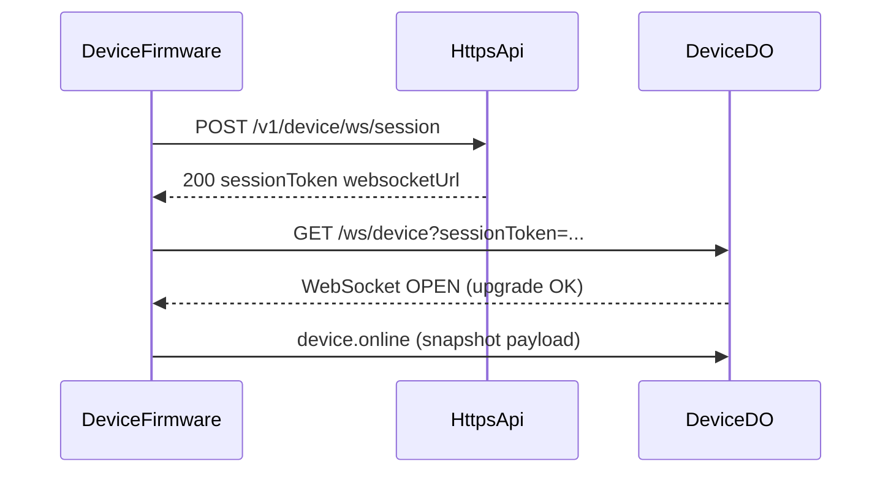
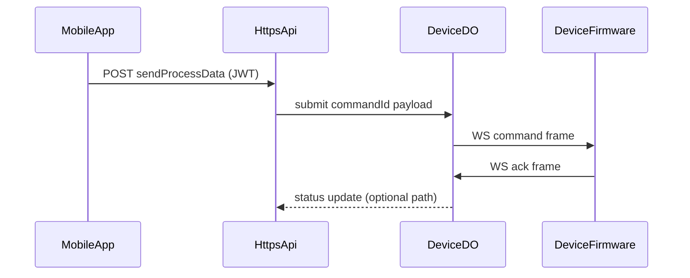
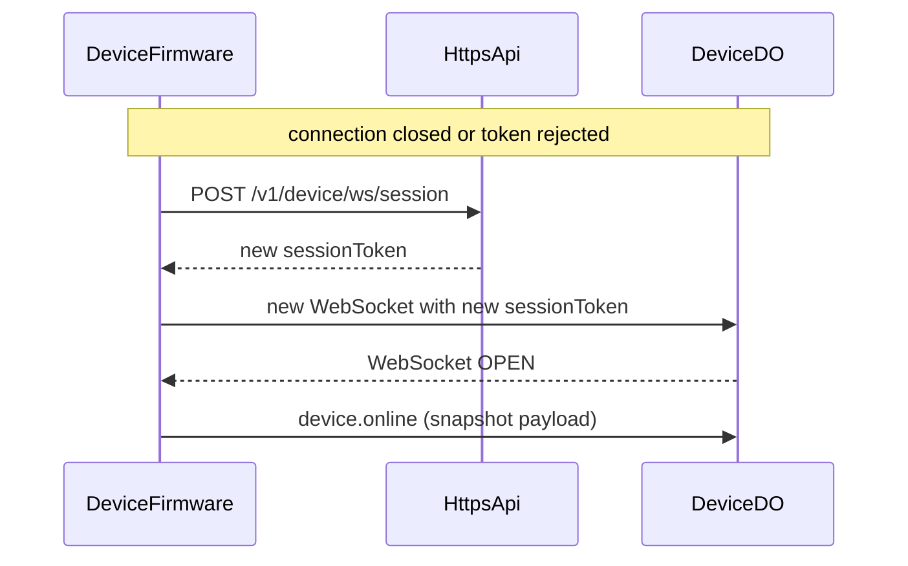
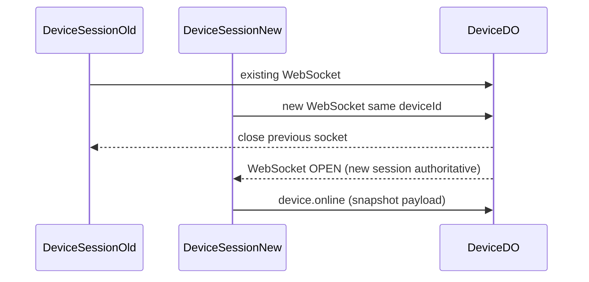

# Device WebSocket Migration Guide

## Audience

This guide is for the device-side app or firmware team integrating the
WebSocket model backed by Durable Objects. The Android client no longer ships an MQTT transport.

HTTP summaries for `POST /v1/device/ws/session`, `GET /ws/device`, and `GET /ws/user`
also appear in `specs/001-worker-http-api/contracts/openapi.yaml` (tag **Realtime**).

## Integration reference (hand-off)

This section is the **joint-debugging** appendix: field tables, sequence diagrams,
and error codes. Implementations may adjust path prefixes or base URLs, but
**field names and semantics** below should stay stable unless both sides agree.

### HTTP and WebSocket field tables

#### `POST /v1/device/ws/session` — request body (JSON)


| Field       | Type   | Required | Description                                                              |
| ----------- | ------ | -------- | ------------------------------------------------------------------------ |
| `deviceId`  | string | yes      | Stable device identifier (same as platform `device.id` string form).     |
| `timestamp` | number | yes      | Unix time in **milliseconds** when the request was built.                |
| `nonce`     | string | yes      | One-time random string; must not repeat within the server replay window. |
| `signature` | string | yes      | Base64-encoded HMAC over the canonical sign string (see below).          |


Canonical sign string (UTF-8):

`deviceId + ":" + String(timestamp) + ":" + nonce`

Algorithm: `HMAC-SHA256`  
Key material: `deviceKey` (same logical secret as legacy `deviceSecret`; name in docs only).

#### `POST /v1/device/ws/session` — success response (JSON)


| Field              | Type   | Description                                                                                |
| ------------------ | ------ | ------------------------------------------------------------------------------------------ |
| `deviceId`         | string | Echo of the requested device id.                                                           |
| `sessionToken`     | string | Opaque short-lived token; use only to open the WebSocket.                                  |
| `expiresInSeconds` | number | TTL for `sessionToken` from issuance.                                                      |
| `websocketUrl`     | string | Absolute `wss://` URL for the device WebSocket entry (may include path only; see connect). |


#### `GET /ws/device` — query parameters


| Parameter      | Required | Description                    |
| -------------- | -------- | ------------------------------ |
| `sessionToken` | yes      | Token from bootstrap response. |


Example: `GET /ws/device?sessionToken=<token>`

Headers: normal WebSocket upgrade (`Connection: Upgrade`, `Upgrade: websocket`).
If the platform uses a subprotocol, document it in deployment notes (optional).

#### WebSocket — unified envelope (JSON text frames)

Every JSON text frame is a single object with **mandatory** top-level fields (bidirectional):

| Field     | Type   | Required | Description |
| --------- | ------ | -------- | ----------- |
| `v`       | number | yes      | Protocol version; use `1`. Unsupported values MUST be rejected by the client. |
| `type`    | string | yes      | Frame discriminator (e.g. `device.online`, `command`, `ack`, `event`, `error`). |
| `id`      | string | yes      | **Globally unique** message id (client: UUID string recommended). |
| `ts`      | number | yes      | Unix time in **milliseconds**. |
| `payload` | object | yes      | Type-specific body; use `{}` when empty. |

Business fields MUST live under `payload`, not at the top level. Payload keys for device reference builds use **snake_case** (e.g. `connection_id`, `command_id`).

Example (device command acknowledgement):

```json
{
  "v": 1,
  "type": "ack",
  "id": "550e8400-e29b-41d4-a716-446655440000",
  "ts": 1710000000000,
  "payload": {
    "command_id": "188523663090001",
    "correlation_id": "",
    "code": 0
  }
}
```

**Application-level JSON `heartbeat` / `heartbeat_ack` frames are not used** on this channel; rely on the WebSocket stack’s native ping/pong (or TCP keepalive) for transport liveness instead.

#### Session readiness (no `connected` frame)

**Server and device have agreed to remove** the legacy server → device **`connected`** JSON text frame. Session readiness for uplink is defined by **successful WebSocket transport open** (HTTP upgrade completed, socket ready to send application frames)—not by any prerequisite inbound message.

The device SHOULD send **`device.online`** (see below) as soon as practical after open so the platform can refresh cached device state for APIs and user apps.

#### Device → server: `device.online` (immediate snapshot on connect / reconnect)

After the WebSocket transport is open, the device sends an unsolicited frame with `type` `device.online`, unified envelope (`v`, `type`, `id`, `ts`, `payload`). The **`payload` object includes `stat`**, which is the **remote snapshot object** (same JSON as `command.stat_response` `payload.data`); it is **not** wrapped as `{ "request_id", "data" }` and does **not** nest the snapshot under `stat.data`.

**BREAKING:** Consumers that read snapshot fields from `device.online` `payload` root MUST migrate to `payload.stat`.

#### Server → device: `command.clear_alerts` (clear persisted warn log)

When the platform needs to wipe the device warn history (same effect as the on-device Alarm Log clear action), it sends `type` **`command.clear_alerts`** with empty `payload` `{}` and a unique top-level `id`. The device deletes all rows in `warn_table`, emits **`event: clear`** on LAN **`GET /v1/monitor/alerts`** SSE subscribers, and replies with **`command.clear_alerts_ack`**: new top-level `id`, `payload.request_id` equal to the inbound `id`, and `payload.data` `{ "success": boolean, "message": string }` (same shape as `command.upload_video_ack`). See `docs/network-api-reference.md` §6.

#### Server → device: `command`

Envelope `type` is `command`. Business fields are inside `payload`, including at least:

| Field | Type   | Description |
| ----------------- | ------ | ----------- |
| `command_id`      | string | Durable id; correlate ACK to this value. |
| `correlation_id`  | string | Optional correlation for tracing. |
| `msg_type`        | number | Legacy-compatible business type (e.g. process dispatch), if used. |
| `data`            | object | Business payload (e.g. `processId`, parameters). |

#### Device → server: `ack`

Envelope `type` is `ack`. Payload MUST include result fields, for example:

| Field             | Type   | Description |
| ----------------- | ------ | ----------- |
| `command_id`      | string | Must match the server-issued command when replying to `command`. |
| `correlation_id`  | string | Echo or trace id when applicable. |
| `code`            | number | Application result (`0` success, non-zero failure). |

#### Device → server: `event` (telemetry / status uplink)

Envelope `type` is `event`. Payload typically includes legacy-oriented fields such as `msg_type`, `version`, and `data` (opaque object)—all nested under `payload`.

#### Server → device: `error` (connection or frame-level)

Envelope `type` is `error`. Payload SHOULD include machine-readable `code`, human `message`, and optional `details`; `ts` on the envelope remains the server timestamp in ms.


### Sequence diagrams

#### Bootstrap and first WebSocket connection




#### Command delivery and ACK




#### Reconnect after token expiry




#### Single active connection replacement




### Error codes

#### HTTP bootstrap (`POST /v1/device/ws/session`)


| HTTP | Code                | Meaning                              | Device action                          |
| ---- | ------------------- | ------------------------------------ | -------------------------------------- |
| 400  | `INVALID_BODY`      | JSON or required fields invalid.     | Fix request shape.                     |
| 401  | `INVALID_SIGNATURE` | HMAC does not verify.                | Check `deviceKey`, clock, sign string. |
| 401  | `DEVICE_UNKNOWN`    | `deviceId` not found or disabled.    | Fix provisioning.                      |
| 401  | `NONCE_REPLAY`      | `nonce` reused within server window. | Generate new nonce.                    |
| 401  | `REQUEST_EXPIRED`   | `timestamp` outside allowed skew.    | Sync clock, retry.                     |
| 429  | `RATE_LIMITED`      | Too many bootstrap calls.            | Back off, retry.                       |
| 500  | `SERVER_ERROR`      | Internal failure.                    | Retry with backoff.                    |


Response body (recommended shape): legacy-compatible envelope if the platform uses one; otherwise JSON `{ "code": "...", "message": "..." }`.

#### WebSocket close (before or after upgrade)

Use standard [WebSocket close codes](https://datatracker.ietf.org/doc/html/rfc6455#section-7.4.1) where possible; document custom ranges in deployment.


| Close code | Meaning                                             | Device action                                   |
| ---------- | --------------------------------------------------- | ----------------------------------------------- |
| 1000       | Normal closure                                      | Reconnect if still needed.                      |
| 1008       | Policy violation (e.g. bad token)                   | New bootstrap, new `sessionToken`.              |
| 1011       | Server error                                        | Retry with backoff.                             |
| 4401       | Application: unauthorized session (if used)         | New bootstrap.                                  |
| 4409       | Application: replaced by newer connection (if used) | Expected for old socket; open only one session. |


Exact numeric mapping is deployment-specific; the **device migration doc for your environment** should pin one table.

#### In-frame `error` (`type: error`) — `code` values


| Code              | Meaning                                 | Device action                     |
| ----------------- | --------------------------------------- | --------------------------------- |
| `INVALID_FRAME`   | JSON parse or schema error.             | Fix client framing.               |
| `UNKNOWN_TYPE`    | Unsupported `type`.                     | Upgrade firmware or fix typo.     |
| `SESSION_EXPIRED` | Token or binding expired.               | Re-bootstrap.                     |
| `NOT_AUTHORIZED`  | Device not allowed for this connection. | Re-bootstrap, check provisioning. |
| `INTERNAL`        | Server-side fault.                      | Retry, escalate logs.             |


#### ACK `data.code` (application result for a command)

These are **business** outcomes carried inside `ack`, not HTTP status.


| Code | Meaning                                 |
| ---- | --------------------------------------- |
| 200  | Success.                                |
| 400  | Bad command payload or unsupported op.  |
| 401  | Local auth or policy failure on device. |
| 409  | Duplicate or stale `commandId`.         |
| 500  | Device execution error.                 |


## Migration Summary

The old device channel depended on:

- MQTT transport
- RabbitMQ MQTT listener authentication
- topic-based uplink and downlink routing
- Redis-backed dispatch status polling

The new channel uses:

- HTTPS bootstrap
- short-lived WebSocket session tokens
- one WebSocket connection per device
- `DeviceDO(deviceId)` as the realtime coordinator
- durable command records in MySQL

The business payload structure can remain close to the old format, but public
protocol naming becomes WebSocket-oriented and transport-agnostic.

## Naming Changes

### New public naming

The new device-facing protocol should use the following names:

- `deviceId`: stable device identifier used by the client
- `deviceKey`: client-held signing key used during bootstrap
- `timestamp`: request timestamp in milliseconds
- `nonce`: one-time random request string
- `signature`: HMAC signature for bootstrap verification
- `sessionToken`: short-lived token used to open the WebSocket connection
- `connectionId`: server-assigned connection identifier for routing inside realtime infrastructure (not required to appear in a device-visible `connected` frame; transport-open is authoritative for the device)
- `commandId`: server-issued durable identifier for a device command

### Legacy naming that becomes internal-only

The following legacy names may still exist in database rows or compatibility
code, but they should no longer be part of the public device protocol:

- `deviceSecret`
- `productKey`
- `requestTime`
- MQTT topic strings
- `nodeKey`

`nodeKey` remains only as an app-side compatibility alias during the transition.

## Authentication Model

### Old model

The old MQTT flow derived connection credentials from:

- device account data
- RabbitMQ HTTP auth callbacks
- `productKey`
- `deviceSecret`
- MQTT `client_id`
- transport-specific signing rules

### New model

The new WebSocket flow should be:

1. the device performs an HTTPS bootstrap request
2. the request is signed with `deviceKey`
3. the server returns a short-lived `sessionToken`
4. the device opens a WebSocket with `sessionToken`
5. `DeviceDO` becomes the connection owner for that `deviceId`

This keeps the device-side identity model simple while removing the MQTT- and
RabbitMQ-specific handshake details.

## Bootstrap Flow

Recommended request:

`POST /v1/device/ws/session`

Request body:

```json
{
  "deviceId": "device-123",
  "timestamp": 1774582000123,
  "nonce": "7f7dba4d5a17c1d0",
  "signature": "base64-hmac"
}
```

Signature recommendation:

- input string: `deviceId + ":" + timestamp + ":" + nonce`
- algorithm: `HMAC-SHA256`
- key: `deviceKey`

Recommended response:

```json
{
  "deviceId": "device-123",
  "sessionToken": "eyJhbGciOi...",
  "expiresInSeconds": 300,
  "websocketUrl": "wss://api.example.com/ws/device"
}
```

## WebSocket Connect

Recommended connect form:

`GET /ws/device?sessionToken=<token>`

The connection rules are:

- only one active connection per device
- a new valid connection replaces the old one
- the server MAY still use an internal `connectionId` (or equivalent) inside `DeviceDO`; it is **not** delivered via a mandatory `connected` text frame anymore
- the device SHALL treat the socket as ready for business uplink **immediately after** the WebSocket upgrade completes, and SHALL send **`device.online`** without waiting for any inbound JSON frame

Recommended first **device → server** frame after open (unified envelope; `payload.stat` is the remote snapshot object, abbreviated):

```json
{
  "v": 1,
  "type": "device.online",
  "id": "550e8400-e29b-41d4-a716-446655440000",
  "ts": 1774582001020,
  "payload": {
    "stat": {
      "example_snapshot_field": "see device-remote-snapshot / stat_response payload.data"
    }
  }
}
```

## Reconnect

Reconnect behavior:

- exponential backoff starting from 1 second
- refresh the `sessionToken` if it is expired or rejected
- once reconnected, treat the old connection as invalid immediately
- the device must not assume pending commands survive reconnect unless the
server replays them explicitly

## Command Envelope

The preferred new envelope standardizes on `commandId`, but payload semantics
stay close to the legacy MQTT message shape.

Server-to-device command:

```json
{
  "type": "command",
  "msgType": 2,
  "commandId": "188523663090001",
  "timestamp": 1774582000123,
  "version": 1,
  "data": {
    "processId": "12345",
    "name": "demo"
  }
}
```

Device ACK:

```json
{
  "type": "ack",
  "msgType": 4,
  "commandId": "188523663090001",
  "timestamp": 1774582002456,
  "version": 1,
  "data": {
    "code": 200,
    "message": "ok"
  }
}
```

Device event:

```json
{
  "type": "event",
  "msgType": 3,
  "timestamp": 1774582003000,
  "version": 1,
  "data": {
    "status": "online",
    "metrics": {}
  }
}
```

## ACK Semantics

Rules:

- `commandId` always refers to the original server-issued command
- the device should ACK each command at most once
- if local execution fails, ACK with a non-success code
- if the device does not understand a command, return an explicit error code and
message

Suggested codes:

- `200`: accepted or completed successfully
- `400`: bad payload or unsupported command
- `401`: invalid session or authorization
- `409`: duplicate or stale command
- `500`: device-side execution failure

## Idempotency Expectations

The device should be prepared for at-least-once delivery in edge cases.

Recommended device behavior:

- keep a short in-memory cache of recent `commandId` values
- ignore duplicate commands already completed
- return a deterministic ACK if the same command is replayed

## Legacy To New Mapping


| Legacy concept       | New public concept                               | Notes                                                          |
| -------------------- | ------------------------------------------------ | -------------------------------------------------------------- |
| `deviceSecret`       | `deviceKey`                                      | Rename in device code and docs                                 |
| `requestTime` header | `timestamp` field                                | Prefer JSON request body or standard header only if necessary  |
| `productKey`         | internal-only or folded into `deviceId` metadata | Keep only if business routing still needs it server-side       |
| MQTT topic           | not exposed                                      | Routing is owned by `DeviceDO`                                 |
| `msgId`              | `commandId`                                      | Same durable value during migration if compatibility is needed |
| `nodeKey`            | deprecated alias to `commandId`                  | App-facing compatibility only                                  |


## Rollout Strategy

### Step 1: Server readiness

- deploy `DeviceDO`
- add WebSocket bootstrap endpoint
- persist durable command records
- keep existing HTTP dispatch and polling APIs

### Step 2: Device dual-readiness

- ship device support for the bootstrap request
- ship WebSocket connect, reconnect, and ACK support
- keep old MQTT path available only if a staged rollout requires fallback

### Step 3: WebSocket cutover

- route active dispatch through `DeviceDO`
- validate command delivery, ACK timing, and reconnect handling
- keep app polling as compatibility only

### Step 4: App realtime adoption

- user apps connect to `UserDO`
- dispatch results move from polling to push
- `nodeKey` is no longer documented as a first-class field

## Testing Checklist For Device Team

- bootstrap request succeeds with a valid signature
- expired or replayed bootstrap requests are rejected
- one device connection replaces the previous one
- transport-level idle handling behaves as expected (native WebSocket ping/pong or server policy)
- commands arrive with stable `commandId`
- ACK reaches the server with the same `commandId`
- duplicate ACK does not break the command state
- reconnect after network loss produces a new transport session and a fresh **`device.online`** uplink (server-internal `connectionId` semantics are implementation-defined)

## Rollback Guidance

If WebSocket rollout must be paused:

- keep the HTTP business APIs unchanged
- disable device WebSocket admission for the affected version range
- fall back to the old transport only if dual-stack support is still deployed
- preserve all durable command audit writes so partial sessions remain traceable

## Final Contract Direction

Long term, the public device protocol should expose:

- `deviceId`
- `deviceKey`
- `sessionToken`
- `connectionId`
- `commandId`

Long term, the public device protocol should not expose:

- MQTT-specific auth fields
- topic-derived routing assumptions
- `nodeKey` as a separate identifier

