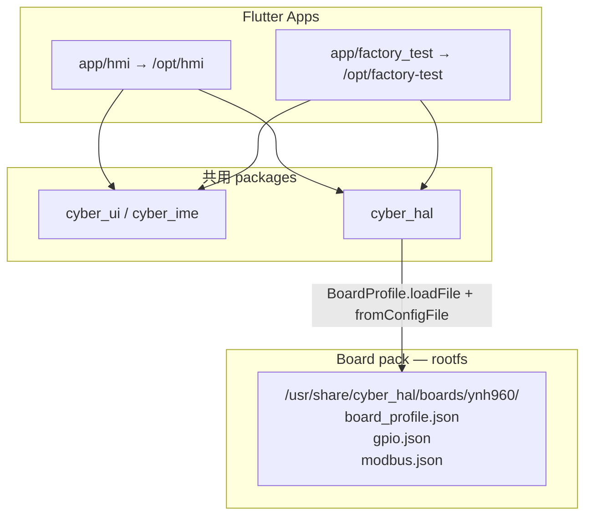

# Factory Test App 计划

目标：在 **lws-hmi** 仓库内并行开发一个通用 **Factory Test** Flutter 应用，作为 **`cyber_hal` 的前端**，用于出场 / 售后验证 HAL 能力；与焊机产品 App（`app/hmi`）共用板级 profile 与 gpio/modbus 目录，打入同一份 rootfs，**不必另刷镜像**，避免损坏用户数据（`/userdata` 等）。

配套阅读：主线 [`flutter-pi-hmi-plan.md`](flutter-pi-hmi-plan.md)（产品 App 可分叉、CyberUI + `cyber_hal`）；HAL 合同 [`hal-portability.md`](hal-portability.md)；包说明 [`packages/cyber_hal/README.md`](../packages/cyber_hal/README.md)。

状态图例：✅ 完成 · 🔄 进行中 · 🔲 未开始

---

## 1. 背景与结论

### 1.1 现状

| 项 | 现状 |
| ---- | ---- |
| 产品 App | 仅 `app/hmi/`；`make build-app` → overlay `/opt/hmi`；`hmi.service` 自启 |
| HAL 前端 | 焊机 App 内嵌 P2 Demo，不是独立应用 |
| 板级 JSON | `app/hmi/assets/hal/{board_profile,gpio,modbus}.json`，随 HMI Flutter assets 打包 |
| 设备槽位 | 单目录 `/opt/hmi`；engine 在 `/usr/lib`，App 只换 `libapp.so` + assets |
| HAL 加载 | `BoardProfile.loadAsset` / `GpioHal.fromAsset` / `ModbusHal.fromAsset`（Flutter asset URI） |
| `/usr/share/cyber_hal/` | 文档已预留，**尚未落地**（见 cyber_hal README） |

### 1.2 结论

1. **源码并行**：新增 `app/factory_test/`，path 依赖 `cyber_hal`（+ 按需 `cyber_ui`），与 `app/hmi` 同 pinned Flutter **3.24.4** / `flutterpi_tool`。
2. **板级目录进 rootfs**：`board_profile.json` / `gpio.json` / `modbus.json` **脱离任一 App**，以 **board pack** 形式打入 rootfs；HMI 与 Factory Test **共用同一路径**。
3. **构建入口**：`make build-factory-test` → overlay `/opt/factory-test` + `apply-overlay`；文档同步更新 `AGENTS.md` / `README.md`。
4. **部署形态**：常驻 rootfs `/opt/factory-test`；**不**进 `multi-user` 自启；可由 Settings 隐藏手势 / systemctl / CLI 进入。日常 OTA/`make upgrade` 即可带上，**无需** factory 专用刷机镜像。
5. **产品形态**：Factory Test = 通用、大而全的 **iPadOS Settings 风格** HAL/平台设置 App（横/竖两套布局）；完成后 **删除** HMI P2 Demo。
6. **进出**：Settings 连续点 5 次 Kernel Version → 切到 Factory Test；产测内 **退出** → 自动唤起 HMI。

---

## 2. 目标与非目标

**目标**

1. 仓库内可独立开发、分析、测试 Factory Test App。
2. ynh960 量产 rootfs **同时** 含 `/opt/hmi`（默认自启）与 `/opt/factory-test`（按需进入）。
3. 两 App 从 **同一套** rootfs 板级 JSON 构造 `BoardBindings` / gpio / modbus，避免双份漂移。
4. 出场 / 售后 / 现场：可不另刷机；经 Settings 手势或 `systemctl` 进入产测，退出后自动回 HMI；**不**清 `/userdata`。
5. Factory Test UI 达到 **通用 Settings 级** 覆盖面（见 §5），并正式支持竖屏 / 横屏布局。
6. Factory Test 功能与入口就绪后，**删除** HMI P2 Demo 及相关 spec/路由。
7. Make / AGENTS / README 说明完整，重建表可抄。

**非目标**

- 不把 Factory Test 做成开机默认桌面或二选一向导。
- 不在同一显示会话并行跑两个 Flutter 客户端（互斥由 `Conflicts=` / 切换脚本保证）。
- 不扩展 `cyber_hal` Android 后端；不另做产测专用 GPT / 双 rootfs 镜像。
- 不把焊机业务页（快速模式 / 工程师 / 监视器等）搬进 Factory Test；产测是 **平台/HAL Settings**，不是第二套焊机 UI。
- 不强制 `make push-factory-test` 为日迭代必选项（可选增强）。
- 不以「改内核 `-o` / 中途旋转面板」为产测布局前提——横竖布局是 **App 自适应**（见 §5.3 / §12.5）。

---

## 3. 架构



| 层级 | 路径 / 角色 |
| ---- | ---- |
| 源码 board pack | 仓库 `board/hal/ynh960/`（与 `board/` 下 LCD / logo / defconfig 并列） |
| Overlay / 设备 | `…/rootfs-overlay/usr/share/cyber_hal/boards/ynh960/`（`apply-overlay` 同步） |
| 产品 HMI | `/opt/hmi`；`hmi.service` → `hmi-launch.sh` |
| Factory Test | `/opt/factory-test`；**无** multi-user 自启；手势 / systemctl / CLI 进入 |
| 切换 | `switch-to-factory-test` / `switch-to-hmi` + unit `Conflicts=` |
| Engine / ICU | 仍仅 `/usr/lib` + `/usr/share/flutter`（两 App 共用，bundle 内禁止第二份 engine） |

**与既有 HAL 合同对齐**：`dart-hal` 允许 product **或 pack** 持有 gpio/modbus；本变更兑现 README 中「安装到 `/usr/share/cyber_hal/`」的延期项。`packages/cyber_hal/boards/sim.json` / `portable-smoke.json` 仍为包内 smoke / stub，**不**充当 ynh960 量产目录。

---

## 4. 板级 pack 迁移

### 4.1 仓库布局

```text
board/hal/ynh960/
  board_profile.json
  gpio.json
  modbus.json
```

从 `app/hmi/assets/hal/` **迁出**（删除 App 内副本，避免双源）。`apply-overlay`（或专用 sync 步骤）将上述文件安装到：

```text
overlay/.../rootfs-overlay/usr/share/cyber_hal/boards/ynh960/
```

设备路径（权威）：

| 文件 | 设备绝对路径 |
| ---- | ---- |
| Profile | `/usr/share/cyber_hal/boards/ynh960/board_profile.json` |
| GPIO | `/usr/share/cyber_hal/boards/ynh960/gpio.json` |
| Modbus | `/usr/share/cyber_hal/boards/ynh960/modbus.json` |

### 4.2 Profile 内容调整

`configs.gpio` / `configs.modbus` 使用 **相对 profile 同目录的路径**（`gpio.json` / `modbus.json`）。HAL `loadFile` 相对 profile 文件所在目录解析（设备 `/usr/share/cyber_hal/boards/ynh960/` 与源码 `board/hal/ynh960/` 行为一致）。详见 §12.3。

`helpers.*`、`net_roles`、`capabilities` 等保持现有 ynh960 语义；仅改配置指针与加载方式。

### 4.3 HAL API 缺口（实现时）

| 已有 | 需补 / 调整 |
| ---- | ---- |
| `GpioHal.fromConfigFile` / `ModbusHal.fromConfigFile` | 已有 |
| `BoardProfile.loadAsset` | 保留（sim / 单测） |
| `BoardProfile.loadFile(path)` | **新增** |
| `GpioHal.fromProfile` / `ModbusHal.fromProfile` | 今日一律走 asset；改为：路径以 `/` 开头 → `fromConfigFile`，否则 → `fromAsset` |
| `_resolveConfigAsset` | 绝对路径 `/…` **原样返回**，不要前缀 `packages/cyber_hal/` |

主机 / stub：继续用包内 `boards/sim.json` + `Stub*`；或不依赖设备路径的单元测试读 `board/hal/ynh960/*.json` 文件。

### 4.4 App 侧接线

- **`app/hmi`**：`main.dart` 经 §12.3 解析顺序加载 profile；删除或改写 `HmiHalAssets` 为路径常量/helper；gpio/modbus 经 `fromProfile`（文件路径），不再硬绑 Flutter assets。
- **`app/factory_test`**：同一解析 helper。
- **单测**：读 `board/hal/ynh960/` 或 `CYBER_HAL_BOARD_ROOT`；更新 portability 文档。

### 4.5 产品差异化边界

本产线（ynh960/961/962 近端共镜像）gpio/modbus **与主板+当前产品线绑定**，放 rootfs pack 合理。若未来 **同主板不同产品** 需要不同寄存器图：再引入「pack 默认 + App overlay」或第二套 `boards/<product>/`；**不在本计划范围**。

---

## 5. Factory Test App（`app/factory_test`）

### 5.1 工程形态

- 标准 Flutter 工程；`pubspec` path：`cyber_hal`、`cyber_ui` / `cyber_ime`（Settings 级 UI 需要）。
- 与 HMI **同一** Flutter SDK pin（`build-factory-test.sh` 复用 `build-app.sh` 的版本校验逻辑）。
- 构建产物布局与 HMI 相同（meta-flutter：`lib/libapp.so` + `data/flutter_assets/`），安装前缀改为 `/opt/factory-test`。

### 5.2 产品定位与 IA（信息架构）

**定位：** 通用、大而全的 **平台 Settings App**（观感对齐 **iPadOS Settings**：左栏分类 + 右栏详情，或窄屏上的列表 → 子页推入），作为 **`cyber_hal` 的完整前端**——出场、售后、研发自测共用，而不是焊机产品里的一块 Demo。

**左栏 / 顶层分组（v1 建议，可随 capability 隐藏空组）：**

| 分组 | 内容（HAL / 平台） |
| ---- | ---- |
| General / About | `sys_info`、`ProductInfo`、镜像/内核/内存/存储/热区/uptime |
| Network | Ethernet、Wi‑Fi、HTTP proxy |
| Bluetooth | Adapter、扫描、配对、连接、A2DP（若有） |
| Display & Sound | 背光、自动休眠、音量、按键音 |
| Keyboard & Mouse | 布局、鼠标加速/自然滚动等 |
| Date & Time | 同步模式、时区、手工校时 |
| GPIO | 命名线状态、读写 / LED 模式 |
| Modbus / Fieldbus | 属性目录、poll、只读优先的写入口 |
| Debug | LAN SSH、USB OTG（debug/mtp/host）等 |
| （页脚） | **Exit to HMI** — 见 §7.4 |

文案中性、面向工厂/售后；不依赖焊机产品文案。焊机业务告警/工艺页 **不**进入此 App。

### 5.3 UI 风格与横竖布局

| 项 | 约定 |
| ---- | ---- |
| 风格参考 | iPadOS Settings：分组列表、导航栏、disclosure、toggle、明细页；用 CyberUI 令牌/组件实现，避免另起一套视觉语言 |
| 横屏 | **主从分栏**（sidebar + detail），类似 iPad 横屏 Settings |
| 竖屏 | **单栏**：根列表 → push 详情；宽阈值变时在分栏/单栏间切换（`OrientationBuilder` / 断点，非两套独立 App） |
| 与面板 `-o` 关系 | 布局随 **Flutter 视口宽高/方向** 自适应。不新增 HAL「运行中改 orientation」API；板级默认方向仍由 launch/`display.conf` 决定。若现场把面板旋到另一方向或换 SKU 方向，产测 UI 仍要可读可用 |
| 退出 | 显眼 **Exit** / 「返回产品界面」控件（侧栏底或 General），见 §7.4 |

### 5.4 与 P2 Demo 的关系

1. **Phase D**：把 Demo 中仍有价值的 HAL 操作 **迁入** Factory Test Settings 页（不是长期双轨）。
2. **Phase E（收尾）**：**删除** HMI P2 Demo 页面、路由、测试与 `p2-device-demo-ui` 中对应要求；Debug 类能力以 Factory Test（及产品 Settings 已有项）为准。
3. 隐藏入口从「Demo 路由」改为 **Settings → Kernel Version 连点 5 次**（§7.3）。

---

## 6. 构建与 Make

### 6.1 脚本

| 脚本 | 行为 |
| ---- | ---- |
| `scripts/build-factory-test.sh` | 对齐 `build-app.sh`：校验 Flutter pin → `flutterpi_tool build --arch=arm64 --release` → 安装到 `rootfs-overlay/opt/factory-test` → `apply-overlay` |
| （可选）`scripts/push-factory-test.sh` | 类 `push-app`，热替换 `/opt/factory-test` **不**重启 `hmi.service`（或仅提示手启） |

实现上可抽公共 `install_flutter_bundle DEST=…`，避免两脚本分叉。

### 6.2 Make 目标

| 目标 | 说明 |
| ---- | ---- |
| `make build-factory-test` | 构建并写入 overlay `/opt/factory-test` + apply-overlay |
| `make build` | 在现有 `build-app` 旁增加 `build-factory-test`（rootfs 必含两 App） |
| `make build-rootfs` | 依赖 overlay 已含两 bundle；`verify-rootfs-overlay.sh` 校验 `/opt/factory-test` 与 `/usr/share/cyber_hal/boards/ynh960/` |
| （可选）`make push-factory-test` | 开发机热推产测 bundle |

### 6.3 文档必改

1. **`Makefile` `help`**：增加 `build-factory-test`（及可选 push）。
2. **`README.md` → Make commands**：构建 / 上板手启示例；说明与 `build-app` / `push-app` 并列。
3. **`AGENTS.md` 重建表**：

| 改动 | 命令 |
| ---- | ---- |
| `app/factory_test/**` | `make build-factory-test`，然后 `make build-rootfs` + `make upgrade`（或可选 push） |
| `board/hal/**` | `make apply-overlay`，`make build-rootfs`，`make upgrade` |
| 仅迭代 HMI | 仍 `make build-app` / `make push-app`（不动 factory-test） |

4. **`app/README.md`** / **`packages/cyber_hal/README.md`** / **`docs/hal-portability.md`**：board pack 路径与加载约定。
5. **`scripts/verify-rootfs-overlay.sh`**：断言 factory-test bundle（无引擎副本）+ board pack 三文件存在。

---

## 7. 板端启动与运维

### 7.1 启动器（决议见 §12）

| 组件 | 角色 |
| ---- | ---- |
| `/usr/libexec/hmi/factory-test-launch.sh` | 复用 `hmi-launch.sh` 前置逻辑；`BUNDLE=/opt/factory-test`；供 unit / 前台调试直接 exec |
| `/usr/bin/factory-test` | 售后/开发 CLI：默认 **拒绝** 在 `hmi.service` active 时抢显；`--stop-hmi` 才 stop 后前台跑 launch |
| `factory-test.service` | **static**（无 `WantedBy=multi-user.target`）；与 `hmi.service` **双向 `Conflicts=`** |

开机默认仍只有 `hmi.service`。产测 **不会** 随 multi-user 自启。

### 7.2 推荐操作流程（出场 / 售后）

**现场主路径（无 SSH，推荐）：**

1. 产品 HMI → Settings → Device Information → 连续点击 **Kernel Version** 五次  
2. 自动切入 Factory Test（HMI 退出）  
3. 测完点 **Exit** → 自动唤起 HMI  

**SSH / systemctl 路径：**

```bash
systemctl start factory-test   # Conflicts → 停 hmi，起产测
systemctl start hmi            # Conflicts → 停产测，回 HMI
```

**前台调试路径：**

```bash
factory-test --stop-hmi        # 或先 stop hmi 再 factory-test
# Ctrl+C 结束前台会话时：不自动 start hmi（避免 SSH 调试误恢复）
# 需要回产品 UI 时：
systemctl start hmi
```

约束：

- 与 HMI **互斥**占用嵌入器 / 显示（unit `Conflicts=` + 切换脚本）。
- 不改 GPT、不要求 RockUSB `make flash`；`make upgrade` 保留 `/userdata`。
- 产测对 HAL persist 的写：UI 标明；默认可恢复；破坏性项二次确认。

### 7.3 HMI → Factory Test（Kernel Version ×5）

| 项 | 约定 |
| ---- | ---- |
| 位置 | Settings → Device Information 页的 **Kernel Version** 行（现有 `SettingsValueRow`） |
| 手势 | **连续点击 5 次**；两次点击间隔建议 ≤ 1.5s，超时清零计数 |
| 反馈 | 第 5 次前可无强提示（隐藏入口）；可选极短 haptic/音量键反馈，避免普通用户发现 |
| 动作 | 调用切换助手（见下）→ **启动 `factory-test.service`**（`Conflicts` 停掉 `hmi`）→ 当前 HMI 进程随 unit stop 结束 |
| 失败 | 若 `/opt/factory-test` 缺失或 `systemctl start` 失败 → Toast/对话框，**留在 HMI**，不把用户晾在黑屏 |

**切换助手（建议）：** `/usr/bin/switch-to-factory-test`（或 `libexec`）内部 `systemctl start factory-test`，供 Dart `Process.start` 调用；勿在 Flutter 里只 `exit(0)` 而不起产测。

**单测：** widget 测连点计数与第 5 次触发回调；可用 fake 替换 systemctl。

### 7.4 Factory Test → HMI（退出按钮）

| 项 | 约定 |
| ---- | ---- |
| UI | Settings 风格页脚或 General 内 **Exit** / 「返回产品界面」 |
| 动作 | 调用 `/usr/bin/switch-to-hmi`（或对称助手）→ `systemctl start hmi` → `Conflicts` 停掉 `factory-test` |
| 与 CLI | **仅 UI Exit / switch-to-hmi** 负责自动回 HMI；前台 `factory-test` + Ctrl+C **不**自动 start hmi（§12.1） |

### 7.5 开发迭代

| 场景 | 建议 |
| ---- | ---- |
| 改产测 UI / HAL 接线 | `make build-factory-test` →（可选 push）或 `build-rootfs` + `upgrade` |
| 改 board pack JSON | `apply-overlay` → `build-rootfs` → `upgrade` |
| 改 HMI 手势 / 业务 | `make build-app` / `make push-app` |

---

## 8. 分阶段任务

### Phase A — Board pack 进 rootfs（🔲）

1. 新增 `board/hal/ynh960/`，从 `app/hmi/assets/hal/` 迁入三 JSON；`configs.*` 相对同目录。
2. Overlay 同步 + `verify-rootfs-overlay.sh` 校验。
3. HAL：`loadFile` + `fromProfile` 文件/相对路径解析。
4. HMI 改为读 rootfs pack；更新单测与 portability 文档。
5. 板端：`build-rootfs` + `upgrade` 后确认 HMI 行为不回归。

### Phase B — 工程与 Make（🔲）

1. scaffold `app/factory_test`（最小「HAL 已加载」页即可）。
2. `scripts/build-factory-test.sh` + `make build-factory-test`；接入 `make build`。
3. 更新 `AGENTS.md` / `README.md` / `Makefile help`。
4. Overlay 安装 `/opt/factory-test`（可先占位 bundle，再完整 UI）。
5. board pack：`configs.*` 相对 profile 同目录解析（§12.3）；HMI/Factory Test 共用 `CYBER_HAL_BOARD_*` 解析 helper。

### Phase C — 切换入口与验收骨架（🔲）

1. `factory-test-launch.sh` + `/usr/bin/factory-test`（含 `--stop-hmi`，默认拒抢显）。
2. static `factory-test.service` + 与 `hmi.service` 双向 `Conflicts=`；`switch-to-factory-test` / `switch-to-hmi` 助手；`verify-rootfs-overlay` 校验。
3. HMI：Kernel Version ×5 → switch-to-factory-test。
4. Factory Test：Exit → switch-to-hmi。
5. 文档：§7 现场 / SSH 路径；设备验收清单（§9）。

### Phase D — Settings 级 UI（🔲）

1. iPadOS Settings 风格壳：横屏分栏 + 竖屏单栏推入（§5.3）。
2. 按 §5.2 填充分组页；从 P2 Demo **迁入**仍需要的 HAL 操作。
3. （可选）`make push-factory-test`。

### Phase E — 删除 P2 Demo（🔲）

1. 删除 `p2_demo_page`、Demo 路由、相关测试与导航入口。
2. 修订 / 归档 `openspec/specs/p2-device-demo-ui`（及 navigation 中 Demo 要求），改为指向 Factory Test + Kernel Version 手势。
3. 确认产品 Settings / Home 已覆盖原 Demo 中面向操作员的能力；仅产测/平台项留在 Factory Test。

---

## 9. 验收标准

| # | 标准 |
| ---- | ---- |
| 1 | 仓库存在 `app/factory_test/`，`flutter analyze` 通过（pinned SDK）。 |
| 2 | `board/hal/ynh960/` 为唯一量产 JSON 源；`app/hmi/assets/hal/` 不再持有副本。 |
| 3 | rootfs 含 `/usr/share/cyber_hal/boards/ynh960/{board_profile,gpio,modbus}.json`。 |
| 4 | rootfs 含 `/opt/factory-test/lib/libapp.so` + `flutter_assets`；**无** bundle 内 engine/icu。 |
| 5 | `make build-factory-test` 写入 overlay；`make help` / README / AGENTS 已描述。 |
| 6 | Settings → Kernel Version 连点 5 次进入 Factory Test；HMI 被停掉且产测可见。 |
| 7 | Factory Test **Exit** 后 HMI 自动恢复；`/userdata` / `product.ini` 未被要求格式化或刷写。 |
| 8 | `systemctl start factory-test` / `start hmi` 仍可用；`make upgrade` 可下发；验收 **不**依赖 `make flash`。 |
| 9 | 无 `CYBER_HAL_BOARD_*` 时设备读默认 pack；主机可用 `CYBER_HAL_BOARD_ROOT`。 |
| 10 | 产测 UI 在竖屏与横屏约束下均可导航（分栏/单栏切换）；覆盖 §5.2 主要分组。 |
| 11 | Phase E 后：仓库无 P2 Demo 页/路由；相关 openspec 已更新。 |

---

## 10. 风险与缓解

| 风险 | 缓解 |
| ---- | ---- |
| HMI 仍读 assets，pack 已迁走 → 启动失败 | Phase A 先切 HMI 加载，再删 assets；同一次 rootfs 交付 |
| 两 App 争用显示 / 输入 | unit 双向 `Conflicts=`；切换助手；CLI 默认拒绝 |
| 五连击误触 | 隐藏行 + 间隔超时清零；无逐步「还差 N 次」提示 |
| 切换失败黑屏 | start 失败则留在当前 App 并报错；助手先检查 bundle 存在 |
| Exit 与 Ctrl+C 语义混淆 | 文档区分：仅 UI Exit / `switch-to-hmi` 自动回 HMI |
| rootfs 体积 | Factory Test 无业务素材时远小于 HMI；仍禁止 bundle 打 engine；盯 `600M` ext2 预算 |
| 产测误改 persist | UI 分级：只读默认；写操作确认；危险项（OTG host、SSH 开）单独页 |
| 文档 / openspec 仍写「App assets」 | 同步改 README、hal-portability、相关 spec 句（实现变更时一并改） |
| `make build` 时间变长 | 可接受；CI/本地可用「只 build-app」日迭代，全量 build 才编两 App |

---

## 11. 重建速查（实现完成后）

```text
# 板级 pack 或 overlay 启动器
make apply-overlay
make build-rootfs
make upgrade

# 仅 Factory Test App
make build-factory-test
make build-rootfs
make upgrade

# 仅焊机 HMI（不变）
make build-app
make push-app

# 全量镜像（含两 App）
make build
```

板端（现场）：

```text
Settings → Kernel Version ×5  →  Factory Test
Factory Test → Exit           →  HMI
```

板端（SSH）：

```text
systemctl start factory-test
systemctl start hmi
```

---

## 12. 决议（已拍板）

### 12.1 CLI 是否自动 `systemctl stop hmi` / 退出是否回 HMI

**决议：**

| 入口 | 行为 |
| ---- | ---- |
| `/usr/bin/factory-test`（无参数） | HMI active → **拒绝**（说明 + 非零退出） |
| `factory-test --stop-hmi` | stop hmi → 前台 launch |
| 前台产测 **Ctrl+C / 进程被杀** | **不**自动 `start hmi` |
| Factory Test UI **Exit** / `switch-to-hmi` | **自动** `systemctl start hmi` |
| HMI Kernel Version ×5 / `switch-to-factory-test` | **自动** `systemctl start factory-test` |

**理由：** 现场手势与 Exit 必须闭环；SSH 前台调试仍避免「断线自动拉起 HMI」干扰排障。

---

### 12.2 是否提供 `factory-test.service`

**决议：提供 static unit（必做）。** 双向 `Conflicts=`；无 multi-user wants。售后 / 手势 / Exit 均通过 `systemctl start` 切换。详见 §7.1。

---

### 12.3 主机 / 模拟器如何加载 board pack

**决议：运行时解析顺序（HMI 与 Factory Test 共用）：**

1. `CYBER_HAL_BOARD_PROFILE` — profile 文件路径  
2. `CYBER_HAL_BOARD_ROOT` — `$ROOT/board_profile.json`  
3. 设备默认 — `/usr/share/cyber_hal/boards/ynh960/board_profile.json`  
4. Stub/sim — 包内 `sim.json` + `Stub*`

`configs.gpio` / `modbus` 为相对 path 时，相对 **profile 文件所在目录** 解析。禁止编译期写入开发机绝对路径。

---

### 12.4 P2 Demo 去留

**决议：Factory Test 做完后删除 Demo（本计划 Phase E）。**

| 阶段 | 约定 |
| ---- | ---- |
| A–C | Demo 可暂留，保证 HMI 不因迁 pack 而缺入口 |
| D | 能力迁入 Factory Test Settings |
| E | 删除 Demo 代码/路由/测试；更新 `p2-device-demo-ui` 与导航 spec |

隐藏入口由 **Kernel Version ×5** 取代 Demo 路由。

---

### 12.5 UI 形态与横竖屏

**决议：** Factory Test 按 **iPadOS Settings** 思路做通用大而全平台设置 App（§5.2–5.3）：横屏主从分栏、竖屏单栏推入；CyberUI 实现。布局随视口自适应，不依赖新增「运行中改面板 orientation」HAL。

---

### 12.6 HMI ↔ Factory Test 切换

**决议：**

1. **进入：** Settings Device Information → **Kernel Version 连续点击 5 次** → `switch-to-factory-test`。  
2. **退出：** Factory Test 内 **Exit** → `switch-to-hmi`（自动恢复 HMI）。  
3. 底层均 `systemctl start` 对端 unit，依赖 `Conflicts=` 停当前 App。

---

## 13. 文档索引（落地时维护）

| 文档 | 变更要点 |
| ---- | ---- |
| 本文 | 计划与验收 |
| `AGENTS.md` | 重建表 + `/opt/factory-test` |
| `README.md` | Make commands；现场进出手势 |
| `docs/hal-portability.md` | Asset → rootfs pack |
| `packages/cyber_hal/README.md` | 兑现 `/usr/share/cyber_hal/` |
| `docs/storage-layout.md` | 可选：第二 bundle 预算 |
| `app/README.md` | 双 App + 切换 |
| openspec `dart-hal` / board pack | 设备路径 |
| openspec `p2-device-demo-ui` / navigation | Phase E 删除或改指向 Factory Test |
