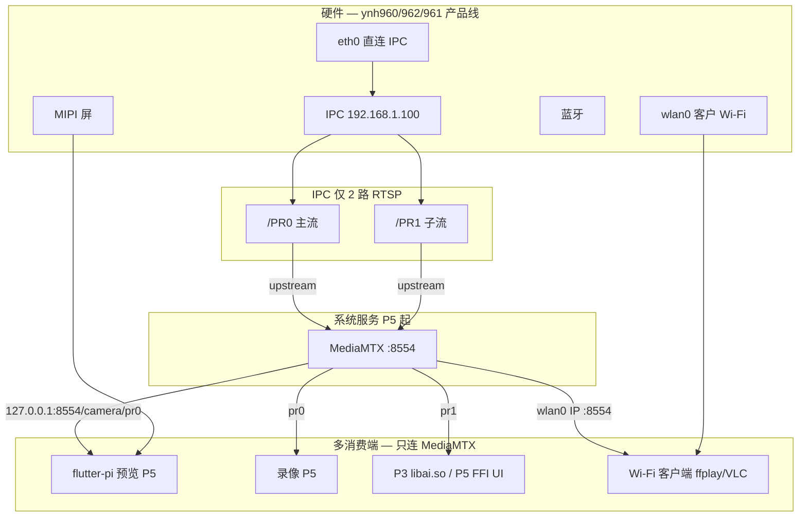
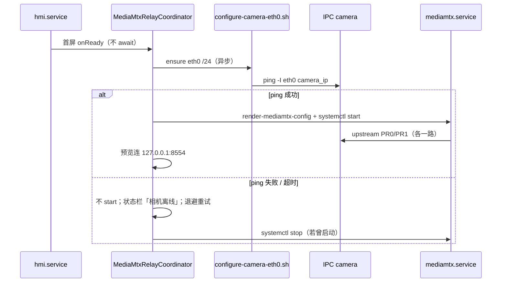
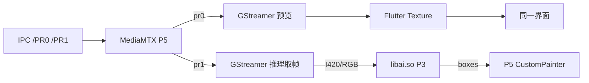

# Flutter-pi HMI 规划（ynh960 产品线 · RK3566 基准）

目标：在现有 **lws-hmi** Buildroot 基线上，用 **flutter-pi** 全屏跑 Flutter UI；按 **P1→P5** 增量交付：**P1** 镜像 + Hello World → **P1.5** 设备调试与快速 UI 迭代 → **P2** Modbus/GPIO（Linux 真机） → **P2.1** 板级 I/O → **P2.2** 日期/时间 Demo → **P2.3** 硬件设置持久化 → **P2.4** A/B 双分区与 `make upgrade` → **P2.5** 模拟器与 Android 兼容 → **P3** `libai.so` → **P4** FrostUI + IME 子模块 → **P5** 全量业务（含 OTA，复用 P2.4）。**裁掉** Rockchip 参考 rootfs 里的 Weston / Chromium / 本地相机等演示模块。

**能力原则**：**lws-hmi 产品能力不少于 lws-ui**；Linux 主线将 Android/Java 平台层替换为 **Buildroot + flutter-pi + Dart/FFI**，**P2.5** 起保留旧 Android 产品兼容构建；算法、拓扑、模型与 API 契约尽量复用。逐项对照见 **§11.5**。

**板级范围**：**ynh960 / ynh962 / ynh961** 为同一产品线的三档板型（**入门 → 中档 → 高档**：RK3566 → RK3568B2 → RK3568；芯片与接口有微小差异，大体硬件拓扑相近）；**理论上可共用一份 Linux 固件**（与 lws-ui Android 通刷思路一致）。**P1～P5 设计与验收以 ynh960（RK3566）为基准**，暂不按 SKU 拆 defconfig 或维护多套镜像。Rockchip SDK 目录 `**rk3566_rk3568`** / Buildroot `**rockchip_rk3566_rk3568_***` 为 3566/3568 族工具链 profile。见 **§3.0**。

---

## 1. 目标与范围


| 阶段                             | 交付                                                                                                                                                                                        | 状态  |
| ------------------------------ | ----------------------------------------------------------------------------------------------------------------------------------------------------------------------------------------- | --- |
| **P1 — 平台镜像 + Hello World**    | Buildroot **Linux 镜像**（含后续所需的 **平台必须组件**）+ splash → `**flutter-pi` Hello World**                                                                                                          | ✅   |
| **P1.5 — 设备调试 + 快速 UI 迭代**     | `make debug-app` 在**真机**上以调试模式启动 App；VSCode / Cursor Flutter 插件接入；为快速 UI 迭代铺路                                                                                                             | ✅   |
| **P2 — Modbus + GPIO**         | 迁移 **Modbus RTU** 与 **GPIO 管理**；Linux 真机验证读设备与下位机信息、**三色指示灯**（红/黄/绿）正常控制                                                                                                                  | ✅   |
| **P2.1 — 板级 I/O 与外设验证**        | 喇叭 / Wi‑Fi / BT / **以太网（RJ45 / eth0）** / **外接键盘（USB HID）** / **按需 LAN·WLAN sshd** 等 **硬件 I/O 前置验证**；顺带收口触控、串口/引脚映射、背光等（见 **§1.1**）；**不做** 产品设置页 / IPC 相机业务 / MediaMTX / Flutter 预览（仍属 P5） | 🔄  |
| **P2.2 — 日期/时间设置（Demo）**      | Demo UI：**日期、时间（及时区）设置**；平台层抽象（`DateTimeController` 等），供 P5 产品设置页复用；**不做** 云 NTP 编排 / 产品 Settings 整页                                                                 | ✅  |
| **P2.3 — 硬件设置持久化**            | 将 **P2.1** Demo 已验证的硬件偏好（Wi‑Fi / eth0 / 背光 / 旋转 / 代理 / BT A2DP 等）在 **整机重启后自动恢复**；系统栈 **独立于 `hmi.service` cgroup**（push-app / HMI 重启不断网）；统一写盘路径与 boot 应用钩子 | ✅  |
| **P2.4 — A/B 双分区 + 远程升级**     | Buildroot **A/B rootfs 双分区**；主机 `**make upgrade`** 经 **USB-SSH / LAN SSH** 推送并切换槽位，**无需进 bootloader 刷机**；为 P5 OTA 打底（见 **§1.3**）                                                   | 🔲  |
| **P2.5 — 模拟器与 Android 兼容**     | `**make emulator`**（Linux HMI 模拟器）；`**make android-emulator**`（参考 lws-ui `make emulator`）；Modbus Android 兼容；GPIO **共用** `gpio_innohi`（YNHAPI 仅降级，§11.0）；Flutter App 可打包 **APK**           | 🔲  |
| **P3 — AI 原生库**                | 迁移 lws-ui **AI 代码库**；新工程打出 `**libai.so`**（+ RKNN/`config.yaml`）                                                                                                                           | 🔲  |
| **P3.5 — Flutter 平台升级（P4 前置）** | 将板端 **flutter-engine / SDK / flutter-pi** 从 P1 pin **升级到上游支持的 stable**（见 **§6.4**）；ynh960 全量回归                                                                                            | 🔲  |
| **P4 — FrostUI + IME（子模块）**    | `**packages/frost_ui`** + `**packages/frost_ime**`（各为独立 git 子模块，对齐 lws-ui FrostUI / IME）                                                                                                  | 🔲  |
| **P5 — 业务迁移（含 OTA）**          | 见 **§1.2**（P5.1～P5.8）；视频、网络 UI、AI 接入、本地/云服务、**lws-ui 实装业务页**；**P5.8 OTA** 复用 **P2.4** 双分区与 `make upgrade` 链路                                                                             | 🔲  |


状态图例：✅ 完成 · 🔄 进行中 · 🔲 未开始

**lws-ui 对照**：算法/拓扑/模型复用；平台层 → Linux + flutter-pi；UI 按上表分阶段；**P5 子阶段 §1.2**、**P2.4 双分区升级 §1.3**；细则勾选 **§12**；**openspec 非完整清单 §11.7**。

当前 Rockchip 参考 defconfig 为 EVB 演示系统；替换为 **HMI 栈 + flutter-pi**，按 **P1→P5** 增量交付。

### 1.1 各阶段任务一览

```text
P1  镜像 + Hello World ✅
    ├─ lws_hmi defconfig + 方案 A systemd（§3.6）
    ├─ 裁剪 weston/chromium/camera/benchmark/adbd …
    ├─ 平台必须组件：Mali、flutter-pi、LCD/splash、RKNPU2 运行时、Wi‑Fi/BT、powermanager …
    ├─ hmi.service 自启；Hello World → /opt/hmi
    └─ 验收：logo → 首页 ≤10 s（§14.2）

P1.5  设备调试 + 快速 UI 迭代 ✅
    ├─ make debug-app：在实体板以调试模式启动 App（断点、热重载、VM Service）
    ├─ VSCode / Cursor Flutter 插件接入
    └─ make push-app：实体板 USB-SSH 快速替换 release/debug bundle

P2  Modbus + GPIO（Linux 真机）✅
    ├─ 迁移 Modbus RTU 与 GPIO 管理程序
    ├─ Modbus：flutter_libserialport；Linux `/dev/ttyS5` 与 lws-ui 寄存器契约
    ├─ GPIO：统一契约 = Innohi `gpio_innohi` 标签（红 GPIO_5 / 黄 GPIO_4 / 绿 GPIO_7）
    ├─ GPIO：直接读写 `/sys/class/gpio_innohi/GPIO_N/value`（不用 YNHAPI 0-based 下标当脚号）
    └─ App demo：读设备与下位机信息；控制三色状态灯（红/黄/绿）

P2.1  板级 I/O 与外设验证（硬件前置）🔄
    ├─ 动机：P2 暴露串口/引脚对不上、触摸驱动 BUG、UART pinmux vs gmac 等；原计划散落在 P5 的外设先打通
    ├─ 喇叭 / 本机音频：ALSA + codec + 功放；`aplay` / speaker-test 出声（Buildroot 开最小音频栈）✅
    ├─ Wi‑Fi：模组固件 + `wpa_supplicant` 关联（含隐藏 SSID）+ wlan0 DHCP/静态 + HTTP 代理/探测（Demo；设置页属 P5.2）✅
    ├─ **LAN/WLAN 按需 sshd**：`enable-ssh-debug.sh` + Demo 开关；主机 `make connect <ip>`（§7.7 提前到 P2.1；产品 5 连击属 P5）🔄
    ├─ 蓝牙：hci0 up + Discoverable/Pairable（可被手机发现配对；非本机扫描；A2DP Sink 可选）✅
    ├─ 以太网（RJ45 / eth0）：Demo + DHCP/静态（`EthernetController`）；DTS/PHY → link up → ping 对端 ✅
    │     （IPC 专链配址、ping 相机、RTSP / MediaMTX / 预览 — 仍属 P5.1 业务迁移）
    ├─ 触控：Goodix / libinput 稳定；坐标与屏旋转一致 ✅
    ├─ 外接键盘（USB HID）：**1 mm pin → USB host** 转接 enum + 按键进 flutter-pi（非 P4 软键盘；板载 Micro-USB OTG 仍归 plug-ssh）
    ├─ 串口 / GPIO / pinmux 台账：`docs/ynh960-io-pinmux-ledger.md` ✅
    └─ 背光 / 屏幕旋转 smoke ✅

P2.2  日期/时间设置（Demo）✅
    ├─ Demo UI：设置系统日期、时间、时区（手工；非产品 Settings 整页）
    ├─ 平台抽象：`DateTimeController`（get/set wall clock + timezone + sync mode）；Linux：`timedatectl` / `date` + RTC（`hwclock`）
    ├─ 联网自动：Network 模式 + Sync Now；复用 `wlan0-time-sync.sh`（rdate / HTTP Date）
    ├─ HTTPS TLS 经 `ensureSaneForTls`（与 HTTP Demo 共用）
    └─ 板端 smoke：手动设时 / Sync Now / 模式持久化

P2.3  硬件设置持久化（整机重启）✅
    ├─ 动机：P2.1 多数偏好已写 `/var/lib/lws-hmi/*`，但重启后栈/接口未自动恢复
    ├─ boot 钩子（systemd oneshot / display-init 后）：按持久化偏好恢复 Wi‑Fi / eth0 / 代理 / 背光 / 旋转 / BT A2DP 等
    ├─ 统一路径与 schema 文档化；Demo Apply 与 boot 复用同一 restore 脚本
    └─ 验收：断电/reboot 后无需再进 Demo 即可恢复上次硬件配置

P2.4  A/B 双分区 + 远程升级（`make upgrade`）🔲
    ├─ `parameter` / GPT：rootfs A/B 双槽（见 `docs/storage-layout.md`）；slot 标记与回滚策略
    ├─ 板端：升级脚本写 inactive 槽 → 校验 → 切换 boot 标记 → reboot（**不进 loader 刷机**）
    ├─ 主机：`make upgrade` 经 USB-SSH 或 `make connect` LAN 推送 rootfs/update 包并触发切换
    ├─ 两级能力先打通「全系统槽位更新」；仅更新 app（`/oem/hmi`）可同链路预留
    └─ **不做** 产品 OTA UI / 云端升级编排（属 **P5.8**，复用本阶段槽位与脚本）

P2.5  模拟器与 Android 兼容 🔲
    ├─ make emulator：构建并启动 Linux 虚拟机，加载 rootfs.img 跑 Linux App
    ├─ make android-emulator：参考 lws-ui make emulator 启动 Android 模拟器
    ├─ Modbus：Android 串口 chmod 后仍用 flutter_libserialport
    ├─ GPIO：**同一套** `gpio_innohi` 文件后端（Android 有 `/sys/class/gpio_innohi` 则直写）；YNHAPI `setGpioState` 仅作降级（入参用 `YNHAPI.GPIO_N`，勿裸写 4/3/6）
    ├─ Flutter App 同时构建 Linux bundle 与 Android APK（系统应用 + platform 签名）
    ├─ make build-apk / push-apk；make version / version-bump；make set-prop / del-prop
    └─ make push-app / make debug-app 兼容 Linux 虚拟机与实体板

P3  AI → libai.so 🔲
    ├─ 迁移 lensinspector（YOLO + 污点检测 + OpenCV + yaml-cpp）
    ├─ Linux aarch64 交叉编译 libai.so；RKNN 模型（默认 rk3566）
    └─ 板端 smoke：librknnrt + so 加载（业务叠框 UI 留 P5）

P3.5  Flutter 平台升级（P4 前置，§6.4）🔲
    ├─ 选定目标：flutter-pi + flutter-ci 已支持的 stable（如 3.41.x 一代）
    ├─ 同步 bump：flutter-sdk / flutter-engine / flutter-pi 三件套 + prebuilt 重编
    ├─ 宿主：fetch-flutter-sdk（macOS darwin / Linux linux）+ flutterpi_tool 对齐
    ├─ 板端：meta-flutter 布局不变；engine 仍仅 /usr/lib（/opt/hmi 仅 libapp + assets）
    └─ 验收：Hello World + P2 demo + P3 libai smoke + 启动 KPI（§14.2）回归

P4  FrostUI + IME（git 子模块）🔲
    ├─ `packages/frost_ui` — FrostUI（§6.3：backdrop 默认 frozen；弹窗按需 liveWhileOpen）
    ├─ `packages/frost_ime` — IME overlay + 字体（对齐 lws-ui `IME.md`）
    └─ 主 App `pubspec` 依赖上述子模块；CI pin 版本

P5  业务迁移（子阶段见 §1.2）🔲
    ├─ P5.1 视频 + MediaMTX
    ├─ P5.2 网络 UI + 状态栏
    ├─ P5.3 AI FFI + 告警链路
    ├─ P5.4 本地 HTTP + 数据层
    ├─ P5.5 云 + 远程
    ├─ P5.6 业务页面（对照 lws-ui 实装，openspec 作参考）
    ├─ P5.7 量产收尾（录像、parity）
    └─ P5.8 OTA（复用 P2.4 A/B + make upgrade；产品升级 UI / 两级更新）
```

**依赖**：`P1 → P1.5 → P2 → P2.1 → P2.2 → P2.3 → P2.4 → P2.5 → P3` 建议顺序固定（**P2.2 / P2.3** 可与 P2.1 收尾并行筹备，但验收串在 P2.1 之后；**P2.4** 依赖稳定 rootfs/SSH 目标，宜在 P2.3 之后）；**P1.5** 先在真机打通调试模式与 IDE 插件；**P2** 验证 Modbus/GPIO；**P2.1** 把喇叭 / Wi‑Fi / BT / **以太网（RJ45）** / 触控 / **外接键盘** 等 **板级 I/O 先验证完**（避免硬件坑拖到 P5）；**P2.2** 补日期时间 Demo 抽象；**P2.3** 保证硬件偏好重启可恢复；**P2.4** 提前落地 A/B 与 `make upgrade`（免 loader 远程升级）；**P2.5** 再补模拟器与 Android 双目标；**P3.5** 在 P3 板端 smoke 通过后、**P4 开工前**完成（FrostUI/IME 子模块常需更高 Dart/Flutter）；**P4** 可与 P3 并行筹备子模块仓库，但 **合并主 App 前须完成 P3.5**；**P5** 在 P1～P4 就绪后按 **§1.2** 分子阶段交付（**P5.1 视频** 为多数后续子阶段前置，且假定 **P2.1** 已通 eth0 RJ45；IPC 专链与 RTSP 在 **P5.1** 完成；**P5.8 OTA** 复用 **P2.4** 双分区与升级脚本，不再另建分区方案）。

### 1.2 P5 子阶段（业务迁移）

P5 体量大，拆为 **P5.1～P5.8** 增量交付。**不能**仅按 `openspec/specs/`* 列清单——openspec 记录不完整，且可能与当前 Android 实装不同步；**以 lws-ui 实际产品行为与源码为准**（§11.7），openspec 作交互细则与验收**补充**。


| 子阶段                   | 交付                                                                                                                                         | 主要对照（lws-ui **实装**）                                                                                                                         | 不在本阶段                                               |
| --------------------- | ------------------------------------------------------------------------------------------------------------------------------------------ | ------------------------------------------------------------------------------------------------------------------------------------------- | --------------------------------------------------- |
| **P5.1 视频与 MediaMTX** | IPC 专链配址（`configure-camera-eth0.sh`）+ ping 相机；mediamtx、GStreamer/MPP、flutter-pi video；PR0/PR1 relay 与预览 smoke；`model.properties` / YAML 渲染 | `CameraEth0Configurator`、`MediaMtxRelayCoordinator`、`MediaMtxConfigRenderer`；`docs/dual-stream-summary.md`                                  | 完整 Monitor UI、AI 叠框；**eth0 RJ45 物理链路**（已在 **P2.1**） |
| **P5.2 网络与状态栏**       | §7.0 异步配网编排 + **状态栏**；Wi‑Fi / 蓝牙**设置页**（产品 UI）；日期/时间设置页复用 **P2.2** `DateTimeController`                                                                                             | `WifiActivity`、`BluetoothManagerActivity`；复用 **P2.1** 已验证的 wpa/BlueZ / eth0 RJ45                                                            | 云 WS、:5580 业务 API；**驱动/出声/关联 AP 本身**（已在 **P2.1**）   |
| **P5.3 AI 产品接入**      | `libai.so` FFI；PR1 取流 + 预览叠框；镜片/零点/告警与 native 契约                                                                                           | `AiManager`、`NativeBridge`；`docs/AI_VISION_`*、`native/lensinspector/docs/*`                                                                 | 全量 Quick/Engineer 页                                 |
| **P5.4 本地 HTTP 与数据**  | **:5580** `shelf`；sqlite / 工艺库；Avahi；Modbus **量产**逻辑（扩 P2 demo）                                                                            | NanoHTTPd 路由、`network-api-reference.md`；Room / 工艺库 XLSX                                                                                     | 云上传；OTA UI（**P5.8**）                                |
| **P5.5 云与远程**         | WebSocket；R2/S3 上传；远程锁/快照/视频列表等                                                                                                            | `docs/device-websocket-migration.md`、`docs/upload-summary.md`                                                                               | 全部 Settings 子页；OTA 业务编排（**P5.8**）                   |
| **P5.6 业务页面**         | 首页、Quick Mode、Engineer、Monitor、Settings、告警/安全提示等 **按实装逐项**                                                                                 | `MainActivity`、`QuickModeActivity`、`EngineerModeActivity`、`DeviceMonitoringActivity`、`DeviceSettingActivity` 等；相关 `docs/*.md` + 可选 openspec | 一次性「全 spec 勾选」                                      |
| **P5.7 量产收尾**         | PR0 录像；**§7.7 产品隐藏入口**（5 连击 / `POST /v1/ssh`，复用 P2.1 已有 `enable-ssh-debug.sh`）；**§11.5 全量 parity**；产品线跨 SKU smoke（可选）                      | 录像与量产验收项                                                                                                                                    | 按 SKU 拆固件；OTA 产品交付放 **P5.8**                        |
| **P5.8 OTA**          | 产品 OTA：**两级更新**（仅 app / 全系统）；复用 **P2.4** A/B 槽位与板端升级脚本；云/本地触发与 UI；Android 兼容继续 `build-apk` / `push-apk`                                         | `UpgradeActivity`；`docs/ota-upgrade-flow.md`；`docs/storage-layout.md`                                                                       | 新业务页；**不重做** 双分区（已在 **P2.4**）                       |


**建议依赖**（可并行处标注）：

```text
P2.1 ──→ P5.1（eth0 RJ45 已通，再上 IPC 专链配址 + MediaMTX + 预览）
P2.1 ──→ P5.2（wpa / BlueZ / eth0 链路已通，再上设置页与状态栏）
P2.2 ──→ P5.2（日期/时间 controller 复用）
P2.3 ──→ P5.2（重启可恢复的网络/显示偏好）
P2.4 ──→ P5.8（A/B + make upgrade 已通，再上产品 OTA UI / 云编排）
P5.1 ──→ P5.3（AI 需 relay 取流）
P5.1 ──→ P5.6 中依赖预览的页面
P5.2 ──↗（与 P5.1 可并行启动；Monitor/云前需 eth0/wlan0 就绪）
P5.3 + P5.4 ──→ P5.5（云常依赖本地 API / 数据层）
P5.1～P5.5 ──→ P5.6（页面可分批，但开工前须有实装 inventory）
P5.* ──→ P5.7
P2.4 + P5.7 ──→ P5.8（量产收尾后交付 OTA；可与 P5.7 后期并行）
```

### 1.3 P2.4 — A/B 双分区与 `make upgrade`


| 交付 | 主要对照 | 不在本阶段 |
| ---- | -------- | ---------- |
| Linux：**A/B rootfs 双槽**（`parameter` / GPT；见 `docs/storage-layout.md`） | Rockchip Buildroot 双系统槽位惯例；misc/slot 标记 | 产品 OTA UI、云端下载编排（**P5.8**） |
| 主机：`**make upgrade**` 经 **USB-SSH / LAN SSH** 推包、写 inactive 槽、切换、重启 | 对齐现有 `push-app` / `device-shell` 目标发现 | `make flash` / 进 bootloader（仍保留作产线初刷；**flash = 设置全清**） |
| 板端：校验、原子切换、失败回滚到上一槽；**不碰 userdata / P2.3 偏好** | — | Android 全系统 OTA 重构 |
| 预留：**仅更新 app** 路径（`/oem/hmi` 或等价） | lws-ui 两级更新中的 app-only | 完整产品两级 UI（**P5.8**） |


---

## 2. 总体架构




**要点**：

- IPC **只有 PR0 + PR1 两路**，是相机固件限制，与 lws-ui 一致。
- **MediaMTX 为系统服务**（非 APK 子进程）：相机各拉 **一路** upstream，板端/局域网 **多读者** fan-out。
- **禁止**多个模块各自 `rtsp://192.168.1.100/PR0`（会抢相机连接）；本机消费统一 `rtsp://127.0.0.1:8554/camera/pr0|pr1`。
- flutter-pi 仍走 **DRM/KMS 直出**，不需要 Weston。

---

## 3. 组件清单（保留 / 移除 / 新增）

### 3.0 板级型号与 SoC（ynh960 产品线）

Innohi **同一产品线**三档板型，对应不同价位/档次（**由低到高：ynh960 → ynh962 → ynh961**）；PCB 与外设拓扑**大体相近**，芯片与少量接口有微小差异：


| 板级型号       | SoC        | 档位  | 说明                                                               |
| ---------- | ---------- | --- | ---------------------------------------------------------------- |
| **ynh960** | **RK3566** | 入门  | **P1～P5 开发/验收基准**；`make lunch` → `ynh960_defconfig`；`ynh960.dts` |
| ynh962     | RK3568B2   | 中档  | **RK3568 精简版**（B2 为阉割版 3568）；暂不单独拆固件                             |
| ynh961     | RK3568     | 高档  | 完整 **RK3568**；暂不单独拆固件                                            |


**SoC 关系**：RK3566（入门）< **RK3568B2**（3568 阉割）< **RK3568**（完整 3568）。勿将 ynh962 理解为高于 ynh961 的档位。

**固件策略**：

1. **目标：一份 `update.img` 覆盖 ynh960 / ynh961 / ynh962**（不按 SKU 拆 Buildroot 或整包固件）；与 lws-ui Android 通刷思路一致。
2. **当前：设计与全量验收以 ynh960（RK3566）为主**；不为 ynh961/ynh962 另建 lunch 目标或独立 CI 线；跨 SKU smoke 可在 P5 后按需补测。
3. Rockchip SDK `**rk3566_rk3568`** profile 覆盖 RK3566/3568 族；Buildroot 用 **一份** `rockchip_rk3566_rk3568_lws_hmi` defconfig。
4. RKNN 默认 `**RKNN_PLATFORM=rk3566`**；3568/B2 所需 `.rknn` 可 **OTA 模型包** 增量交付，不必为此拆 rootfs。
5. 上游 SDK 可能只带 `**ynh962_defconfig`** 文件名而内核用 `**ynh960.dts**`；本仓库 overlay 补 `**ynh960_defconfig**` 锁定开发基准（SDK 文件名 ≠ 产品 ynh962 SKU）。

**注意**：三档是 **三个板级 SKU**，不是「一块 ynh960 板上混贴不同 SoC 丝印」。

当前仓库 `**board/ynh960_defconfig`** 为 **唯一** `make lunch` 目标（产品线统一固件下的开发入口）。

### 3.1 固件与 SDK 层（已基本具备 — lws-hmi）


| 组件                     | 状态        | 说明                                                       |
| ---------------------- | --------- | -------------------------------------------------------- |
| U-Boot `rk3566_rk3568` | **保留**    | 现有 `make build` 流程                                       |
| 内核 6.1 + 板级 DTS        | **保留**    | `**ynh960.dts`** 为当前基准；产品线统一固件下三档 SKU 共用启动链              |
| `ynh960_defconfig`     | **保留**    | FIT、`parameter-buildroot-fit.txt`；**唯一** `make lunch` 目标 |
| LCD/MIPI 参数 overlay    | **保留**    | `960_lcd_param_rk356x.txt`、`lcd_mipi_param.txt`          |
| **Boot splash logo**   | **P1 必需** | U-Boot / 内核 early logo（上电即显，见 §5.2）                      |
| Recovery rootfs        | **P1 可关** | 缩短编译；产品阶段再开                                              |


### 3.2 Buildroot — 从参考 defconfig **移除**

对应 `buildroot/configs/rockchip_rk3566_rk3568_defconfig` 中的 `#include`：


| 移除的配置                                | 原因                                        |
| ------------------------------------ | ----------------------------------------- |
| `gui/weston.config`                  | flutter-pi 不用 Wayland 合成器                 |
| `network/chromium.config`            | 无浏览器壳                                     |
| `multimedia/camera.config`           | 无板载摄像头                                    |
| `multimedia/gst/camera.config`       | 同上                                        |
| `tools/benchmark.config`             | glmark2 / lmbench / unixbench 等压测演示       |
| `tools/test.config`                  | Rockchip 测试包                              |
| `multimedia/gst/audio.config`        | P1 无音频；**P2.1** 开最小 ALSA / 喇叭验证；P5 再按业务扩展 |
| `bus/can.config` / `bus/pci.config`  | 按硬件裁剪                                     |
| `fs/ntfs.config` / `fs/exfat.config` | U 盘场景不需要可删                                |


**量产 overlay 额外关闭**（`lws_hmi_base.config`，覆盖 `base/base.config` 默认）：


| 关闭项                                            | 原因                        |
| ---------------------------------------------- | ------------------------- |
| `BR2_PACKAGE_ANDROID_ADBD`                     | 量产不用 USB adb；调试走 §7.7 SSH |
| `BR2_TARGET_GENERIC_GETTY`                     | HMI 全屏，无串口登录需求（开发版可开）     |
| `input-event-daemon` / `usbmount` / `pm-utils` | 无对应硬件场景可关                 |


**P1 镜像暂不引入**（已改为 **P1 备好依赖 / 分阶段开功能** — 见 `README.md` Dependencies）：


| 原「暂缓」             | 现 P1 `build-deps`                                                                                       |
| ----------------- | ------------------------------------------------------------------------------------------------------- |
| GStreamer / MPP   | `make build-gstreamer` + defconfig `lws_hmi_gst_rtsp.config`                                            |
| mediamtx          | `make build-mediamtx` + fs-overlay `usr/bin/`                                                           |
| 串口 / GPIO 平台适配    | P2 / P2.1 / P2.5；`/dev/ttyS5` + `gpio_innohi`；P2.1 固化 pinmux 台账；P2.5 Android 非 GPIO 能力可继续用 `YNHAPI.jar` |
| OpenCV / yaml-cpp | `fetch-opencv*` + platform `yaml-cpp`                                                                   |
| Avahi / sqlite    | `build-platform-packages`                                                                               |


**仍按阶段交付的是 App/功能**：FrostUI、业务页、FFI 叠框（**P5**）、OTA 业务（**P5.8**，底层 A/B 在 **P2.4**）等（非 rootfs 包名）。

### 3.3 Buildroot — **保留**


| 保留                                             | 原因                                                       |
| ---------------------------------------------- | -------------------------------------------------------- |
| `base/base.config`                             | busybox、ext4 rootfs、eudev、基础工具                           |
| `chips/rk3566_rk3568_aarch64.config`           | 芯片相关（**3566 + 3568 + 3568B2 共用**）                        |
| `gpu/gpu.config` → `BR2_PACKAGE_ROCKCHIP_MALI` | flutter-pi 需要 EGL/GLES                                   |
| `multimedia/mpp.config`                        | P5 RTSP 硬解 H.264/H.265（P1 defconfig 可注释）                 |
| `**npu2.config`（运行时）**                         | **P3 YOLO**：`librknnrt.so`、`rknn_server`；见 §3.5          |
| `**wifibt/wireless.config`**                   | **Wi‑Fi**：`wpa_supplicant`、`hostapd`（含 `network.config`） |
| `**wifibt/bt.config`**                         | **蓝牙**：BlueZ5 + `**rkwifibt`**（固件/驱动，Rockchip 板级常用）      |
| `network/network.config`                       | chrony 等；`**openssh` 可装但默认 disable**（§7.7）               |
| `font/chinese.config`                          | 中文 UI（可选，体积不大）                                           |
| `powermanager.config`                          | 背光/电源（与 ynh960 屏参配合）                                     |
| `fs/vfat.config`                               | 可选，便于 SD 调试                                              |


### 3.4 Buildroot — **新增 / 分阶段合入**


| 组件                             | P1     | P2    | P2.1  | P3    | P4  | P5    | 说明                                                                                       |
| ------------------------------ | ------ | ----- | ----- | ----- | --- | ----- | ---------------------------------------------------------------------------------------- |
| **flutter-pi** + Mali/libdrm   | ✓      |       |       |       |     |       | P1 Hello World；**P3.5** engine/SDK/pi 三件套升级                                              |
| **RKNPU2 运行时**（无 example）      | ✓      |       |       | ✓     |     |       | P1 编入 rootfs；P3 用                                                                        |
| **wifibt** 栈                   | ✓      |       | ✓ use |       |     | ✓ UI  | 驱动/daemon；**P2.1** 关联/可发现 smoke；**P2.3** 重启 restore；**P5.2** 设置页                      |
| **本机音频 / 喇叭**                  |        |       | ✓     |       |     | ✓     | **P2.1**：ALSA + codec 出声；P5 业务提示音/媒体                                                     |
| **触控 / libinput**              | ✓      |       | ✓ fix |       |     |       | P1 起可用；**P2.1** 收口驱动与坐标                                                                  |
| **外接键盘（USB HID）**              |        |       | ✓     |       |     |       | **P2.1** 真机 smoke；非 P4 软键盘                                                               |
| **GStreamer + MPP + mediamtx** | ✓ prep |       |       |       |     | ✓ use | P1 备好；**P5.1** 开预览/relay（含 IPC ping / RTSP）                                              |
| **以太网 eth0（RJ45）**             |        |       | ✓     |       |     | ✓     | **P2.1**：DTS/PHY + link up；**P2.3** 重启 restore；**P5.1**：IPC 专链 / MediaMTX               |
| **串口 / GPIO 平台适配**             |        | ✓ use | ✓ doc |       |     | ✓     | P2 demo；**P2.1** 台账/pinmux 收口；P2.5 双端；P5 量产                                              |
| **日期/时间 / RTC**                |        |       |       |       |     | ✓ UI  | **P2.2** Demo + `DateTimeController`；P5 设置页复用；云 NTP 可选                                  |
| **A/B rootfs + upgrade**       |        |       |       |       |     | ✓ OTA | **P2.4** 双槽 + `make upgrade`；**P5.8** 产品 OTA 复用                                         |
| **OpenCV / yaml-cpp**          | ✓ prep |       |       | ✓ use |     |       | opencv `.cache/` + yaml-cpp BR                                                           |
| **Avahi / sqlite 等**           | ✓ prep |       |       |       |     | ✓ use | P1 `build-platform-packages`                                                             |


Hello World 与后续 App **不放进 Buildroot 编译**；开发机交叉编译后 overlay 或 **oem** 部署（见 §6）。

### 3.5 NPU — 保留运行时，去掉演示

上游 `npu2.config` 仅一行 `BR2_PACKAGE_RKNPU2=y`，但 merge 进完整 defconfig 后会默认带上 `**BR2_PACKAGE_RKNPU2_EXAMPLE=y`**（`rknn_common_test` + 示例 model，占空间且无产品价值）。

建议在 lws-hmi 新增 `buildroot/configs/rockchip/chips/lws_hmi_npu.config`：

```makefile
# 运行时 — P1 起可编入 rootfs，P3 才真正使用
BR2_PACKAGE_RKNPU2=y
BR2_PACKAGE_RKNPU2_ARCH="aarch64"
# 不要示例/demo
# BR2_PACKAGE_RKNPU2_EXAMPLE is not set
```


| 组件                            | 保留  | 说明                                            |
| ----------------------------- | --- | --------------------------------------------- |
| 内核 RKNPU 驱动                   | ✓   | 各板 DTS 中 RKNPU 节点（RK356x 通用）                  |
| `librknnrt.so`                | ✓   | Buildroot `rknpu2` 包，来自 SDK `external/rknpu2` |
| `rknn_server`                 | ✓   | 同包安装到 `/usr/bin`                              |
| `rknn_common_test`、示例 `.rknn` | ✗   | 关闭 `RKNPU2_EXAMPLE`                           |
| RKNN-Toolkit2                 | 开发机 | 模型转换（ONNX/PT → `.rknn`），**不打包进 rootfs**       |


**与 lws-ui 的关系**：Android 版已在 `lws-ui/native/lensinspector` 用 `librknnrt.so` 跑 RKNN YOLO；**P3** 迁移为 Linux aarch64 `**libai.so`**；**P5** 经 FFI 接入 Flutter 业务 UI。

### 3.6 Init 与 systemd 极简（**方案 A**，量产默认）

**结论**：量产默认 **systemd 作 PID 1**，用 **少量 unit** 管启动链；**不**按桌面发行版配全套 daemon。**MediaMTX 用 systemd 管理也不挡首屏**，前提是 **不进 `hmi.service` 的 critical chain**（见 §6.4）。

`**libsystemd` 与 systemd init 是两件事**（勿混用）：


|            | `libsystemd`（`libsystemd.so`）                                                         | systemd（PID 1）                            |
| ---------- | ------------------------------------------------------------------------------------- | ----------------------------------------- |
| 是什么        | 用户态库，`sd_event` 等 API                                                                 | init 进程 + unit/target 管理                  |
| flutter-pi | **链接依赖**：用 `sd_event` 作进程内事件循环                                                        | **运行时不需要** PID 1 必须是 systemd              |
| 上游说明       | [flutter-pi README](https://github.com/ardera/flutter-pi)：`libsystemd` is not systemd | —                                         |
| lws-hmi 做法 | 经 Buildroot `BR2_PACKAGE_SYSTEMD=y` 提供 `.so`                                          | `**BR2_INIT_SYSTEMD=y`**：SDK 惯例 + unit 编排 |


Buildroot 将 `libsystemd` 与 `systemd` 包绑在一起（难以只装库、不装 init），故 P1～P5 **沿用 systemd init**，而非因 flutter-pi **必须**有 PID 1 systemd。见 [flutter-pi #439](https://github.com/ardera/flutter-pi/issues/439)、[Buildroot #30](https://gitlab.com/buildroot.org/buildroot/-/issues/30)。

#### 3.6.0 单一镜像（无 debug / prod 分叉）

**原则**：开发与量产 **同一份** `update.img`、同一套启动链；避免「开发镜像」与「量产镜像」在 sysinit 网络、sshd 自启、内核 `ip=` 等处行为不一致。


| 能力                        | 单一镜像做法                                                                                              |
| ------------------------- | --------------------------------------------------------------------------------------------------- |
| **工程调试**                  | **串口** `ttyFIQ0`（`console=` + Rockchip `serial-getty@ttyFIQ0`）；`make serial-console`                |
| **远程 SSH**                | 包在 rootfs，**默认不监听**；**P2.1**：Demo / `enable-ssh-debug.sh` **按需** start（重启后仍默认关）；**P5**：产品隐藏入口复用同一脚本 |
| **eth0**                  | **首屏后** `configure-camera-eth0.sh`（§7.1）；**禁止** sysinit 静态 IP、内核 `ip=` bootargs                     |
| **mediamtx / bluetoothd** | 默认 **不进 multi-user wants**；**mediamtx** P5 由 App 在 **IPC 相机 ping 通后** `systemctl start`（§7.5）；蓝牙按需  |
| **可选 USB ECM**            | 默认 `**lws-hmi-usb-gadget.config`**（plug-to-ssh）；`make push-app` 迭代应用，无需 rootfs reflash              |


**禁止**：`lws-hmi-debug-boot` 类早期配网 unit、`LWS_HMI_DEV` 换 overlay、内核 cmdline 写死 `10.0.0.240` 等仅开发镜像行为。

#### 3.6.1 方案 A 原则


| 原则                           | 说明                                                                                               |
| ---------------------------- | ------------------------------------------------------------------------------------------------ |
| **flutter-pi 链接 libsystemd** | CMake `pkg_check_modules(libsystemd)`；`event_loop.c` 使用 `sd_event_*`。**不要求** systemd 当 init      |
| **init 用 systemd（工程选择）**     | Buildroot 打包路径、Rockchip SDK 默认、少量 unit 管 `hmi` / 可选 `mediamtx`；不引入 Plymouth、networkd 等           |
| **首屏 KPI 独立**                | `hmi.service` **仅** `After=local-fs.target`；**禁止** `network-online` / `mediamtx` / `udev-settle` |
| **MediaMTX 不挡 UI**           | unit 可存在，但 **无 `[Install]` / 不在 wants**；**仅相机可达后**由 App `systemctl start`（§6.4、§7.5）             |
| **busybox init 替换**          | **方案 B（实验）**：需 Buildroot 只装 `libsystemd` 或 fork flutter-pi（如 libuv）；非 P1～P5 量产默认                 |


#### 3.6.2 Buildroot：`lws_hmi_systemd.config`

仓库路径：`overlay/buildroot/chips/lws_hmi_systemd.config`（合入 defconfig 时 `#include`）。


| Kconfig                                     | 量产                                                    |
| ------------------------------------------- | ----------------------------------------------------- |
| `BR2_INIT_SYSTEMD=y`                        | systemd 作 PID 1（服务编排；与 flutter-pi 无运行时耦合）             |
| `BR2_PACKAGE_SYSTEMD=y`                     | systemd 用户态 + `**libsystemd.so`**（flutter-pi 链接用）     |
| `BR2_PACKAGE_SYSTEMD_NETWORKD`              | **关** — eth0 走 §7.1 脚本                                |
| `BR2_PACKAGE_SYSTEMD_RESOLVED`              | **关**                                                 |
| `BR2_PACKAGE_SYSTEMD_TIMESYNCD`             | **关** — **P2.2** Demo 用手设 / RTC；P5 云 NTP 再按需 chrony   |
| `BR2_PACKAGE_SYSTEMD_LOGIND`                | **关**                                                 |
| `BR2_PACKAGE_SYSTEMD_POLKIT`                | **关**                                                 |
| `BR2_PACKAGE_SYSTEMD_ANALYZE` / `FIRSTBOOT` | **关**                                                 |
| journald                                    | **保留**；rootfs overlay `**Storage=volatile`**（不写 eMMC） |


#### 3.6.3 网络包：`lws_hmi_network.config`

覆盖 `network/network.config` 中 EVB 默认（dhcpcd、dnsmasq、dropbear 等 HMI 不需要项）：


| 项                    | 量产                                       |
| -------------------- | ---------------------------------------- |
| `wpa_supplicant`     | **保留**（`wifibt/wireless.config`）         |
| `dhcpcd` / `dnsmasq` | **关** — eth0 不 DHCP                      |
| `dropbear`           | **关** — 用 `openssh`，默认 **disable**（§7.7） |
| `chrony`             | P1 可关；**P2.2** 用手设 + RTC；P5 云 NTP 再开     |
| `iproute2` / `ping`  | **保留**（§7.1 / Camera Comm Status）        |


#### 3.6.4 rootfs overlay（systemd unit）

路径：`overlay/board/rockchip/rk3566_rk3568/lws-hmi-fs-overlay/`（已由 `overlay/buildroot/rk3566_rk3568_lws.config` 挂载）。


| 文件                                                     | 作用                                                                                       |
| ------------------------------------------------------ | ---------------------------------------------------------------------------------------- |
| `etc/systemd/system/hmi.service`                       | **P1** 启用；`After=local-fs.target` only                                                   |
| `etc/systemd/system/mediamtx.service`                  | P5；**默认不 enable**（无 `[Install]`，`static`）；`After=hmi.service`；**相机 ping 通后** App `start` |
| `etc/systemd/journald.conf.d/00-lws-hmi-volatile.conf` | 日志仅内存                                                                                    |
| `usr/lib/lws-hmi/systemd-enable-hmi.sh`                | post-build：**enable hmi**，**disable** mediamtx/sshd/bluetoothd（P1+ 蓝牙改 App 触发）           |


#### 3.6.5 方案 A 体积 / 启动收益（粗估，在 §3.2 瘦身之上）


| 指标             | 参考 defconfig | + §3.2     | + **方案 A**                            |
| -------------- | ------------ | ---------- | ------------------------------------- |
| P1 rootfs      | ~1.5–2 GB    | 250–450 MB | **220–400 MB**                        |
| 上电→首页（eMMC 优化） | —            | 8–15 s     | **5–9 s**（再 **−0.5～1.5 s** systemd 链） |


#### 3.6.6 验收

```bash
systemd-analyze
systemd-analyze critical-chain hmi.service   # 不得含 mediamtx / network-online
systemd-analyze blame
ls /etc/systemd/system/multi-user.target.wants/  # 应有 hmi；量产无 mediamtx
```

---

## 4. 建议的 Buildroot defconfig 结构

在 lws-hmi 仓库新增（尚未实现，规划如下）：

```
# 骨架见 overlay/buildroot/rockchip_rk3566_rk3568_lws_hmi_defconfig
buildroot/configs/rockchip_rk3566_rk3568_lws_hmi_defconfig
  #include "base/base.config"
  #include "chips/lws_hmi_base.config"        # 关 adbd/getty 等（§3.6）
  #include "chips/lws_hmi_systemd.config"      # 方案 A 极简 systemd（§3.6.2）
  #include "chips/rk3566_rk3568_aarch64.config"
  #include "gpu/gpu.config"
  #include "multimedia/mpp.config"          # P5；P1 可注释
  #include "chips/lws_hmi_npu.config"       # RKNPU2 运行时，无 example
  #include "chips/lws_hmi_network.config"   # 覆盖 network.config 臃肿项（§3.6.3）
  #include "wifibt/wireless.config"       # Wi-Fi（仍含 wpa_supplicant）
  #include "wifibt/bt.config"              # BlueZ + rkwifibt
  #include "font/chinese.config"
  #include "powermanager.config"
  #include "fs/vfat.config"                 # 可选 SD 调试
  #include "chips/lws_hmi_flutter.config"    # flutter-pi + libdrm 等
  #include "chips/lws_hmi_mediamtx.config"    # P5：mediamtx 二进制
  # P5: #include "chips/lws_hmi_gst_rtsp.config"
  # rootfs overlay: overlay/buildroot/rk3566_rk3568_lws.config → lws-hmi-fs-overlay
```

SDK `output/.config` 中设置：

```bash
RK_ROOTFS_SYSTEM_BUILDROOT=y
RK_BUILDROOT_CFG=rockchip_rk3566_rk3568_lws_hmi   # 新 defconfig 名
RK_RECOVERY=n                                      # P1 关闭 recovery 编译
RK_WIFIBT=y                                        # 与 wifibt/*.config 一致
# 模组型号按 ynh960 硬件在 lunch/menuconfig 里选（如 RK_WIFIBT_RTK_AP）
```

**预期 rootfs 体积**（粗估）：


| 配置                  | rootfs.ext4                                   |
| ------------------- | --------------------------------------------- |
| 当前参考 defconfig      | ~1.5–2 GB                                     |
| P1 Hello World 瘦身   | ~250–450 MB（含 NPU 运行时 + Wi‑Fi/BT 栈，无 example） |
| P1 + **方案 A**（§3.6） | **~220–400 MB**                               |
| P5 + GStreamer/RTSP | ~450–750 MB                                   |
| P5 全产品栈             | **~500–800 MB**                               |
| P3 + `.rknn` 模型文件   | 视模型大小 + 原生插件 so                               |


---

## 5. 显示栈（DRM，非 Wayland）


| 层       | 组件                             | 说明                                                             |
| ------- | ------------------------------ | -------------------------------------------------------------- |
| 内核      | DRM/KMS、MIPI DSI               | 板级 DTS + LCD overlay（ynh960 / RK3566；未来 ynh961/ynh962 或另屏参时再增） |
| 用户态 GPU | `rockchip-mali`                | `gpu/gpu.config`                                               |
| 用户态显示   | **libdrm + libgbm + EGL/GLES** | flutter-pi 直接 scanout                                          |
| 不需要     | Weston、Wayland、X11、Chromium    | 从 defconfig 删除                                                 |


**ynh960 屏参**（已在 `board/960_lcd_param_rk356x.txt`）：

- 物理：800×1280 MIPI，`lcd0_rotation=90`
- flutter-pi 启动时可对齐：`-o landscape_left` 或 `-r 90`（以实机为准）

### 5.2 Boot splash logo（P1 必需）

**必须**在上电后、flutter-pi 首页之前显示 **产品 logo**（对齐 lws-ui Android `windowBackground` / splash 体验；无 Weston 时靠 **U-Boot + 内核 early splash**）。


| 层            | 做法                                                                              |
| ------------ | ------------------------------------------------------------------------------- |
| **U-Boot**   | Rockchip 常用 `logo.bmp` / resource 分区；`make lunch` 板级 logo 与 **MIPI 旋转/分辨率** 一致  |
| **内核 early** | DRM/KMS 或 FB early logo（`CONFIG_LOGO` / Rockchip bootlogo 驱动）；**尽早**接管同一 MIPI 屏 |
| ** handoff** | flutter-pi 起来后 **无缝接屏**（同分辨率/旋转）；避免黑屏闪一下                                        |
| **资产**       | `board/logo/` 或 overlay；与 Flutter 启动页可共用同一视觉（可选）                                |


**与 KPI 关系**：

- splash **从第一帧亮屏开始**即应可见（U-Boot 或内核阶段，通常上电 **<1～2 s** 内）
- **不计入**「上电 → App 首页」10 s KPI 的终点，但 **是 P1 验收必测项**（禁止长时间黑屏）
- 网络/MediaMTX 异步期间，用户 **一直看到 logo**，直到首页覆盖

**不做**：Plymouth（依赖 systemd、偏重）；Weston 合成器 splash。

**P1 验收**：上电 → **logo 立即出现** → 保持至 flutter-pi 首页 → 无异常闪屏/花屏。

---

## 6. Flutter 应用与 flutter-pi

### 6.1 Hello World（P1）

**开发机**（非板子上编译 Flutter）：

```bash
# 安装 flutter-pi 工具链（与目标 engine 版本匹配）
# 创建工程
flutter create --template=app lws_hmi
cd lws_hmi

# 配置为 flutter-pi 目标（具体以 flutter-pi 文档为准）
# flutterpi_config / custom device

# Release + AOT
flutter build --release   # 产出 app.so + assets
```

**板子目录布局**（示例）：

```
/opt/hmi/
  app.so          # AOT 编译产物
  icudtl.dat
  flutter_assets/
```

**运行**：

```bash
flutter-pi --release /opt/hmi
```

### 6.2 部署方式（三选一）


| 方式                                                    | 适用                                                                                |
| ----------------------------------------------------- | --------------------------------------------------------------------------------- |
| Buildroot **rootfs overlay** `board/.../lws-hmi-app/` | P1 固定 Hello World                                                                 |
| **oem** 分区挂载 `/oem/hmi`                               | 便于 **P2.4 / P5.8** 只更新应用（app-only）                                              |
| `**make upgrade**`（USB-SSH / LAN SSH）                 | **P2.4**：远程写 A/B inactive 槽并切换，**无需进 bootloader**；P5.8 产品 OTA 复用同一板端链路          |
| `**make debug-app`**                                  | **P1.5 UI 调试**：在**实体板**以调试模式启动 App，配合 VSCode / Cursor Flutter 插件                  |
| `**make push-app`**（USB ECM + ssh/scp）                | **P1.5 / P2**：插 USB → 推 `libapp.so` + assets → `systemctl restart hmi`，无需 reflash |
| `**make push-app`**（Linux emulator）                   | **P2.5 虚拟机迭代**：向加载 `rootfs.img` 的 Linux VM 推送 App                                 |
| `**make push-apk`**（adb push + pm install）            | **P2.5 旧 Android 产品兼容**：不安装到 `priv-app`，旧产品已预置系统应用位置                              |
| 开发阶段 adb push / scp                                   | Android 或 LAN（§7.7）                                                               |


#### 6.2.1 P1.5 设备调试与 IDE 插件

P1.5 不另建 debug 固件镜像，而是在 **现有 P1 镜像** 上提供设备侧调试启动能力：

**前置修复**：Rockchip 6.1 BSP 在 flutter-pi 退出时暴露了 GEM object/funcs 指针损坏：既出现过空指针、非空但指向 slab/ASCII 数据的悬空 funcs，也出现过 object 有效但 `obj->dev` 变成非内核地址。仓库通过 `overlay/kernel/patches/0001-drm-gem-handle-objects-without-funcs-on-release.patch` 在访问 funcs/VMA/refcount 前验证 object 与 `obj->dev`，并让 Rockchip 发布不可变的 canonical funcs table，在 release/free 前发现异常即恢复 funcs。release/debug 切换统一调用 `hmi-stop-and-wait.sh`，确认所有 `flutter-pi` 及延迟 DRM/Mali task work 退出后才启动下一实例；`make push-app` 仍先安装完整 payload，再执行受控 stop/start，并在启动失败时进行有限次数恢复。


| 命令               | 预期行为                                                                         |
| ---------------- | ---------------------------------------------------------------------------- |
| `make debug-app` | 在**实体板**以 **调试模式** 启动 App（debug bundle + flutter-pi 调试启动），供 IDE attach 与断点调试 |


VSCode / Cursor Flutter 插件应能选择 lws-hmi 自定义设备，并通过 `make debug-app` 拉起调试会话。调试命令应复用 repo `.env` / 环境变量（`FLUTTER_SDK`、`SERIAL` 等），避免开发者在 IDE、Makefile、脚本中维护多份配置。

**P2.5** 再增加 `**make emulator`**（Linux HMI 模拟器）与 `**make android-emulator**`（参考 lws-ui `make emulator`）：构建并启动 Linux 虚拟机，加载 `rootfs.img` 并运行 Linux App；`make push-app` 与 `make debug-app` 届时同时支持实体板 USB-SSH 与该 Linux VM。

### 6.3 Frost 渲染分场景策略（backdrop blur）

P4 移植 lws-ui **FrostUI** 时，毛玻璃 **默认不用 live blur**；仅在组件/弹窗 **显式开启** 时，弹窗存续期间对下层 **动图** 做实时采样模糊。RK356x 家族 **共用同一 API**，**不按板级 SKU 分叉**（当前仅实现/验收 ynh960）。

#### 6.3.1 设计原则


| 原则           | 说明                                                                                                                     |
| ------------ | ---------------------------------------------------------------------------------------------------------------------- |
| **默认冻结**     | 绝大多数 `FrostCard` / dialog / modal：**一次 capture + 冻结**（或静态 fake glass），对齐 lws-ui 首页 stat 卡、时钟、More Monitor 内静态壁纸        |
| **按需 live**  | 仅当弹窗 **盖在首页动图层**（`frost_blur_target` 等价：`RepaintBoundary` 内 GIF + 静态底图）且视觉需要 **随动图更新** 时，在 **该次 show** 上开启             |
| **组件属性**     | live 是 `**FrostDialog` / `FrostModal` / `FrostCard` 的可选参数**，不是全局开关；调用方 **每次 show 决定**                                  |
| **弹窗独占 GPU** | overlay 打开时 **冻结** 首页 sibling 卡片的 backdrop（等价 `freezePageBackdropDuringOverlay`）；live blur **仅 dialog 卡片**（+ 可选 scrim） |
| **降级**       | live 初始化失败或 profile 掉帧 → **半透明渐变 + 边框**（fake glass），禁止回退 CPU 全屏 stack blur                                             |


#### 6.3.2 API 草图（P4 Flutter）

```dart
/// 默认 [FrostBackdropBlurMode.frozen]；仅少数 modal 按需传 [liveWhileOpen]。
enum FrostBackdropBlurMode {
  /// 布局稳定后 capture → blur → 冻结（默认）
  frozen,
  /// 弹窗可见期间每帧更新 backdrop blur（仅小面积、少块数）
  liveWhileOpen,
}

class FrostCard extends StatelessWidget {
  const FrostCard({
    this.backdropBlurMode = FrostBackdropBlurMode.frozen,
    this.blurIntensity = FrostBlurIntensity.low,
    // ...
  });
}

Future<T?> showFrostDialog<T>({
  required BuildContext context,
  FrostBackdropBlurMode backdropBlurMode = FrostBackdropBlurMode.frozen,
  // ...
});

class FrostModal extends StatelessWidget {
  const FrostModal({
    this.backdropBlurMode = FrostBackdropBlurMode.frozen,
    // ...
  });
}
```

**命名约定**：文档与代码统一用 `backdropBlurMode`（或等价 `liveBackdropBlur: bool`，默认 `false`）；**禁止**在业务页散落裸 `BackdropFilter` 而不走 Frost 组件。

#### 6.3.3 何时开启 `liveWhileOpen`（少数）


| 场景                                | `backdropBlurMode`            | 说明                                                                      |
| --------------------------------- | ----------------------------- | ----------------------------------------------------------------------- |
| 首页 stat 卡 ×4、快捷入口、时钟              | `**frozen`（默认）**              | 动图在旁/边缘；冻结 + 分钟级刷新即可                                                    |
| 设置 / Monitor / 工程师页 Frost 卡       | `**frozen`**                  | 无首页 GIF 或静态底图                                                           |
| More Monitor / `WorkStatusDialog` | `**frozen**`                  | 弹窗内 **本地静态壁纸** + 独立 capture root（对齐 lws-ui `frosted_glass_blur_target`） |
| 普通 confirm / 告警 / Wi‑Fi 提示（盖首页）   | `**frozen`（默认）**              | 动图不明显时可不开 live                                                          |
| **盖首页动图区的 prompt / 输入框**          | `**liveWhileOpen`（按需）**       | 产品唯一 **建议默认开启 live** 的路径；IME 抬起时优于 frozen 重采错位                          |
| 开机自检等 footer 动态增高                 | `**frozen` + manual capture** | 对齐 lws-ui `MANUAL` policy，不用 live                                       |


**经验法则**：新增 dialog 时 **先 `frozen`**；设计稿明确要求「弹窗毛玻璃随两侧 GIF 流动」再设 `liveWhileOpen`。

#### 6.3.4 实现要点（flutter-pi / Skia）

```text
Stack
├── RepaintBoundary id=homeBackdrop   ← 静态底图 + GIF（对齐 BlurTarget）
├── FrostCard …                       ← frozen（默认）
└── FrostDialogHost
    ├── scrim（可选；与卡片共享 blur 纹理，避免双 pass）
    └── FrostDialogCard               ← backdropBlurMode 由 show 传入
```


| 项   | frozen（默认）                                          | liveWhileOpen                         |
| --- | --------------------------------------------------- | ------------------------------------- |
| 实现  | capture → downscale 2～3× → blur → `Image`/`Texture` | `BackdropFilter` 或 Frost 内等价 GPU pass |
| 更新  | 布局/IME/分钟边界 **一次**                                  | **仅 modal 可见期间**                      |
| 关闭  | 缓存可复用                                               | **立即 dispose**，停止 GPU 更新              |
| 强度  | `FrostBlurIntensity` 对齐 lws-ui（8～25 px）             | 同左；多卡同屏 **共享一层 blur**                 |


#### 6.3.5 验收（ynh960 PCB）

- 全 app **frozen 默认路径**：首页 stat + 时钟无 jank；弹窗开关无 flash（对齐 lws-ui 已修项）
- `**liveWhileOpen` 用例**（至少 1 个盖 GIF 的 confirm + 1 个输入 dialog）：弹窗打开期间 **≥ 30 fps**；关闭后 GPU 占用回落
- More Monitor（frozen + 本地壁纸）：**不得**误开 live
- 与 P5 RTSP 预览 **同屏**时：dialog live 仍达标，否则该 dialog **降 frozen 或 fake glass**（不因 3568 自动开 live）

参考：lws-ui `docs/frostui.md`、`docs/frostui-dialog-backdrop-fix-guide.md`、`FrostBlurViewSupport`（`BLUR_SCALE_FACTOR = 3`、freeze 语义）。

### 6.4 开机自启与启动顺序（**方案 A** systemd，§3.6）

**指标定义**：产品「开机时间」= **上电 → Flutter 首页 UI 首帧可见**；**不含** RTSP 预览、RKNN、Wi‑Fi 关联。**Boot splash logo** 为 **P1 必需**（§5.2），上电即显、填补至首页，**不替代** KPI 终点。

**原则**：**首页 UI 不被任何网络就绪阻塞**（eth0 / wlan0 / MediaMTX / 云 WS 均为 **首屏之后** 异步或后台配置）；用户通过 **状态栏图标** 感知进度（类似手机 Wi‑Fi 连接中转圈），见 **§7.0**。

**systemd 与首屏**：systemd **不会**故意挡 UI；仅当 unit 写错依赖（如 `hmi` `After=mediamtx` / `network-online`）才会拖慢。**MediaMTX** 仅在 **IPC ping 通后** 由 App `systemctl start`（§7.5），不进 `hmi` critical chain。

```ini
# overlay/.../lws-hmi-fs-overlay/etc/systemd/system/hmi.service
[Unit]
Description=flutter-pi HMI
DefaultDependencies=yes
After=local-fs.target
# 禁止: After=mediamtx.service network-online.target systemd-udev-settle.service

[Service]
Type=simple
ExecStart=/usr/bin/flutter-pi --release /opt/hmi
Restart=on-failure
RestartSec=2
Environment=FLUTTER_PI=1
# 可选实测: Nice=-5

[Install]
WantedBy=multi-user.target
```

```ini
# mediamtx.service — P5；量产不在 multi-user.wants；相机可达后 App systemctl start
[Unit]
Description=MediaMTX RTSP relay (PR0/PR1)
After=hmi.service
# 禁止 Wants/After=network-online.target

[Service]
Type=simple
ExecStartPre=/usr/lib/lws-hmi/render-mediamtx-config.sh
ExecStart=/usr/bin/mediamtx /etc/mediamtx/mediamtx.yaml
Restart=on-failure
RestartSec=3

# 无 [Install] — 按需启动；见 §7.5（IPC ping 通后才 start，相机离线则 stop/不启）
```


| 组件                         | 启动时机                                                                                         | 是否阻塞首页                              |
| -------------------------- | -------------------------------------------------------------------------------------------- | ----------------------------------- |
| **boot splash logo**       | U-Boot / 内核 early（§5.2）                                                                      | **否**（**P1 必需**可见；不挡 flutter-pi 进程） |
| **flutter-pi / 首页**        | `local-fs` 后 `**hmi.service`**                                                               | —（**KPI 终点**）                       |
| **eth0 动态配址**              | 首页后 / 用摄像头前运行 `configure-camera-eth0.sh`                                                     | **否**                               |
| **wpa_supplicant / wlan0** | 后台或 App 触发；**勿** bind `network-online`                                                       | **否**                               |
| **mediamtx**               | **IPC 相机 ping 通后**（eth0 已配）→ `MediaMtxRelayCoordinator` `systemctl start`；相机离线 **不启 / stop** | **否**（不进 `critical-chain hmi`）      |
| **RTSP 预览 / 录像**           | 用户进入预览页或 App 内 `initState` 后连 relay                                                          | **否**                               |
| **RKNN / libai**           | 进入检测页或首页占位后再 FFI 初始化                                                                         | **否**                               |
| **bluetoothd / sshd**      | **disable**；SSH 见 §7.7 隐藏入口                                                                  | **否**                               |


Flutter 侧重试：`127.0.0.1:8554` 未就绪时首页仍显示；预览区与状态栏展示「连接中」（§7.0）。

### 6.5 Flutter Engine 版本策略与升级（**P3.5**）

**P1～P3 不升级**：板端与宿主均 pin **同一套** Flutter 三件套，保证 AOT `libapp.so` 与 rootfs `libflutter_engine.so` 严格匹配。


| 项              | P1～P3（当前）                                                                                                     | P3.5 目标                                                                                                                                                  |
| -------------- | ------------------------------------------------------------------------------------------------------------- | -------------------------------------------------------------------------------------------------------------------------------------------------------- |
| Flutter SDK    | **3.24.4**（`overlay/buildroot/flutter-sdk.version`）                                                           | 上游 [flutter-pi](https://github.com/ardera/flutter-pi) / [flutter-ci](https://github.com/ardera/flutter-ci) **已支持的 stable**（升级时按当时 stable 选定，如 3.41.x 一代） |
| flutter-engine | 同 SDK 版本；prebuilt `prebuilt/flutter-engine/<ver>/`                                                            | 与 SDK **同版本**；`make build-flutter-engine` 或团队 NAS 缓存                                                                                                     |
| flutter-pi     | commit pin（`overlay/buildroot/flutter-pi.version`，当前 **37bd977**）                                             | 与目标 engine **兼容**的 flutter-pi commit                                                                                                                     |
| 宿主构建           | macOS：**darwin** SDK + `flutterpi_tool`；Linux：**linux** SDK                                                   | 同上；**禁止** macOS 上误用 Linux SDK tarball（见 `app/README.md`）                                                                                                 |
| 板端布局           | meta-flutter：`/opt/hmi/lib/libapp.so` + `data/flutter_assets/`；engine **仅** `/usr/lib` + `/usr/share/flutter` | 布局不变；仍禁止 bundle 内第二份 engine                                                                                                                              |


**为何 P1 不跟 host PATH 上的新 Flutter**：flutter-pi 在 **RK356x Mali** 上无树莓派级官方认证；P1 已在 ynh960 验收 **3.24.4 + 37bd977** 与启动 KPI。宿主 `flutter` 3.41.x 与板端 3.24.4 engine **AOT 不兼容** → splash 卡住、`flutter-pi` 秒退（`Invalid kernel binary` / 无 journal 错误）。

**升级时机**：**P3 `libai.so` 板端 smoke 通过后、P4 FrostUI 子模块合入前**（§1.1）。FrostUI / IME 与较新 Dart 约束通常在 P4 需要；在 P4 前集中升级，避免 P2/P3 与平台迁移并行。

**P3.5 迁移清单**（OpenSpec / 实施时勾选）：

1. **选型**：查 flutter-pi release / flutter-ci engine 标签，确定目标 Flutter **x.y.z** 与 flutter-pi **commit**。
2. **版本文件**：`flutter-sdk.version`、`flutter-engine.version`、`flutter-pi.version` 同步 bump。
3. **Prebuilt**：`make build-flutter-engine`、`make build-flutter-pi`（或拉 NAS）；`make check-prebuilt`。
4. **宿主 SDK**：`make fetch-flutter-sdk`（各 OS 正确包）→ `make build-app`（`build-app.sh` 版本 gate + `flutterpi_tool` 重装）。
5. **Rootfs**：`make apply-overlay` → `make build-rootfs` → `make build-img`；`verify-rootfs-overlay.sh` 通过。
6. **板端回归**：`diagnose-hmi`、`verify-env`；Hello World → P2 demo → P3 `libai` smoke；**§14.2** 启动 KPI；Mali 首帧 / splash handoff。
7. **文档**：更新 `app/README.md`、`prebuilt/manifest.json`；CI 拒绝错误 Flutter 版本。

**不在 P3.5 范围**：Impeller/Vulkan 开关实验、按 SKU 拆 engine、仅 OTA `libapp.so` 而不同步 rootfs engine（仍禁止）。

---

## 7. 网络、Wi‑Fi、蓝牙

### 7.0 网络异步与 UI 状态（产品原则）

开机链路里 **最大不确定因素** 是网络（Wi‑Fi 关联、eth0 动态选址、相机可达、MediaMTX、云 WS）。**全部允许在首屏可见之后** 再配置；**不得** 在 `main()` / 首页 build 路径上 `await` 这些步骤。


| 能力              | 首屏前                                    | 首屏后（后台 / 异步）                                     | UI 状态（示例）                                           |
| --------------- | -------------------------------------- | ------------------------------------------------ | --------------------------------------------------- |
| **wlan0 连 AP**  | 不阻塞 UI；`wpa_supplicant` 可由系统先起或 App 触发 | 关联、重连、换 AP                                       | Wi‑Fi 图标：**转圈/闪烁**=关联中；实心=已连；叉/灰=未连                 |
| **eth0 相机链**    | 无 IP 亦可进首页                             | `configure-camera-eth0.sh`（需时读 wlan0 IP）         | 相机/链路图标：配置中 / 已通 / 离线（对齐 lws-ui Camera Comm Status） |
| **MediaMTX**    | 不启                                     | **eth0 配好且 IPC ping 通后** `systemctl start`（§7.5） | 预览区占位 + 「视频连接中」；相机离线不启 relay                        |
| **云 WebSocket** | 不连                                     | Wi‑Fi 就绪后重试退避                                    | 云图标：连接中 / 在线 / 离线（P5）                               |
| **蓝牙**          | 不阻塞                                    | 设置页或按需扫描                                         | BT 图标（P5 设置页为主）                                     |


**Flutter 实现要点**：

- 首页 **先渲染 shell**（导航 + 状态栏 + 占位内容）；网络任务放 `**WidgetsBinding.instance.addPostFrameCallback`** / `Isolate` / platform channel，**不阻塞首帧**。
- 用 `**Stream` / `ChangeNotifier`** 驱动状态栏（如 `NetworkStatusController`），各子系统上报：`connecting` → `ready` → `error`。
- 失败 **自动重试**（指数退避）；用户可进设置页手动重试（等价 lws-ui `WifiActivity`）。
- **业务页**（预览、AI）在依赖项 `ready` 前显示 skeleton/提示，不 pop 阻塞对话框挡开机。

**与 lws-ui 对齐**：Android 侧 `setCameraNetworkSegment` 已在 `Application` 线程池异步跑；Buildroot HMI 改为 **首屏 onReady 后** 同等编排，并用 Flutter 状态栏替代通知栏/设置页零散提示。

### 7.1 以太网 eth0（有线 RJ45；量产专链 IPC）

**eth0 = 有线 RJ45**。量产拓扑下与 IPC **网线直连**（不经过交换机）；**wlan0** 接客户 Wi‑Fi。拓扑见 lws-ui `docs/camera-eth0-topology.md`。

**阶段边界**：**P2.1** 只验收 RJ45 物理与驱动（link up，可用 PC/交换机做对端）；**IPC 专链配址、ping 相机、RTSP / MediaMTX** 在 **P5.1** 业务迁移时完成。

#### 不是 Buildroot 静态 IP（P5.1 专链逻辑）

lws-ui **不在**系统启动时写死 eth0 地址，而是在 **App 初始化完成后**（及用摄像头前、Wi‑Fi 地址变化时）由 `**setCameraNetworkSegment()`** 动态配置：

1. 读摄像头 IP（`CameraConfig` / `model.properties`，默认 `192.168.1.100`）
2. 读当前 **wlan0** IPv4（未连 Wi‑Fi 可为 null）
3. `**CameraEth0AddressPlanner`**：在摄像头 `/24` 内选平板 eth0 地址（如 `.234`），避开摄像头 IP 与 **同网段** 的 wlan0 IP
4. `**CameraEth0Configurator`**：`ip link set eth0 up` → `ip addr replace …/24 dev eth0` → 摄像头网段路由 → 可选 `ping -I eth0`
5. **Wi‑Fi DHCP 变化**：`CameraEth0WifiNetworkCallback` 重新执行上述逻辑

Buildroot **不要**为 eth0 配 `systemd-networkd` 静态地址或 `dhcpcd`；与 lws-ui 旧版 `install-eth0-autofix.sh`（固定 `192.168.1.10`）**冲突**，勿装。

#### lws-hmi 等价实现（P5.1）


| 项       | 做法                                                                                          |
| ------- | ------------------------------------------------------------------------------------------- |
| 脚本      | `/usr/lib/lws-hmi/configure-camera-eth0.sh`（移植 `CameraEth0Configurator` + `AddressPlanner`） |
| 触发时机    | **首屏 onReady 后**后台；用摄像头 / MediaMTX 前 `ensure`；wlan0 变化时重跑                                   |
| 是否阻塞 UI | **否**（与 lws-ui `LaserApplication` 线程池调 `systemParamsSetting` 一致）                            |
| 前置      | **P2.1** 已验证 eth0 RJ45 link；本脚本只负责 IPC 专链网段                                                 |


#### 哪一阶段需要 eth0？


| 阶段        | eth0 要求                                                                                                               |
| --------- | --------------------------------------------------------------------------------------------------------------------- |
| **P1～P2** | 内核驱动入镜像；无联调验收要求                                                                                                       |
| **P2.1**  | **RJ45 硬件 smoke**：DTS/PHY 正确；`ip link set eth0 up` → carrier / link LED；可选配临时地址后 ping 对端 PC（**不依赖** IPC 相机）           |
| **P5.1**  | 移植 `**configure-camera-eth0.sh`**（专链配址）→ `**ping -I eth0 <camera_ip>**` → RTSP DESCRIBE / MediaMTX relay 与 Flutter 预览 |


| 组件        | 说明                                                                                      |
| --------- | --------------------------------------------------------------------------------------- |
| 内核        | 板级 DTS 以太网节点（PHY `reg`、reset、`tx_delay`/`rx_delay`；见 `docs/kernel-evb-dts-deferred.md`） |
| 用户态（P2.1） | `ip link` / carrier；临时配址 smoke 即可                                                       |
| 用户态（P5）   | **运行时** `configure-camera-eth0.sh` 动态配址（非 fstab/networkd 静态）                            |


### 7.2 Wi‑Fi（保留）


| Buildroot                | 作用                                           |
| ------------------------ | -------------------------------------------- |
| `wifibt/wireless.config` | `wpa_supplicant`、`hostapd`（AP 模式可选）          |
| `BR2_PACKAGE_RKWIFIBT`   | Rockchip 打包 Wi‑Fi/BT **固件与 ko**（`bt.config`） |
| SDK `RK_WIFIBT=y`        | `./build.sh` 后处理会把对应模块装进 rootfs              |


**P1 验证（栈存在）**：`wpa_cli status` 能跑。**P2.1 验收（真机联调）**：选定模组固件 → 关联客户 AP → `ping` 网关；失败则查 DTS / `rkwifibt` / RF 天线后再进 P5 UI。

Flutter 侧后续可用 `**wifi_iot`** 等插件或 **platform channel** 调 `wpa_supplicant`/`nmcli`（Buildroot 默认无 NetworkManager，需自研或用 shell/DBus 封 BlueZ/wpa）。

### 7.3 蓝牙（保留）


| Buildroot                  | 作用                                                                              |
| -------------------------- | ------------------------------------------------------------------------------- |
| `BR2_PACKAGE_BLUEZ5_UTILS` | `bluetoothd`、`bluetoothctl`                                                     |
| `BR2_PACKAGE_RKWIFIBT_APP` | Rockchip 配套用户态工具/脚本                                                             |
| `BR2_PACKAGE_BLUEZ_ALSA`   | A2DP **Sink** 包（手机 → 板载喇叭；`bluealsa` + `bluealsa-aplay`；**默认不启**，Demo/API 开关打开） |


**P1 验证（栈存在）**：`hciconfig` / `bluetoothctl` 可用。**P2.1 验收（真机联调）**：`hci0` up → Discoverable → 配对；需要媒体连接时打开 **BT speaker (A2DP)** → 手机 **连接成功** 且播音乐出板载喇叭。功放通路仍为本机 ALSA（`RING_SPK_HP`）。日后 BLE GATT 配网与 A2DP Sink 可同适配器并存。

### 7.4 相机双码流 PR0 / PR1（硬约束，对齐 lws-ui）

IPC 通过 **eth0 直连**（见 lws-ui `docs/camera-eth0-topology.md`），出厂默认 `**192.168.1.100/24`**。相机**仅提供两路 RTSP**：


| 码流         | IPC 路径                     | 典型用途（与 lws-ui 一致） |
| ---------- | -------------------------- | ----------------- |
| **主流 PR0** | `rtsp://192.168.1.100/PR0` | 录制、大屏预览、LAN 转发    |
| **子流 PR1** | `rtsp://192.168.1.100/PR1` | 实时推理、低负载预览        |


平板 eth0 须与 IPC 同网段且 **≠ 摄像头 IP**、**≠ wlan0 IP**（地址规划逻辑同 lws-ui `CameraEth0AddressPlanner`）。

**阶段分工**：**P2.1** 只验收 **RJ45 / eth0 物理与驱动链路**（link up，不依赖 IPC）；**P5.1** 再移植 `configure-camera-eth0.sh`、ping IPC、RTSP DESCRIBE / MediaMTX relay 与 Flutter 预览。`scripts/device-network/probe-dual-stream.sh`（可自 lws-ui 移植）在 **P5.1** 对原始 IPC URL 或本地 relay 探测。

### 7.5 MediaMTX 系统服务（P5 必需）

lws-ui 把 MediaMTX 打进 APK 并由 `MediaMtxRelayCoordinator` 拉起；flutter-pi 版改为 **Buildroot 系统服务**（`mediamtx.service`），行为与 URL **与 lws-ui 对齐**。

#### 角色

- 相机 upstream：**每路只拉一次**（PR0 一条、PR1 一条）。
- 板内多消费者（Flutter 预览、录像、RKNN 取帧、调试 `gst-launch`）均作为 **MediaMTX 下游读者**。
- Wi‑Fi 侧手机/PC：`rtsp://<设备-wlan0-IP>:8554/camera/pr0`（**不要**让他们直连 `192.168.1.100`，eth0 与车间 Wi‑Fi 二层隔离）。

**为何按需启动**：MediaMTX 的唯一职责是 **把 IPC 的 PR0/PR1 分流到本机 `:8554`**。相机未连通时启动只会空转、占用 CPU/端口，且 upstream 配置指向不可达地址——**无业务价值**。因此 **禁止** 在 `multi-user.target.wants` 里 enable；也 **禁止** 在首页 onReady 无条件 `start`。

#### 按需启动（IPC 相机 ping 通后）

由 Flutter `**MediaMtxRelayCoordinator`**（移植 lws-ui）编排，与 eth0 配网同一后台链路：




| 步骤      | 说明                                                                                              |
| ------- | ----------------------------------------------------------------------------------------------- |
| 1. eth0 | `configure-camera-eth0.sh`（§7.1）；相机 IP 来自 `model.properties`（默认 `192.168.1.100`）                |
| 2. 可达性  | `**ping -I eth0 <camera_ip>**`（或等价 `ping` platform channel）；**成功** 才进入下一步                       |
| 3. 配置   | `ExecStartPre`：`render-mediamtx-config.sh` 写 `/etc/mediamtx/mediamtx.yaml`（upstream URL 含相机 IP） |
| 4. 启动   | `systemctl start mediamtx.service`（unit **无 `[Install]`**，`systemctl is-enabled` 为 `static`）    |
| 5. 停止   | 相机持续不可达、用户退出预览、或 eth0 重配导致网段变化 → `**systemctl stop mediamtx.service**`                          |
| 6. 重试   | 与 lws-ui 一致：指数退避轮询 ping；**不在** `main()` / 首帧路径 `await`                                          |


P1 镜像可 **预置** `usr/bin/mediamtx` + unit 文件（`verify-env` 仅检查 **未自启、未运行**）；P5.1 再实现 Coordinator 与 YAML 渲染。

**验收**：刷机后 `verify-boot` / `verify-env` — `mediamtx` **不在** `multi-user.target.wants`、进程未运行；接 IPC 网线且 ping 通后，App 触发 start，`127.0.0.1:8554` 可 DESCRIBE。

#### 标准 URL（与 `MediaMtxRelayUrls` 一致）


| 消费者                     | URL                                 |
| ----------------------- | ----------------------------------- |
| 本机 PR0                  | `rtsp://127.0.0.1:8554/camera/pr0`  |
| 本机 PR1                  | `rtsp://127.0.0.1:8554/camera/pr1`  |
| 局域网 PR0                 | `rtsp://<wlan0-ip>:8554/camera/pr0` |
| 局域网 PR1                 | `rtsp://<wlan0-ip>:8554/camera/pr1` |
| **仅 MediaMTX upstream** | `rtsp://192.168.1.100/PR0` 或 `/PR1` |


#### 配置文件（对齐 `MediaMtxConfigRenderer`）

建议路径：`/etc/mediamtx/mediamtx.yaml`（或 `/oem/mediamtx/mediamtx.yaml` + 符号链接）。

```yaml
logLevel: info
logDestinations: [stdout]
writeQueueSize: 32
rtspAddress: :8554
paths:
  camera/pr0:
    source: rtsp://192.168.1.100/PR0
    rtspTransport: udp
    sourceOnDemand: yes
    sourceOnDemandStartTimeout: 15s
    sourceOnDemandCloseAfter: 10s
  camera/pr1:
    source: rtsp://192.168.1.100/PR1
    rtspTransport: udp
    sourceOnDemand: yes
    sourceOnDemandStartTimeout: 15s
    sourceOnDemandCloseAfter: 10s
```

`camera_ip` 若由 `/system/etc/model.properties`（或 Buildroot 等价物）覆盖，启动前 **渲染 YAML**（同 lws-ui 动态 config）。

#### systemd 单元（示例）

见 **§6.4**（`hmi.service` 与 `mediamtx.service` **并行**，均不阻塞首页）。

`hmi.service` **不得** `After=mediamtx.service`。Flutter 播流 **只连** `127.0.0.1:8554/...`，连接失败时在 UI 内重试。

#### Buildroot 集成（待实现）


| 项    | 说明                                                                                                                     |
| ---- | ---------------------------------------------------------------------------------------------------------------------- |
| 二进制  | 交叉编译 [bluenviron/mediamtx](https://github.com/bluenviron/mediamtx) `**GOOS=linux GOARCH=arm64`**（比 lws-ui Android 版简单） |
| 版本   | 可与 lws-ui `tools/mediamtx/VERSION` 对齐（当前 v1.11.x）                                                                      |
| 打包   | `lws_hmi_mediamtx.config` 或 Buildroot package + rootfs overlay                                                         |
| 构建脚本 | 参考 lws-ui `scripts/ci/build-mediamtx.sh`，改 `GOOS=linux`                                                                |
| 防火墙  | 默认监听 `0.0.0.0:8554`；生产可仅 wlan0 暴露                                                                                      |


#### 与 lws-ui 差异


| lws-ui                                    | lws-hmi                                                             |
| ----------------------------------------- | ------------------------------------------------------------------- |
| MediaMTX 在 APK assets，`ProcessBuilder` 拉起 | **systemd** `mediamtx.service`；**相机 ping 通后** App `systemctl start` |
| Coordinator 在相机可用时启动子进程                   | 同上；相机离线 **不启 / stop**                                               |
| EasyPlayer 直连 IPC 或本地 relay               | **统一只读 MediaMTX**（upstream 除外）                                      |


### 7.6 Flutter / GStreamer 消费（P5）

**仍不需要**：`camera_engine_rkaiq`、V4L2 本地相机插件。


| 组件                     | 作用                                     |
| ---------------------- | -------------------------------------- |
| **MediaMTX**           | 多路 fan-out 中枢（§7.5）                    |
| GStreamer + MPP        | 硬解；**输入 URL = MediaMTX 本地路径**          |
| flutter-pi video 插件    | 例如播 `rtsp://127.0.0.1:8554/camera/pr0` |
| Flutter `video_player` | 同上                                     |


**P5 最小 GStreamer 包**（`lws_hmi_gst_rtsp.config`）：

- `gstreamer1` + `gst1-plugins-base`（tcp/udp/app）
- `gst1-plugins-good`（rtsp、rtp）
- `gst1-plugins-bad`（部分 codec，按 IPC 编码选）
- Rockchip `gstreamer1-rockchip` / MPP 相关插件

### 7.7 远程 SSH 调试（生产默认关闭；工程首选 USB plug-ssh + P2.1 按需 LAN）

lws-ui **生产不开放**网络 ADB；仅通过 **隐藏操作** 临时开启 `adbd`（`:5555`）。Buildroot HMI 用 **OpenSSH `sshd`** 作等价能力，**默认不运行、不监听**。

**P1 工程迭代（首选）**：OTG USB 插入主机 → **VBUS 触发** ECM + `usb0`（`192.168.55.1/24`）+ **仅 `usb0` 监听**的 sshd → 主机 `**make push-app`**（`scp` staging + 运行时安装 payload + restart/retry `hmi.service`，不重启整机）。拔线自动 teardown；**不进** `multi-user.target.wants`。多板用 `**SERIAL=`**（gadget `iSerial`），与 `make flash` 一致。进入 RockUSB Loader：设备 shell 运行 `**reboot-loader**`，或主机运行 `**make reboot-loader**`；Android 仍可用 adb。

**P2.1（LAN/WLAN 按需）**：板端 `**/usr/lib/lws-hmi/enable-ssh-debug.sh`**（及 `disable-ssh-debug.sh`）启动 `lws-hmi-lan-ssh.service` → `lan-ssh-run.sh`（仅在 **eth0/wlan0** 的 IPv4 上 `ListenAddress`，**不**绑 `0.0.0.0` / `192.168.55.1`）；与 USB-SSH **并存**。**不** `systemctl enable sshd`。P2 Demo「LAN SSH debug」开关调用同一脚本。主机 `**make connect <ip>`** 注册后可用 `push-app` / `shell` / `debug-app` / `reboot`（**不含** `reboot-loader`）。重启后自动关闭。


| lws-ui（Android）                                                   | lws-hmi（Buildroot）                                                                     |
| ----------------------------------------------------------------- | -------------------------------------------------------------------------------------- |
| `adbd` 默认不监听 LAN                                                  | `**sshd` 默认 `disable --now`**                                                          |
| USB 插线即 adb（开发）                                                   | **USB 插线即 ECM+ssh**（`lws-hmi-usb-plug-ssh`）；仅 `usb0`；LAN debug 另开 eth0/wlan0 监听，互不抢占 |
| **设置 → 设备信息 → 连续 5 次点击 System Version**（5 s 内，`SecretTapTracker`） | **P2.1**：Demo 开关 + CLI；**P5**：Flutter 设备信息页 → 系统版本 **5 连击** → 同一 `enable-ssh-debug.sh` |
| `AdbRemoteDebugHelper.enableRemoteDebugging()`                    | **P2.1+**：`/usr/lib/lws-hmi/enable-ssh-debug.sh`（专用 LAN sshd，非 boot `sshd.service`）    |
| `**POST /v1/adb`**（`:5580`，与 UI 同一路径）                             | `**POST /v1/ssh**`（P5 `:5580`，同一 helper）                                               |


**Buildroot**：

- 可装 `**openssh`**（便于现场 `ssh`），overlay 默认 `**systemctl disable --now sshd**`
- **不**装 `adbd`；工程阶段默认 **USB `make push-app`** 或 **P2.1 LAN `make connect`**；串口 `ttyFIQ0` 仍可用于 bring-up
- 可选：仅监听 **wlan0**、禁用 root 密码登录、只允许公钥（P5 hardening）

**开启后行为**（LAN 按需，P2.1+）：

- 与 adb 类似：**按需 `start`**；**不**默认 `enable`（**重启后自动关闭**）
- USB plug-ssh：**拔线即关** USB 专用实例；若 LAN debug 仍开则 eth0/wlan0 继续可 SSH

**调试模式边界**：P1.5 通过 `make debug-app` 在设备上启动调试 App，**不**维护 debug 固件镜像或长期分叉的 `LWS_HMI_DEV` overlay；开发与量产共用 P1 平台镜像，差异仅在 App 调试启动方式。

---

## 8. AI / NPU（P3：`libai.so`；P5：FFI + 业务 UI）

**P3 目标**：迁移 lws-ui `**lensinspector`**，在新工程交叉编译出 Linux aarch64 `**libai.so**`（RKNN YOLO + **污点检测** + OpenCV + yaml-cpp）；板端 smoke 验证 so 加载与推理，**不要求**完整 Flutter 产品 UI。

**P5 目标**：对齐 lws-ui `**AiManager` / `NativeBridge`**——经 FFI 对 PR1 帧跑推理，在 Flutter 业务 UI 绘制框/标签/告警。

### 8.1 板端栈（Buildroot 已有基础）


| 层       | 组件                                                                       |
| ------- | ------------------------------------------------------------------------ |
| 内核      | RKNPU2 驱动（**RK356x**：3566 / 3568 / 3568B2）                               |
| 用户态     | `librknnrt.so`、`rknn_server`（`BR2_PACKAGE_RKNPU2`）                       |
| 模型文件    | `**/userdata/models/`**（见 `[docs/storage-layout.md](storage-layout.md)`） |
| 推理代码    | C/C++ `**libai.so**`（**P3** 交付）                                          |
| Flutter | **P5**：FFI / MethodChannel + `CustomPainter` 叠框                          |


### 8.2 开发机（不进 rootfs）


| 工具                                                           | 用途                                                                   |
| ------------------------------------------------------------ | -------------------------------------------------------------------- |
| [RKNN-Toolkit2](https://github.com/airockchip/rknn-toolkit2) | PyTorch/ONNX → `.rknn`，量化                                            |
| `lws-ui` `convert-rknn.sh` / `onnx_to_rknn.py`               | 默认 `**RKNN_PLATFORM=rk3566`**（基准）；3568/B2 可另出 `.rknn`（OTA 模型包，不必拆固件） |


### 8.3 建议数据流

**P3（板端 smoke）**：独立测试程序或最小 harness 加载 `libai.so`，从文件/本地 RTSP 取帧验证 RKNN 输出。

**P5（产品 UI）**：




### 8.4 明确不要

- `tools/benchmark.config`（glmark2 等）
- `BR2_PACKAGE_RKNPU2_EXAMPLE` / `rknn_common_test`
- 在 rootfs 里装 RKNN-Toolkit2 / Python 训练环境

---

## 9. flutter-pi 在 RK356x 上的集成注意

flutter-pi 官方主要验证 **树莓派**；**RK356x**（P1 在 **ynh960 / RK3566** 上验证）需额外工作：


| 项              | 说明                                                                                                                                       |
| -------------- | ---------------------------------------------------------------------------------------------------------------------------------------- |
| GPU            | 使用 **Mali** 而非 Mesa VC4；Buildroot 选 `BR2_PACKAGE_ROCKCHIP_MALI`                                                                          |
| 编译             | 在 Buildroot 添加 `flutter-pi` package，或 SDK 外挂 `external/`                                                                                 |
| Flutter Engine | **P1～P3** pin **3.24.4**（与 SDK、flutter-pi commit 对齐）；**P3.5** 升至上游 supported stable（§6.5）；`libapp.so` 与 `libflutter_engine.so` **必须同版本** |
| 触摸             | libinput；**P2.1** 与各板 DTS input 节点、旋转/坐标映射一并验收（P2 期间已见 Goodix 等问题）                                                                       |
| 外接键盘           | 独立 USB **host** 口 + HID + libinput；**P2.1** 真机 smoke（OTG 口仍为 plug-ssh）                                                                   |
| 调试             | **串口** `ttyFIQ0`（默认）；远程 **§7.7** 隐藏入口后再 `ssh`（同一镜像）                                                                                      |


建议 **P1** 在 Buildroot 中 **只打包 flutter-pi 二进制**，Hello World 在 CI/开发机交叉编译后 overlay 打入 rootfs。

---

## 10. 与当前 lws-hmi 仓库的映射

**可复用 Dart/Flutter 包**以 **git submodule** 形式放在 `**packages/`** 目录下（P4 起：`frost_ui`、`frost_ime` 等）。


| 已有                                                                         | 规划用途                                                                                                                |
| -------------------------------------------------------------------------- | ------------------------------------------------------------------------------------------------------------------- |
| `board/ynh960_defconfig`                                                   | **产品线统一固件**的开发/构建入口（基准板 ynh960 / RK3566）                                                                            |
| LCD/MIPI fs-overlay                                                        | 内核/用户态显示参数                                                                                                          |
| `overlay/.../05-lws-hmi-display.sh`                                        | 保留                                                                                                                  |
| Docker volume 构建                                                           | 继续用于 Buildroot 编译                                                                                                   |
| **待增** `board/logo/` + U-Boot/内核 logo 打包                                   | P1 boot splash（§5.2）                                                                                                |
| **待增** `overlay/buildroot/chips/lws_hmi_{base,systemd,network,npu}.config` | **方案 A** Kconfig（§3.6）                                                                                              |
| **待增** `overlay/buildroot/rockchip_rk3566_rk3568_lws_hmi_defconfig`        | 瘦身 defconfig 骨架                                                                                                     |
| **待增** `buildroot/configs/rockchip/rk3566_rk3568_lws_hmi_defconfig`        | 合入 SDK 后生效                                                                                                          |
| **待增** `buildroot/package/flutter-pi/` 或 external                          | flutter-pi 打包                                                                                                       |
| **待增** `native/` 或独立 repo                                                  | **P3** `libai.so`（对齐 `lws-ui/native/lensinspector`）                                                                 |
| **待增** `app/` 或独立 repo                                                     | Flutter 工程（P1 Hello World → P2 demo → P2.1 I/O smoke 辅助 → P5 业务）                                                    |
| **待增** `packages/frost_ui/`（**git submodule**）                             | **P4** FrostUI（§6.3）                                                                                                |
| **待增** `packages/frost_ime/`（**git submodule**）                            | **P4** IME（对齐 lws-ui `IME.md`）                                                                                      |
| **待增** `buildroot/configs/rockchip/chips/lws_hmi_mediamtx.config`          | **P5** mediamtx 二进制                                                                                                 |
| **已有** `overlay/.../lws-hmi-fs-overlay/etc/systemd/system/hmi.service`     | P1 enable（§3.6.4）                                                                                                   |
| **已有** `overlay/.../mediamtx.service`                                      | P5；**默认 disable**                                                                                                   |
| **已有** `overlay/.../post-hooks/06-lws-hmi-systemd.sh`                      | enable hmi / disable 非关键 unit                                                                                       |
| **已有** P2：串口 + GPIO demo                                                   | `flutter_libserialport`、`/dev/ttyS5`、`gpio_innohi` 三色灯（`GPIO_5/4/7`，§11.0）；OpenSpec 已归档 `2026-07-14-p2-modbus-gpio` |
| **已有** P2.1：喇叭 / Wi‑Fi / BT / **以太网 RJ45** / 触控 / 背光 smoke + pinmux 台账     | `[docs/ynh960-io-pinmux-ledger.md](ynh960-io-pinmux-ledger.md)`；**待** 外接 USB 键盘；**非** 产品 UI / IPC 相机业务              |
| **待增** P2.5：Android 兼容                                                     | `gpio_innohi` 双端 GPIO、`YNHAPI.jar`（非 GPIO 平台能力）、`make emulator` / `make android-emulator`、APK 构建                    |
| **待增** `scripts/configure-camera-eth0.sh`                                  | **P5.1** runtime IPC 专链配址（自 lws-ui 移植；假定 **P2.1** eth0 RJ45 已通）                                                     |
| **待增** `scripts/build-mediamtx.sh`                                         | **P5** linux/arm64 交叉编译                                                                                             |
| **待增** `scripts/enable-ssh-debug.sh`                                       | **P2.1**：板端 `/usr/lib/lws-hmi/enable-ssh-debug.sh` + Demo 开关；**P5** 隐藏入口 / `POST /v1/ssh` 复用                        |
| **待增** overlay：`sshd` disabled by default                                  | 生产默认不监听                                                                                                             |
| **待增** `docs/` 本文                                                          | 规划                                                                                                                  |
| **§6.5** Flutter engine 升级（P3.5）                                           | P3 后、P4 前；三件套 + prebuilt + ynh960 回归                                                                                |


---

## 11. lws-ui 对照（Buildroot 补充 / 网络 / 阶段）

**lws-ui** 为 Android priv-app（Java/Kotlin + JNI），**lws-hmi** 主线为 Buildroot + flutter-pi，**P2.5** 起保留旧 Android 产品兼容构建。主线不能搬 APK，而是：**复用算法、拓扑、模型流水线；替换 Linux 平台层；Flutter 重写 UI 与服务**。Android 兼容目标继续延续系统应用与 platform 签名，只用于旧产品支持。命名与文案见 **§11.6**；**P5 范围与 openspec 边界**见 **§11.7**。

**P2 / P2.1～P2.5 分工**：

- **P2（Linux 真机，已完成）**：迁移 **Modbus RTU** 与 **GPIO 管理**；`flutter_libserialport` + `**/sys/class/gpio_innohi/GPIO_N`**；验证读设备与下位机信息、三色指示灯（红=`GPIO_5` / 黄=`GPIO_4` / 绿=`GPIO_7`）。
- **P2.1（板级 I/O 前置，进行中）**：喇叭 / Wi‑Fi / BT / **以太网 RJ45** / 触控 / 背光 等 **硬件联调与 smoke**；**外接 USB 键盘**（HID）待硬件到位验收；pinmux 台账 `[ynh960-io-pinmux-ledger.md](ynh960-io-pinmux-ledger.md)`。**不做** 产品设置页、IPC 相机专链、MediaMTX、Flutter 预览。
- **P2.2**：Demo 日期/时间设置 + 可复用 `DateTimeController`（P5 产品时钟页复用）。
- **P2.3**：P2.1 硬件偏好 **整机重启后自动恢复**（boot restore）。
- **P2.4**：A/B 双分区 + `make upgrade`（SSH 远程，免 loader）；**P5.8** 产品 OTA 复用。
- **P2.5（模拟器 + Android）**：Flutter App 同时构建 **Linux bundle** 与 **Android APK**；`make emulator` / `make android-emulator`；Modbus Android 兼容（串口 chmod）；**GPIO 优先复用与 Linux 相同的 `gpio_innohi` 文件后端**（见下 **§11.0**）；`make version`、`make build-apk`、`make push-apk` 等。

### 11.0 GPIO / YNHAPI 策略（P2 → P2.5）

侧边三色灯等与 Innohi `own_gpio` 相关的 IO，以 **DTS/`gpio_innohi` 标签**为产品契约，**不以 YNHAPI 整数下标为真相源**。板级脚位与踩坑全文见 `[docs/ynh960-io-pinmux-ledger.md](ynh960-io-pinmux-ledger.md)`。


| 颜色  | `gpio_innohi` 标签（契约） | Linux 路径                              | YNHAPI 常量（仅降级）  | jar 入参实际值      |
| --- | -------------------- | ------------------------------------- | --------------- | -------------- |
| 红   | `GPIO_5`             | `/sys/class/gpio_innohi/GPIO_5/value` | `YNHAPI.GPIO_5` | **4**（0-based） |
| 黄   | `GPIO_4`             | `…/GPIO_4/value`                      | `YNHAPI.GPIO_4` | **3**          |
| 绿   | `GPIO_7`             | `…/GPIO_7/value`                      | `YNHAPI.GPIO_7` | **6**          |


**为何曾混脚号：** `YNHAPI.GPIO_N = N−1`。lws-ui 曾把标签号 **5/4/7** 与 jar 入参 **4/3/6** 当成同一套数；Linux 直写标签路径后暴露了该 off-by-one。jar 本身可用，但 **不是** Linux/Android 统一脚号的理想主键。

**实现原则：**

1. **Dart 配置只存标签语义**（红/黄/绿 → `5`/`4`/`7` 或显式 `GPIO_N` 字符串），两端共用。
2. **主路径：直写 `/sys/class/gpio_innohi/GPIO_N/value`**（P2 Linux 已采；P2.5 Android 在节点存在且权限足够时走同一后端 → 双端统一、无映射负担）。
3. **Android 降级：** 无 sysfs 时再调 `YNHAPI.setGpioState`，且必须用 `**YNHAPI.GPIO_N` 常量**（或 `label−1`），禁止再维护第二套裸数字表。
4. `**YNHAPI.jar` 保留用途：** 状态栏/导航栏、静默安装、以太网开关、存储查询等 **非 GPIO** 平台能力；**不进** Buildroot rootfs，只进 Android 兼容 APK。
5. **经典 `/sys/class/gpio/export`：** 仅作 `gpio_innohi` 不可用时的工程兜底；脚被 `gpio_innohi` 占用时 export 会失败（预期）。

### 11.1 Buildroot 补充包（相对 §3 已有栈）

在 Mali、MPP、RKNPU2、Wi‑Fi/BT、flutter-pi、MediaMTX 之上，按 lws-ui 产品能力对齐：


| 包/服务                       | 用途                                                  | 阶段                 | 备注                                                                                                                   |
| -------------------------- | --------------------------------------------------- | ------------------ | -------------------------------------------------------------------------------------------------------------------- |
| **flutter_libserialport**  | Modbus RTU（Linux `/dev/ttyS5`；Android 串口 chmod 后访问） | **P2 / P2.5**      | P2 Linux 验证；P2.5 Android 兼容；P5 量产业务                                                                                  |
| **mediamtx**               | LAN `rtsp://设备:8554/camera/pr0|pr1` 转发              | **P5**             | **systemd 系统服务**；见 §7.5                                                                                              |
| **OpenCV**                 | `lensinspector` 预处理 / ROI                           | P3                 | 或 static 链进 `libai.so`                                                                                               |
| **yaml-cpp**               | 原生读 `config.yaml`                                   | P3                 | 或 FFI 只暴露已解析结构                                                                                                       |
| **ping / iproute2**        | eth0 link smoke；P5 相机连通性                            | **P2.1** / P5      | P1 busybox 可能够用                                                                                                      |
| **Avahi**                  | mDNS 发现                                             | P5                 |                                                                                                                      |
| **sqlite**                 | 本地告警 / 工艺库                                          | P5                 | drift / isar                                                                                                         |
| **curl / ca-certificates** | 云同步、OTA；**P2.1 Demo HTTPS probe**                   | **P2.1** / P5 / P2.4 | `BR2_PACKAGE_CA_CERTIFICATES` in `lws_hmi_network.config`（Dart `HttpClient` 需要 `/etc/ssl/certs/ca-certificates.crt`） |
| **ALSA / 本机音频**            | 喇叭 smoke                                            | **P2.1**           | 最小音频栈；P5 业务音效再扩                                                                                                      |


**Linux rootfs 仍不引入**（lws-ui 无等价需求或太臃肿）：Chromium、Weston、rkaiq、benchmark、`RKNPU2_EXAMPLE`；Android 专用 EasyDarwin AAR、Gradle 栈。`**YNHAPI.jar`（Innohi）** 仅进入 Android 兼容 APK，不进入 Buildroot rootfs；GPIO **不依赖** jar 进入 Linux。

**体积粗估**（在 §4 表基础上）：


| 增量                  | 影响               |
| ------------------- | ---------------- |
| OpenCV + `libai.so` | rootfs +30–80 MB |
| mediamtx            | 单一静态二进制，约数 MB    |
| GStreamer RTSP 集    | 见 §14.1 P5 体积行   |
| 不引入 Chromium/Weston | 仍远小于参考 defconfig |


### 11.2 网络架构硬约束（照抄 lws-ui）

```text
eth0  ←─网线─→  IPC (192.168.1.100, RTSP /PR0 /PR1)
wlan0 ←─Wi‑Fi─→  客户路由（云 WebSocket、mDNS、LAN API :5580）
```

Buildroot **P1** 应保证：

1. **eth0 / wlan0 / BT**：驱动与 daemon **入镜像**（**P2.1** 真机联调；**P5.2** 产品设置页与状态栏）
2. **Flutter 状态栏**：Wi‑Fi / 相机链路 **连接中动画** + 就绪/失败态（**P5** 产品 UI）

**RTSP 规则**：

- **upstream**（MediaMTX → IPC）走 **eth0**
- **本机/ LAN 读者** 只连 MediaMTX relay（§7.5），Wi‑Fi 跑云 WS、mDNS、HTTP，**不让 LAN 客户端直连 `192.168.1.100`**

P5 验证脚本（可自 lws-ui 移植）：`scripts/device-network/probe-dual-stream.sh`。

### 11.3 阶段与 lws-ui 能力映射


| 阶段       | lws-hmi 目标                                                       | 对应 lws-ui                                                                                                                  |
| -------- | ---------------------------------------------------------------- | -------------------------------------------------------------------------------------------------------------------------- |
| **P1**   | Linux 镜像 + Hello World                                           | Splash / 占位 UI / 平台栈                                                                                                       |
| **P1.5** | `debug-app`、IDE 插件（真机调试）                                         | 模拟器、Android Studio / adb 闭环                                                                                                |
| **P2**   | Linux 真机 Modbus / GPIO demo（设备信息、三色灯 `GPIO_5/4/7`）               | Android APK 侧同能力                                                                                                           |
| **P2.1** | 喇叭 / Wi‑Fi / BT / **以太网 RJ45** / 触控 / **外接键盘** / 背光 **硬件 smoke** | Android 侧同硬件链路；**不含** 设置页 / EasyPlayer / IPC 相机业务                                                                          |
| **P2.2** | Demo 日期/时间设置 + `DateTimeController` 抽象                       | 产品时钟/时区设置页的平台层；手设壁钟（非完整 NTP 产品流）                                                                                            |
| **P2.3** | P2.1 硬件偏好 **整机重启后恢复**                                      | 启动后自动恢复 Wi‑Fi / eth0 / 显示等；对齐「设置一次、重启仍有效」                                                                                     |
| **P2.4** | A/B 双分区 + `make upgrade`（SSH 远程，免 loader）                   | 系统升级底层；对应 lws-ui OTA 中的槽位/刷写能力（无产品 UI）                                                                                         |
| **P2.5** | Linux + Android 双目标；`emulator` / `android-emulator`；APK 构建与推送    | Modbus 串口 chmod；GPIO **共用** `gpio_innohi` 后端（YNHAPI GPIO 降级）；其它平台 API 可对照 `YNHAPI.jar` / `LedIndicatorManager`；版本号与 APK 签名 |
| **P3**   | `libai.so` + RKNN/`config.yaml`                                  | `NativeBridge` / `lensinspector` / `AiManager`（原生层）                                                                        |
| **P4**   | `**frost_ui` + `frost_ime`** 子模块                                 | FrostUI、`IME.md` / frostui specs                                                                                           |
| **P5**   | 视频、网络 UI、云、:5580、**lws-ui 实装业务**；**P5.8 OTA**（复用 P2.4）         | EasyPlayer、MediaMTX 协调器、Room、NanoHTTPd、各 Activity；`UpgradeActivity`                                                           |


### 11.4 可直接复用 vs 必须替换（摘要）


| 可直接复用                                                               | 必须替换                                                                                                                             |
| ------------------------------------------------------------------- | -------------------------------------------------------------------------------------------------------------------------------- |
| RKNN 转换流水线（`scripts/make/convert-rknn.sh`）、`config.yaml`、`.rknn` 模型 | EasyDarwin / ExoPlayer → GStreamer + flutter-pi video                                                                            |
| eth0/wlan0 拓扑、PR0/PR1 分工、云 API 契约（`network-api-reference.md`）       | 整个 Android UI → Flutter（**实装页面** + openspec 补充，§11.7）                                                                            |
| `native/lensinspector` C++（Linux aarch64 + FFI）                     | Modbus4j → `flutter_libserialport`；GPIO → **共用** `gpio_innohi` 文件 adapter（Android YNHAPI GPIO 仅降级，§11.0）                         |
| LCD/MIPI 参数（lws-hmi overlay **已有**）                                 | NanoHTTPd → Dart `shelf`；JmDNS → Avahi                                                                                           |
| `openspec/specs/*`                                                  | **参考** UI/交互验收；**非**完整迁移清单（§11.7）                                                                                                |
| lws-ui `docs/*.md`（拓扑、API、AI、OTA 等）                                 | Linux：**P2.4** A/B + `make upgrade`；**P5.8** 产品 OTA 两级更新 → oem / `update.img`；旧 Android 继续 `build-apk` / `push-apk`；**adbd** → Linux **sshd 按需开启**（§7.7） |
| `model.properties`（相机 IP 等）                                         | key 复用；Linux 目录可与 Android 不同（默认候选 `/oem/etc/model.properties`），供 `configure-camera-eth0.sh` / mediamtx 渲染                        |


### 11.5 lws-ui 能力 parity 核对（仅据前文分析）

下表确认：**lws-hmi 每一行 lws-ui 能力均有 Linux + flutter-pi 等价物**，无遗漏。


| lws-ui 能力                      | lws-hmi 等价                                                                                                                | 阶段                                           | 核对       |
| ------------------------------ | ------------------------------------------------------------------------------------------------------------------------- | -------------------------------------------- | -------- |
| FrostUI / 全业务 HMI              | Flutter UI（对照 lws-ui Activity/Fragment **实装**；openspec 作补充，§11.7）                                                         | **P5.6** 为主                                  | ✓        |
| Frost 毛玻璃 / backdrop blur      | `**FrostCard` / `FrostDialog` / `FrostModal`**（`**packages/frost_ui**`）；默认 **frozen**；盖首页动图弹窗按需 `**liveWhileOpen`**（§6.3） | **P4**                                       | ✓        |
| **IME** 软键盘 overlay            | `**packages/frost_ime`**（对齐 lws-ui `IME.md`）                                                                              | **P4**                                       | ✓        |
| 显示 / MIPI 旋转 + **boot splash** | flutter-pi DRM + LCD overlay + **U-Boot/内核 logo**（§5.2）                                                                   | **P1**                                       | ✓        |
| eth0 直连 IPC、`/PR0` `/PR1`      | 同拓扑 + `probe-dual-stream.sh`                                                                                              | **P2.1** RJ45 link / **P5.1** 专链 + relay     | ✓ §7.4   |
| eth0 动态配址 / 重配                 | `configure-camera-eth0.sh`（等价 `setCameraNetworkSegment`）                                                                  | **P5.1**（P2.1 仅 RJ45 物理链路）                   | ✓ §7.1   |
| Wi‑Fi 连客户 AP                   | `wpa_supplicant` + Flutter 设置页                                                                                            | **P2.1** 关联 smoke / **P5.2** UI              | ✓        |
| 蓝牙配对 / 管理                      | BlueZ + `bluetoothctl` + Flutter 设置页                                                                                      | **P2.1** scan smoke / **P5.2** UI            | ✓        |
| 相机连通性状态                        | ping / Camera Comm Status                                                                                                 | **P5.1** ping / **P5** 状态栏（P2.1 仅 eth0 link） | ✓ §11.1  |
| RTSP 预览                        | GStreamer + flutter-pi video → `127.0.0.1:8554/camera/pr0`                                                                | **P5.1**                                     | ✓        |
| 本机喇叭 / 提示音                     | ALSA + codec                                                                                                              | **P2.1** 出声 / **P5** 业务音效                    | ✓        |
| 触控                             | libinput + 板级 DTS                                                                                                         | **P2.1** 收口                                  | ✓ §9     |
| 外接键盘（USB HID）                  | 独立 USB **host** 口 + libinput / flutter-pi                                                                                 | **P2.1** smoke                               | ✓        |
| **PR0 录像**                     | GStreamer 等从 relay 写文件（同 lws-ui 主流录制）                                                                                     | **P5**                                       | ✓ §12 P5 |
| **PR1 推理取流**                   | `127.0.0.1:8554/camera/pr1` → `**libai.so`**                                                                              | P3 so / **P5** UI                            | ✓        |
| MediaMTX LAN 转发                | **mediamtx.service** `:8554/camera/pr0|pr1`                                                                               | **P5**                                       | ✓ §7.5   |
| EasyDarwin / EasyPlayer        | **删除** → GStreamer                                                                                                        | —                                            | ✓ 替换     |
| ExoPlayer RTSP                 | flutter-pi `video_player`                                                                                                 | **P5**                                       | ✓        |
| `NativeBridge` / `AiManager`   | `**libai.so`（P3）** + FFI + Dart（**P5**）                                                                                   | P3 / **P5**                                  | ✓        |
| RKNN YOLO + **污点检测**           | `lensinspector` 全量移植（非仅 demo YOLO）                                                                                        | **P3**                                       | ✓ §8     |
| `config.yaml` + `.rknn`        | `**/userdata/models/`**                                                                                                   | **P3**                                       | ✓        |
| RKNN 转换 Docker 流水线             | 开发机沿用 `convert-rknn.sh`                                                                                                   | 开发机                                          | ✓        |
| 云 WebSocket                    | Dart `web_socket_channel` 等                                                                                               | **P5**                                       | ✓        |
| LAN HTTP **:5580**             | Dart `shelf` / `HttpServer`                                                                                               | **P5**                                       | ✓        |
| mDNS 设备发现                      | **Avahi** + Dart 或固定发现                                                                                                    | **P5**                                       | ✓        |
| Modbus RTU `/dev/ttyS5`        | `**flutter_libserialport`**；Linux `/dev/ttyS5`，Android chmod 后访问串口                                                        | **P2 / P2.5** demo / **P5** 量产               | ✓        |
| GPIO 指示灯                       | **双端** `/sys/class/gpio_innohi/GPIO_{5,4,7}`；Android 无节点时才降级 `YNHAPI.GPIO_*`（§11.0）                                       | **P2 / P2.5** demo / **P5** 量产               | ✓        |
| Room 本地库                       | **sqlite** + drift / isar                                                                                                 | **P5**                                       | ✓        |
| AWS S3 / **R2 上传**             | Dart REST + 签名                                                                                                            | **P5**                                       | ✓ §12 P5 |
| APK / priv-app OTA             | Linux：**P2.4** A/B + `make upgrade`；**P5.8** 产品两级更新（app-only / 全系统）；旧 Android：沿用系统应用 + platform 签名，`push-apk` 只做 `pm install` | **P2.4 / P2.5 / P5.8**                       | ✓        |
| `model.properties` 动态相机 IP     | key 兼容 lws-ui；Linux 目录待实现确认（候选 `/oem/etc/model.properties`）+ `render-mediamtx-config.sh`                                  | **P5.1** eth0 专链 / mediamtx                  | ✓ §7.5   |
| 远程调试                           | **sshd 按需**（P2.1 Demo/CLI；P5：5 连击 / `POST /v1/ssh`）                                                                       | **P2.1** / **P5**                            | ✓ §7.7   |
| 背光 / 电源                        | `powermanager.config`（Buildroot 保留）                                                                                       | **P1** 入栈 / **P2.1** 亮度 smoke                | ✓ §3.3   |
| Chromium / Weston / rkaiq      | **不引入**（无 lws-ui 等价需求）                                                                                                    | —                                            | ✓ 有意省略   |


**结论**：按前文 lws-ui 分析，**无能力缺口**；主线差异为 **实现栈**（Android → Linux + Flutter）与 **MediaMTX 部署方式**（APK 子进程 → systemd），**P2.5** 另保留旧 Android 产品 APK 兼容构建。

### 11.6 迁移 / 参考 lws-ui 时的命名与文案

在从 **lws-ui** 移植代码、对照文档、复用 API 契约或 UI 文案时，遵守以下约定：


| 情形                                                                      | 做法                                                                           |
| ----------------------------------------------------------------------- | ---------------------------------------------------------------------------- |
| **明确的拼写 / 语法错误**                                                        | 在 **lws-hmi** 侧 **改正**（标识符、注释、用户可见字符串、文档引用等），**不要**原样复制错误                    |
| **不确定是否为错误**                                                            | **不得**擅自改名或改文案；**先询问澄清**（产品/原 lws-ui 维护者）：是历史 typo、有意保留的契约字段，还是对外已发布的 API/文案 |
| **对外契约字段**（HTTP 路径、Modbus 寄存器名、云 API JSON key、`model.properties` key 等） | 即使看起来像 typo，也 **默认保持与 lws-ui 一致**，除非澄清后确认可改并同步上下游                            |
| **仅内部符号**（私有类名、日志 tag、未文档化的常量）                                          | 可在澄清后修正；若该符号已被其他模块或脚本引用，仍须先确认                                                |


**原则**：**能力对齐 lws-ui，代码质量优于机械复制**；任何可能影响互操作、OTA、脚本或客户文档的改名，**以澄清结果为准**，避免「静默修正」导致联调或回归失败。

#### 11.6.1 资源迁移与 App 体积

参考 **lws-ui** 实现 **lws-hmi** 界面、拷贝原项目资源时，默认做一次资源瘦身，不机械照搬 Android 资源目录：


| 项               | 做法                                                                                |
| --------------- | --------------------------------------------------------------------------------- |
| **PNG 位图**      | 拷贝到 Flutter assets 前，优先转换为 **WebP**；照片/背景类用有损 WebP，透明 UI 贴图用无损 WebP 或确认视觉后有损 WebP |
| **多 dpi 资源**    | Android `drawable-*dpi` 同图多份时，只保留 Flutter 实际需要的 1 份或按目标屏幕保留少量规格，避免全量复制            |
| **未使用资源**       | 每迁移一个页面/Manager，只带入该页面实际引用的图片、动画、字体；阶段完成后跑一次 assets inventory 清理孤儿文件              |
| **简单图标 / 纯色形状** | 优先改为 Flutter `Icon`、矢量 SVG、代码绘制或 FrostUI 组件样式，避免为小图标打包大位图                         |
| **字体**          | 仅打包业务实际使用字体；中文字体若必须内置，优先做子集化或沿用系统字体，避免整包字体重复进 App                                 |
| **大背景 / 动画**    | 背景图按 ynh960 目标分辨率预缩放；动画优先降帧、压缩或改静态/程序化效果，避免把 Android 原始大图逐帧复制进 App                |


**验收**：P5 业务页迁移时记录 assets inventory（来源、用途、格式、体积）；对比转换前后 `/opt/hmi` 或 `/oem/hmi` 目录大小，确保资源优化收益可见。

### 11.7 业务迁移范围：`openspec` vs lws-ui 实装

**结论**：`lws-ui/openspec/specs/*` **不能**作为 P5 的唯一迁移清单或验收依据。openspec 偏 **UI 交互增量** 与变更归档，**覆盖不全**，且可能与当前 Android 产品 **不同步**（未归档行为、平台 glue、临时逻辑仍留在源码里）。


| 来源                     | 角色            | 典型内容                                                                                                       |
| ---------------------- | ------------- | ---------------------------------------------------------------------------------------------------------- |
| **lws-ui 源码（权威）**      | **主清单**       | `MainActivity`、`QuickModeActivity`、`EngineerModeActivity`、各 `*Manager`/Service；Modbus 轮询、告警状态机、MediaMTX 协调 |
| `**lws-ui/docs/*.md`** | **主清单（补充）**   | `network-api-reference.md`、`camera-eth0-topology.md`、`dual-stream-summary.md`、AI/OTA/WebSocket 集成说明        |
| `**openspec/specs/*`** | **参考 / 验收补充** | Frost 控件细节、对话框交互、部分 Settings/Monitor 条目；**有则遵循，无则仍以实装为准**                                                  |
| **本规划 §11.5**          | parity 粗粒度核对  | 能力行级对照；P5.6 须再 **细化到页面/路由 inventory**                                                                      |


**openspec 常见缺口（须看实装）**：

- 视频栈与 **MediaMTX / EasyPlayer 协调**、双码流消费分工
- **Android 平台层**：Application 初始化顺序、线程池、`YNHAPI.jar`（非 GPIO 主路径，§11.0）、权限与系统 API
- **JNI / NativeBridge** 与 HTTP `:5580` 路由的完整面
- 部分 **Settings / Advanced / Engineer** 深层页与隐藏入口
- **网络脚本**（eth0 动态配址）与 Buildroot 部署差异
- 历史/兼容分支、debug 开关、未写入 spec 的边界行为

**P5.6 推荐流程**（每个业务页或 Manager 一块）：

1. 在 lws-ui 定位 **Activity / Fragment / Manager** 与入口路由
2. 对照 `**docs/`** 与相关 `**openspec/specs/<name>/spec.md**`（若存在）
3. 在 lws-hmi 建 **parity 子项**（行为 + API + 数据，非仅 UI 像素）
4. openspec 与实装 **冲突时**：以 **当前量产 Android 行为** 为准，差异记入迁移笔记并 **询问澄清**（§11.6）
5. 子项完成后再勾选 §11.5 / P5.7 / P5.8 回归

**参考入口**：`lws-ui/docs/project-architecture-summary.md`、`docs/root-docs-index.md`；Activity 包 `com.lasercyber.lws.ui.activitys.*`。

---

## 12. 实施顺序（检查清单）

各阶段任务树见 **§1.1**（P5 子阶段见 **§1.2**，P2.4 见 **§1.3**）；以下为可勾选验收项。

### P1 — Linux 镜像 + Hello World ✅

**P1 封板（ynh960）：2026-07-11，`4c2b6dc` — OpenSpec `p1-linux-flutter-platform` + `usb-plug-ssh-push-hmi` 已归档；KPI 见 `docs/boot-kpi-optimization.md` §6。**

- `rockchip_rk3566_rk3568_lws_hmi_defconfig` + `**lws_hmi_{base,systemd,network,npu}.config`**（方案 A §3.6）
- 裁剪 weston/chromium/camera/benchmark/test；**关 adbd**；保留 wifibt、powermanager
- Buildroot：**flutter-pi** + Mali + libdrm/gbm + fontconfig + **RKNPU2（无 example）**
- overlay：`hmi.service` enable；journald volatile；mediamtx/sshd/bluetooth **disable**
- **Boot splash logo**（§5.2）；LCD 参数与 ynh960 一致
- 开发机 Flutter **Hello World** → `/opt/hmi`；`hmi.service` 自启验收
- 上电 → logo → 首页 **≤10 s**（§14.2）；ynh960（RK3566）全量验收；ynh961/ynh962 跨 SKU smoke 可选（**未做，不阻塞 P1**）

### P1.5 — 设备调试 + 快速 UI 迭代 ✅

**P1.5 封板（ynh960 真机调试）：2026-07-13，`3d904ae` — OpenSpec `p1-5-device-flutter-debugging` 已归档；Linux 模拟器 deferred → P2.5。**

- `make debug-app`：在实体板以调试模式启动 App
- VSCode / Cursor Flutter 插件：可选择 lws-hmi 自定义设备；可 attach 调试会话
- `make push-app`：实体板 USB-SSH 目标（release 替换 debug 已验证路径）

### P2 — Modbus + GPIO（Linux 真机）✅

**P2 封板（ynh960）：2026-07-14，`996352a` — OpenSpec `p2-modbus-gpio` 已归档并同步主 specs；`openspec/changes/archive/2026-07-14-p2-modbus-gpio/`。**

- 迁移 **Modbus RTU** 与 **GPIO 管理**程序（迁移时修正拼写，如 `Filed`→`Field`；计划旧称 “Modbus-MTU” 一律按 RTU）
- Modbus：统一 `**flutter_libserialport`**（Linux 实测可用等效后端）；文档化 Linux `/dev/ttyS5` 与 lws-ui 寄存器契约
- GPIO：直写 `/sys/class/gpio_innohi/GPIO_N`（契约红=`GPIO_5` / 黄=`GPIO_4` / 绿=`GPIO_7`；见 §11.0）
- App：**读设备与下位机信息**（Device SN 来自 iSerial；其余来自 Modbus）
- App：**三色状态灯 demo**（红/黄/绿；每色 Steady / Blink / Off 互斥）
- 串口/日志验证 Modbus 时序与 lws-ui 一致；Linux 真机 smoke

### P2.1 — 板级 I/O 与外设验证（硬件前置）🔄

**进行中**：喇叭 / 背光 / 旋转 / Wi‑Fi / BT / **以太网 RJ45** / 触控 / pinmux 台账已真机验收或文档固化；余下 **外接 USB 键盘（HID）** 待硬件到位。

**动机**：P2 联调暴露串口/引脚对不上、触摸驱动 BUG、UART pinmux 与 gmac 冲突等；原计划把喇叭 / Wi‑Fi / BT / 以太网等放到 P5 才做，风险过晚。本阶段先把 **设备输入输出与硬件相关能力** 在 Linux 真机上打通，再进入模拟器 / AI / 业务 UI。

**边界**：平台栈、DTS、脚本、命令行 / Demo smoke。**不做** Flutter 产品设置页、状态栏、IPC 相机专链、MediaMTX 编排、GStreamer 预览（仍属 P5.1 / P5.2）。

- **喇叭 / 本机音频**：Buildroot 最小 ALSA + codec（mpg123/`amixer`）；Demo Play/`shanghai_tan` + volume slider 真机出声与调音量 OK（`archive/2026-07-14-p2-1-audio-backlight-rotation`）
- **Wi‑Fi**：AIC8800 固件栈；可见/隐藏 SSID 关联；wlan0 DHCP 或静态；HTTP 代理 + Demo「Send request」；板端 smoke OK（`archive/2026-07-14-p2-1-wifi-bluetooth`）
- **蓝牙**：本机 Discoverable/Pairable；手机发现 `lws-hmi` 并配对；Incoming peers；可选 A2DP Sink 出板载喇叭（**非**本机扫描外设；设置页仍属 P5.2）
- **以太网（RJ45 / eth0）**：Demo + `EthernetController` + `eth0-*.sh`；板端 DTS（RMII / PHY）→ link up → DHCP/静态 ping（`archive/2026-07-15-p2-1-ethernet`；IPC 专链属 P5.1）
- **触控**：Goodix / libinput 稳定点击与滑动；与屏旋转坐标一致（`[lws-hmi-ynh960-touch.dtsi](../overlay/kernel/rockchip/lws-hmi-ynh960-touch.dtsi)`）
- **外接键盘（USB HID）**：**1 mm pin → USB host** 转接识别键盘；按键事件到达 flutter-pi / Demo（与触控并存；板载 **Micro-USB OTG** 仍为 plug-ssh；**非** P4 软键盘 `frost_ime`）
- **LAN/WLAN 按需 sshd**：`enable-ssh-debug.sh` + Demo「LAN SSH debug」；主机 `make connect <ip>`（§7.7；**非** boot enable；产品 5 连击仍属 P5）
- **串口 / GPIO / pinmux 台账**：`[docs/ynh960-io-pinmux-ledger.md](ynh960-io-pinmux-ledger.md)`（`ttyS5`、gpio_innohi、own-gpio↔gmac、触控）
- **背光**：powermanager / sysfs 亮度可调 smoke — Demo 亮度 slider（`LinuxSysfsBacklight`）；板端路径名以设备实测为准
- **屏幕旋转**：Portrait / Landscape → `/var/lib/lws-hmi/display-orientation` + `hmi-launch.sh` `-o`；Demo 按钮组（真机切换需 HMI 重启）
- ~~（可选）`verify-io` 一键 smoke~~ — **跳过**（非必要；板端按台账 §6 手工核对即可）

### P2.2 — 日期/时间设置（Demo）✅

**封板**：OpenSpec `p2-2-date-time-settings` 已归档 `openspec/changes/archive/2026-07-15-p2-2-date-time-settings/`。

**动机**：板端 RTC 易停在旧年代（HTTPS/TLS 与日志依赖正确壁钟）；产品 Settings 时钟页也应有可复用的平台层。

**边界**：Demo UI + 平台 `DateTimeController`；**不做** 产品 Settings 整页、chrony / systemd-timesyncd（P5）。

- [x] Demo：日期 / 时间 / 时区设置与当前时钟显示；Manual / Network；Apply / Sync Now（置于以太网之前）
- [x] 平台抽象：`DateTimeController`（get/set wall clock、timezone、sync mode）；Linux：`timedatectl` / `date` + `hwclock`
- [x] 与 P2.1 HTTP TLS 对钟合一（`LinuxHttpClientController` → `ensureSaneForTls`）
- [x] 验收（板端）：Demo 改时 → RTC/系统时间；Network Sync Now；HTTPS 在陈旧 RTC 下可恢复

### P2.3 — 硬件设置持久化（整机重启）✅

**动机**：P2.1 多数偏好已落 `/var/lib/lws-hmi/*`，但断电/reboot 后 Wi‑Fi / eth0 / 代理等栈往往需再进 Demo 手动 Apply；且 Demo `Process.run` 曾把 `wpa_supplicant`/`dhcpcd` 留在 **`hmi.service` cgroup**，导致 `push-app` / `systemctl restart hmi` 断网。

**边界**：boot 恢复钩子 + 文档化 schema；系统栈独立 unit；**不**新增产品设置 UI。

**不变式**：系统设置相关长期进程 **不得** 进入 `hmi.service` cgroup；`hmi` 重启不得拖垮 Wi‑Fi / eth0 / LAN SSH（LAN SSH 仍不随 reboot 恢复）。

- 清单：Wi‑Fi 凭据与 wlan0 IPv4、eth0 IPv4、HTTP 代理、背光、屏幕旋转、BT A2DP Sink 偏好等（以 P2.1 已交付项为准）
- `lws-hmi-wpa` / `lws-hmi-wlan0-dhcp` / `lws-hmi-eth0`：on-demand；`lws-hmi-settings-restore.service`：**`After=hmi`**（UI 先起，再恢复网/BT；Nice/idle；Demo `starting` 跟手动开一致）
- Demo Apply 与 boot restore **同一实现**（wanted 标记 `wifi-wanted` / `eth0-wanted`）
- 偏好目录：**`/userdata/lws-hmi/`**（`/var/lib/lws-hmi` → symlink，`lws-hmi-prefs-bind.sh`）
- **保留 / 清除策略**（详见 [`docs/storage-layout.md`](storage-layout.md) §Prefs）：
  - **reboot / `push-app` / HMI restart** → 保留
  - **`make upgrade`（P2.4 A/B，只换 rootfs 槽）** → **保留**（不得动 userdata）
  - **`make flash`（产线全量）** → **必须清除**（工厂重置；实现待补 wipe，见 storage-layout）
- 验收：配置一次 → `reboot` → 无需触屏即可恢复网络/显示等；`restart hmi` / `make push-app` 不断 Wi‑Fi；失败有 journal 可诊断

### P2.4 — A/B 双分区 + `make upgrade`🔲

**动机**：日常迭代与产线外升级不应依赖进 bootloader 的 `make flash`；产品 OTA（P5.8）只需复用本阶段槽位与脚本。

- `board/parameter-buildroot-fit.txt`：rootfs **A/B** 双槽；更新 `docs/storage-layout.md` 与 kernel `root=` / slot 选择
- 板端：写 inactive 槽 → 校验 → 切换 boot 标记 → reboot；失败可回滚到上一槽
- 主机：`make upgrade` 经 **USB-SSH** 或 `make connect` **LAN SSH** 推送并触发（复用 `device-target` / `ssh-devices`）
- **userdata 不变**：升级 **不得** 格式化 userdata 或删除 `/userdata/lws-hmi`（P2.3 设置随升级保留）；与 **`make flash` 全量重置** 相对
- 预留 app-only（`/oem/hmi`）路径；全系统槽位更新先验收
- **不做** Upgrade 业务页 / 云下载（**P5.8**）
- 验收：SSH 可达时完成一次槽位切换并正常启动 HMI；坏包不破坏当前槽；升级前后 Wi‑Fi 等偏好仍在

### P2.5 — 模拟器与 Android 兼容 🔲

- `make emulator`：构建并启动 Linux 虚拟机，加载 `rootfs.img` 并运行 Linux App
- `make android-emulator`：参考 lws-ui `make emulator` 启动 Android emulator
- Flutter App 同时构建 Linux bundle 与 Android APK；Android 延续系统应用与 platform 签名
- `make version` / `make version-bump`：延续 lws-ui 项目版本号规则
- `make build-apk`；`make push-apk` = `adb push` + `adb shell pm install`（不安装到 `priv-app`）
- Makefile / 脚本 `.env` 支持迁移；`make set-prop` / `make del-prop` 可用
- `model.properties` key 兼容 lws-ui；Linux 存储目录确认并文档化（可能不同于 Android）
- Modbus **Android 兼容**：串口 chmod 后仍用 `flutter_libserialport`
- GPIO **Android**：优先同一套 `gpio_innohi` 文件后端；否则降级 `YNHAPI.GPIO_N`（从 lws-ui 拷贝 jar，仅垫片，§11.0）
- `YNHAPI.jar`：状态栏/安装/以太网等非 GPIO 平台能力按需 MethodChannel 封装
- `make push-app` / `make debug-app` 兼容 Linux 虚拟机与实体板
- Android / Linux 双目标 smoke（GPIO 脚号表只有标签一套）

### P3 — AI 代码库 → libai.so 🔲

- 开发机 RKNN：`RKNN_PLATFORM=rk3566`（基准；3568/B2 模型可 OTA 另包）
- 迁移 `**lensinspector` 全量** → Linux aarch64 `**libai.so`**
- OpenCV / yaml-cpp 链入或 static；`config.yaml` + `.rknn` → `**/userdata/models/**`
- 板端：`librknnrt.so` + `rknn_server` + **so 加载 smoke**（无需完整 Flutter 业务 UI）
- 文档：FFI 接口约定（供 P5 接入）

### P3.5 — Flutter 平台升级（P4 前置，§6.5）🔲

- 选定目标 Flutter stable + flutter-pi commit（flutter-ci engine 产物可用）
- Bump `overlay/buildroot/flutter-{sdk,engine,pi}.version`；`make build-flutter-engine` / `build-flutter-pi`；`check-prebuilt`
- 宿主：`make fetch-flutter-sdk` + `make build-app`（禁止 PATH 上非 pin 版本）
- Rootfs：`apply-overlay` → `build-rootfs` → `build-img`；`verify-rootfs-overlay.sh`
- 板端：Hello World + P2 demo + P3 libai smoke；启动 KPI §14.2；`diagnose-hmi` / `verify-env`
- `/opt/hmi` 无 bundle engine；`/usr/lib/libflutter_engine.so` 与 AOT 同版本

### P4 — FrostUI + IME（git 子模块）🔲

- 创建 `**frost_ui`** 仓库 → `**packages/frost_ui**` submodule；实现 **§6.3**（`FrostCard` / `showFrostDialog` / `FrostModal`；默认 **frozen**；按需 **liveWhileOpen**）
- 创建 `**frost_ime`** 仓库 → `**packages/frost_ime**` submodule；**IME** overlay + 字体（对齐 lws-ui `**IME.md`**）
- 主 App `pubspec` 依赖 `**frost_ui**`、`**frost_ime**`；CI 对两子模块 pin 版本
- **Frost 验收**：3566 frozen 全路径 + 至少 2 个 `liveWhileOpen` 用例
- **IME 验收**：输入框 + 弹窗 + 键盘抬起/收起与 Frost 弹窗无错位（对齐 lws-ui 已修项）

### P5 — 业务迁移（§1.2 子阶段）🔲

子阶段任务表见 **§1.2**；**P5.6 须按 lws-ui 实装建 inventory**（§11.7），勿仅扫 openspec。**P5.8 OTA** 复用 **P2.4**，不另建分区方案。

#### P5.1 — 视频与 MediaMTX

- 移植并验证 `configure-camera-eth0.sh`；`ping -I eth0` 相机 IP（假定 **P2.1** eth0 RJ45 已通）
- 对 IPC `/PR0` `/PR1` 做 RTSP DESCRIBE（可直连 IPC，或经本地 relay）
- Buildroot：**mediamtx** + `lws_hmi_gst_rtsp.config` + MPP；`mediamtx.service`（默认 disable）
- `/oem/etc/model.properties` + `render-mediamtx-config.sh`
- upstream `/PR0`、`/PR1`；本机 `127.0.0.1:8554/camera/pr0|pr1`
- flutter-pi **video** 插件；预览 smoke；`probe-dual-stream.sh`

#### P5.2 — 网络与状态栏

- 复用 **P5.1** 的 `configure-camera-eth0.sh`；首屏后异步编排（§7.0）；**P2.1** 已通 eth0 RJ45 / wpa / BlueZ；**P2.3** 重启可恢复偏好
- **状态栏**：Wi‑Fi / eth0 相机链 / 云占位图标与动画
- **WifiActivity** / **BluetoothManagerActivity** 等价设置页（底层 wpa/BlueZ 已在 **P2.1** 验证）
- 日期/时间设置页复用 **P2.2** `DateTimeController`（可补产品 NTP）

#### P5.3 — AI 产品接入

- `**libai.so` FFI**；PR1 relay 取帧 + 预览 **CustomPainter** 叠框
- 镜片/污点/零点/告警链路与 lws-ui `AiManager` 行为对齐（对照源码 + `docs/AI_VISION_`*）

#### P5.4 — 本地 HTTP 与数据

- **:5580** Dart `shelf`（契约 `network-api-reference.md`）
- **sqlite** + 工艺库；**Avahi** mDNS
- Modbus **量产**轮询/寄存器（扩 P2 demo）

#### P5.5 — 云与远程

- 云 **WebSocket**；**R2** 上传；远程锁/快照/视频列表等（对照 `device-websocket-migration.md`）

#### P5.6 — 业务页面（实装驱动）

- 维护 **页面/Manager inventory**（Activity 级 + 关键 Manager，§11.7）
- 迁移页面资源时执行 **assets 瘦身**：PNG → WebP、清理未用资源、合并 dpi 重复图、字体子集化（§11.6.1）
- 分批交付：**Main / Quick Mode / Engineer / Monitor / Settings / 告警与安全提示** …
- 每项：实装行为 → Flutter 路由；openspec **有则对照**，无则不以 spec 代替实装

#### P5.7 — 量产收尾

- **PR0 录像**
- `**sshd` 默认关** + §7.7 **产品隐藏调试**（复用 P2.1 `enable-ssh-debug.sh`）
- 全量 **§11.5 parity**；ynh960 量产验收；**同一份镜像**在 ynh961/ynh962 上 smoke（可选）

#### P5.8 — OTA（复用 P2.4）🔲

- 产品 **两级更新**：仅更新 app（`/oem/hmi`）/ 更新整个系统（写 A/B inactive 槽）
- **复用 P2.4**：A/B 布局、板端切换脚本、`make upgrade` SSH 链路；本阶段补 UI / 云或本地包源编排
- Android：保持兼容；延续 **app 更新**（`build-apk` / `push-apk`）
- 对照 lws-ui `UpgradeActivity`、`docs/ota-upgrade-flow.md`

---

## 13. 编译命令速查（P1 / P1.5 / P2 / P2.1～P2.5）

```bash
# 1. 仍用 lws-hmi 环境
make setup
make docker-volume-init    # macOS 首次
make lunch                 # rk3566_rk3568:ynh960_defconfig（产品线统一固件；开发基准 ynh960/RK3566）
# 待 defconfig 就绪后改 RK_BUILDROOT_CFG 或新 lunch 目标

# 2. 只编 rootfs（迭代最快）
make build-rootfs
make build-img
make flash

# 3. 完整固件
make build
make flash

# 4. P1.5 设备调试（实体板）
make debug-app
make push-app

# 5. P2 Linux 真机 Modbus/GPIO 迭代（已封板；回归用）
make push-app

# 5b. P2.1 板级 I/O（DTS / ALSA / wifibt / eth0 脚本变更后）
make apply-overlay
make build-kernel          # 若改 DTS / 音频 / 触控
make build-rootfs          # 若改 fs-overlay / Buildroot 音频包
make build-img
make flash

# 5c. P2.2 / P2.3（App Demo + 持久化 / boot restore）
make build-app
make push-app              # 仅 App 迭代
# 若改 fs-overlay restore 钩子：
make apply-overlay
make build-rootfs
make build-img
make flash

# 5d. P2.4 A/B + 远程升级（改 parameter / 升级脚本后需 flash 一次换表）
make apply-overlay
make build-rootfs
make build-img
make flash                 # 产线/首次换 GPT；日常迭代用 upgrade
make upgrade               # USB-SSH 或已 make connect 的 LAN 目标

# 6. P2.5 Linux emulator
make emulator

# 7. P2.5 Android 兼容构建
make version
make build-apk
make push-apk
make android-emulator
make set-prop
make del-prop
```

---

## 14. 体积与开机（预估）

> 首版 `lws_hmi` defconfig 编出 rootfs 后，用 `du -sh target` 与板端秒表/`systemd-analyze` 替换下表。

### 14.1 rootfs 体积（不含 Flutter 业务 app）


| 阶段          | rootfs.ext4    | 说明                                   |
| ----------- | -------------- | ------------------------------------ |
| P1          | **220–400 MB** | 方案 A；Mali、flutter-pi、RKNPU2、Wi‑Fi/BT |
| P5 + 视频/业务栈 | **500–800 MB** | + GStreamer、mediamtx、Avahi、sqlite 等  |


**Flutter 应用目录**（`/opt/hmi` on rootfs；**P2.4 / P5.8** 可选 `/oem/hmi`）：Hello World **5–15 MB**；P5 全业务 UI **约 30–70 MB**（插件原生依赖已算在 rootfs）。

**eMMC 分区**：rootfs **1 GiB 固定**；**userdata grow**（~27 GiB @ 32G 盘）。RKNN 模型 → `**/userdata/models/`**。详见 `[docs/storage-layout.md](storage-layout.md)`。

`**update.img**`（`RK_RECOVERY=n`）：约 **650 MB–1.0 GB**（`boot.img` ~40 MB + rootfs + 可选 oem）。

### 14.2 开机时间（仅到 **App 首页 UI**）

**Boot splash**（§5.2）：上电 **<1～2 s** 内必须出现 logo，并持续至首页接替；**单独验收**，不替代下表 KPI 终点。

**不计入 KPI 终点**：RTSP、RKNN、Wi‑Fi、MediaMTX upstream（同前）。

**前提**：**方案 A**（§3.6）；`hmi.service` 仅 `After=local-fs.target`；**所有网络能力首屏后异步**（§7.0）。


| 阶段                        | 上电 → 首页首帧                | 主要耗时                               |
| ------------------------- | ------------------------ | ---------------------------------- |
| 内核 + systemd 到 multi-user | **4–9 s**                | U-Boot、驱动（Mali/DRM）、**极简 systemd** |
| flutter-pi 冷启到首页          | **2–5 s**                | AOT `app.so`、Mali EGL、字体/asset     |
| **合计（eMMC，方案 A 目标）**      | **≤ 10 s**（典型 **5–9 s**） | §14.3                              |
| **合计（eMMC，未优化）**          | **8–15 s**               | P5 全 UI 易超 10 s                    |
| **合计（SD 卡）**              | **10–18 s**              | 难稳定 <10 s，量产应用 eMMC                |


后台并行（**不影响上述指标**）：

- eth0 **动态配址**、wpa_supplicant 与 flutter-pi 并行；配址在 **首页后 / 用摄像头前**（§7.1）
- 预览/AI：进入功能页后再连 `127.0.0.1:8554` / FFI。

### 14.3 稳定 **≤10 s** 进首页的优化清单

> **追踪表（状态 / 构建流程 / KPI 记录）**：`[docs/boot-kpi-optimization.md](boot-kpi-optimization.md)` — 实施优化时 **先更新该文档 §4 状态**，避免改错或遗漏 `build-img` / `flash` 步骤。

**KPI 终点**：上电 → Flutter **首页首帧**（不含 RTSP/RKNN/Wi‑Fi 关联完成）。**Boot splash** 单独验收（§5.2）。

实施后用 `systemd-analyze` / `systemd-analyze blame` / `critical-chain hmi.service` 与秒表在 **ynh960 eMMC** 上验收。

#### P0. 与方案 A / 单一镜像不符的实测项（先做）

来自板端启动日志；不修则后续优化收益会被抵消。


| 项                                    | 现象                                  | 做法                                                         | 归属                                      |
| ------------------------------------ | ----------------------------------- | ---------------------------------------------------------- | --------------------------------------- |
| **sshd / mediamtx 自启**               | 不应默认监听 22、不应跑 mediamtx              | post-hook 扫全部 `*.wants`（含 `sshd.socket`）；刷机后 `verify-boot` | **repo** — 见 boot-kpi-optimization §P0  |
| **内核 / sysinit 早期配网**                | 历史 `ip=` bootargs、`debug-boot` unit | **done** — 已移除                                             | 仓库                                      |
| **systemd-network-generator FAILED** | 无 `ip=` 时无害但吵                       | post-hook **mask**                                         | **repo**                                |
| **构建产物未到 host**                      | 只跑 `build-rootfs` 就刷机               | 必须 `**make build-img`**（自动 export）→ `**make flash**`       | **repo** — `docker-export-artifacts.sh` |
| **多分区 EXT4 recovery**                | unclean shutdown                    | 正常 `poweroff`                                              | 运维                                      |


#### A. 启动链（内核 / U-Boot）— 通常 **−1～3 s**


| 项                           | 做法                                                              |
| --------------------------- | --------------------------------------------------------------- |
| U-Boot `bootdelay=0`        | 去掉倒计时                                                           |
| 内核 `quiet loglevel=3`       | 少串口 printk（**单一镜像**下仍保留 `console=ttyFIQ0`；verbose 仅影响 printk 量） |
| 裁内核                         | 去掉 boot 不用驱动（USB 存储、多余 I2C/SPI、unused DRM connector）            |
| 模块改内置或去掉                    | 首屏必需：DRM/MIPI、Mali、eMMC、eth0；**RKNPU/Wi‑Fi/BT 可 modprobe 延迟**   |
| 不用 `systemd-udev-settle` 阻塞 | 确认无 unit `After=systemd-udev-settle`                            |
| eMMC 调优                     | HS200/HS400、`noatime`；**量产勿用 SD 卡测 KPI**                        |


#### B. systemd init **方案 A 瘦身**（§3.6）— 通常 **−1～2 s**，**−10～25 MB**

目标：在 **保留 systemd 作 PID 1** 的前提下，裁掉桌面级 daemon、减少 enable 的 unit 数量。**不是**为 flutter-pi 裁 systemd——flutter-pi 只依赖 `**libsystemd.so`**，与 init 选择解耦。


| 项                                             | 做法                                                                        |
| --------------------------------------------- | ------------------------------------------------------------------------- |
| `**lws_hmi_systemd.config**`                  | 关 networkd / resolved / timesyncd / logind / polkit / analyze / firstboot |
| **journald volatile**                         | `overlay/.../journald.conf.d/00-lws-hmi-volatile.conf`                    |
| `**lws_hmi_base.config`**                     | 关 **adbd**、虚拟 tty **getty**（保留 **serial-getty@ttyFIQ0**）                  |
| `**lws_hmi_network.config`**                  | 关 dhcpcd、dnsmasq、dropbear；eth0 **无** networkd                             |
| **sysinit 仅早期显示**                             | `param-update.service` @ sysinit；网络不进 sysinit（§3.6.0）                     |
| 生产 **enable 仅 `hmi.service`**（+ `mainserver`） | post-hook `06-lws-hmi-systemd.sh`                                         |
| **disable 默认**                                | `**mediamtx`**、`**sshd**`、`**bluetoothd**`（§7.7 / P1 Wi‑Fi 按需 start）      |
| 禁止 `network-online.target`                    | 任何 UI 相关 unit 不得 `Wants/After` 它                                          |
| `**mediamtx` 若 enable**                       | `**After=hmi.service` only** — 不挡 KPI，最多并行抢 CPU **~0.3～1 s**              |
| 不用 `systemd-udev-settle`                      | 确认无 unit `After=systemd-udev-settle`（`hmi` 不得等）                           |
| mask 无用 unit                                  | `systemd-network-generator`（post-hook §P0）                                |
| 可选：`hmi.service` `Nice=-5`                    | 首页进程略提优先级（需实测）                                                            |


**MediaMTX 推荐（量产 KPI）**：

```ini
# 首选（量产）：mediamtx.service 无 [Install]，不在 multi-user.wants；
# MediaMtxRelayCoordinator：configure-camera-eth0 → ping IPC → start；离线 stop
[Unit]
After=hmi.service
# 无 [Install]
```

**禁止**：在 `multi-user.target.wants` enable mediamtx；在首页 onReady **无条件** `start`（相机未通无意义）。

#### C. flutter-pi / Flutter App — 通常 **−1～3 s**


| 项                 | 做法                                                 |
| ----------------- | -------------------------------------------------- |
| 仅 **Release AOT** | 无 debug/trace；`--split-debug-info` 仅开发机            |
| **首页零重插件**        | `main()` 不 `init` video_player、WebSocket、FFI/libai |
| **懒加载 asset**     | 大字体/图片不进首帧路径；FrostUI 级 UI 按路由 deferred import      |
| 减小 `app.so`       | tree-shake；避免首页依赖整包 `http`/数据库                     |
| 首页 widget 树尽量浅    | 首屏占位 + 异步拉数据，重布局放 `addPostFrameCallback`           |
| `icudtl.dat`      | 保留必需 locale，勿打包多余 ICU 数据                           |


#### D0. Boot splash（P1 必需，见 §5.2）


| 项                    | 做法                                           |
| -------------------- | -------------------------------------------- |
| **U-Boot + 内核 logo** | 上电 **<1～2 s** 内亮 logo；MIPI 旋转/分辨率与 ynh960 一致 |
| **接屏**               | flutter-pi 首页无缝接替，禁止长时间黑屏                    |
| **验收**               | 与 KPI 分开测：上电即有 logo；KPI 仍只计到 App 首页          |


#### D. 存储与部署 — 通常 **−0.5～1 s**


| 项                         | 做法                                                       |
| ------------------------- | -------------------------------------------------------- |
| App 放 **eMMC rootfs** 同分区 | 避免 oem 二次 mount 延迟（或 oem 在 fstab **noauto** + 首页后 mount） |
| rootfs 精简                 | P5 仍 **500–800 MB** 可接受；勿再塞 Chromium 级包                  |
| strip                     | target 二进制 `--strip`（Buildroot 默认）                       |


#### E. 验收方法

```bash
systemd-analyze
systemd-analyze blame
systemd-analyze critical-chain hmi.service
verify-boot
# 秒表：上电 → 首页首帧（与 KPI 一致）
```

**推荐实施顺序**：**P0**（对齐方案 A）→ **A + D0**（U-Boot/内核/splash）→ **B**（systemd 瘦身）→ **C**（flutter-pi/App）→ **D**（存储）。

** realistic 组合（eMMC + P0 + A+B+C 大部分）**：


| 段                             | 目标                                   | 备注                                    |
| ----------------------------- | ------------------------------------ | ------------------------------------- |
| **U-Boot / 内核 splash**        | 上电 **<1～2 s** 有 logo（**P1 必需**，§5.2） | 与 KPI 分开测                             |
| U-Boot + 内核（至 multi-user）     | 2–4 s                                | `multi-user` = 应用可启，非「多用户登录」          |
| systemd → `hmi.service` start | 1–2 s                                | `critical-chain` 不得含 network/mediamtx |
| flutter-pi → 首页首帧             | 2–4 s                                | AOT + Mali EGL                        |
| **合计**                        | **6–10 s**                           | ynh960 eMMC 典型                        |


SD 卡、未做 P0（sshd/mediamtx 误 enable）、或 mediamtx/rknn_server 与首屏抢 CPU 时，**很难稳定 <10 s**。

---

## 15. 参考链接

- [flutter-pi](https://github.com/ardera/flutter-pi) — KMS/EGL 直出，无 Wayland
- [flutter-pi GStreamer video player](https://github.com/ardera/flutter-pi#GStreamer-video-player)
- [RKNN-Toolkit2](https://github.com/airockchip/rknn-toolkit2) — 模型转换
- lws-hmi `README.md` — ynh960 显示参数、Docker 构建
- lws-ui `native/lensinspector` — RKNN YOLO 参考实现
- lws-ui `openspec/specs/*` — UI/交互**参考**（非完整迁移清单，§11.7）
- lws-ui `docs/project-architecture-summary.md`、`docs/root-docs-index.md` — 实装与文档索引
- lws-ui `scripts/make/convert-rknn.sh` — RKNN 模型转换流水线
- lws-ui `docs/camera-eth0-topology.md`、`docs/dual-stream-summary.md`、`docs/network-api-reference.md` — PR0/PR1 与 MediaMTX LAN URL
- lws-ui `MediaMtxConfigRenderer.java` / `MediaMtxRelayUrls.java` — YAML 与 URL 规范
- lws-ui `AdbRemoteDebugHelper.java` / `POST /v1/adb` — SSH 隐藏调试对标（§7.7）
- lws-ui `docs/frostui.md`、`FrostBlurViewSupport.kt` — Frost 冻结/live 语义对照（§6.3）
- Rockchip SDK `buildroot/configs/rockchip_rk3566_rk3568_defconfig` — 当前臃肿基线（对照用）

---

**总结**：**能力不少于 lws-ui**（§11.5）。**P1**：镜像 + Hello World + boot splash + **≤10 s 首页**（方案 A §3.6）。**P1.5**：真机调试 + 快速 UI 迭代。**P2～P2.5**：Modbus + GPIO（契约 `GPIO_5/4/7`、直写 `gpio_innohi`，§11.0）→ 板级 I/O → 日期时间 Demo → 设置持久化 → **A/B + `make upgrade`** → 模拟器与 Android 兼容。**P3～P4**：AI so → `**frost_ui` / `frost_ime`**。**P5**：按 **§1.2（P5.1～P5.8）** 迁移业务（**P5.8 OTA** 复用 **P2.4**）；**以 lws-ui 实装为准**，openspec 作补充（§11.7）。