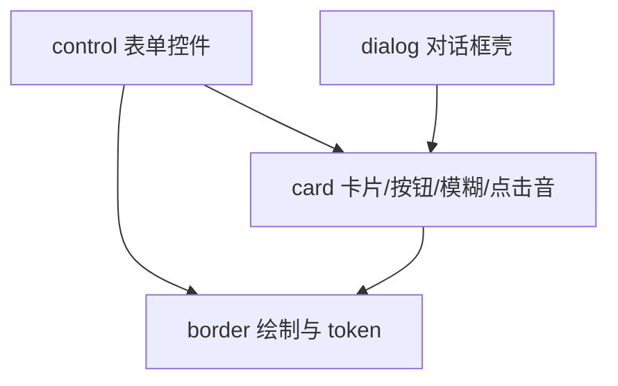
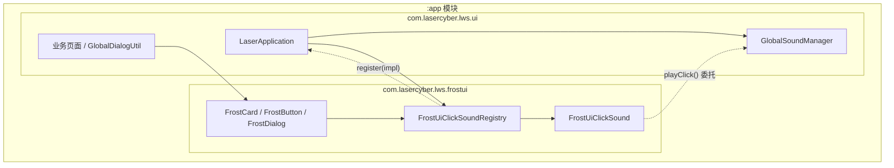
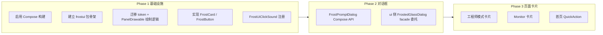

# FrostUI Compose 重构设计

本文档描述将现有 **雾化玻璃（Frosted Glass）UI** 从 `com.lasercyber.lws.ui` 中抽离，在 **app 模块内** 以 `com.lasercyber.lws.frostui` 包 + **Jetpack Compose** 逐步重构的设计方案。

**相关现状**：

- 现有实现位于 `app/src/main/java/com/lasercyber/lws/ui/component/dialog/`，约 21 个 `FrostedGlass*.java` 类及大量 `frosted_glass_*` XML 布局/资源。
- 项目已有 `com.lasercyber.lws.ai` 与 `com.lasercyber.lws.ui` 两个逻辑包，均在同一 `:app` Gradle 模块内。
- 项目尚未引入 Jetpack Compose；`kotlin-android` 插件已配置，无 `.kt` 源码。
- 设计规范见 `openspec/specs/frosted-glass-components/spec.md`、`openspec/specs/frosted-glass-dialog/spec.md`。

---

## 1. 背景与动机

当前 Frost UI 以 **View + XML** 实现，核心能力包括：

- `FrostedGlassPanelDrawable`：圆角玻璃填充与渐变边框绘制
- `FrostedGlassCard`：带 BlurView 实时背景模糊的卡片容器
- `FrostButton` / `FrostButtonView`：共享玻璃风格的按钮（含按压 alpha + ripple）
- `FrostedGlassDialog` / `FrostedGlassOverlayHost`：应用内 overlay 对话框栈与生命周期

该体系在对话框场景下工作良好，但存在以下问题：

1. 视觉逻辑与 `ui` 业务代码耦合在同一包路径下，难以作为独立设计系统演进。
2. 非对话框场景复用玻璃风格时，仍需手工拼装 drawable / BlurView。
3. 新 UI 若继续堆叠 XML，维护成本随 HMI 复杂度上升。

因此计划在 **不新建 Gradle 模块** 的前提下，参照 `ai` 包模式，引入 `frostui` 包并以 Compose 重构设计系统层。

---

## 2. 目标与非目标

### 2.1 目标

- 在 `app` 模块内建立逻辑独立的 `com.lasercyber.lws.frostui` 包。
- 使用 **Kotlin + Jetpack Compose** 实现可复用的 Frost 设计系统（Card、Button、Dialog 壳、主题 token、边框/模糊绘制）。
- `frostui` **不依赖** `com.lasercyber.lws.ui` 业务代码；`ui` 单向依赖 `frostui`。
- 通过 **点击音效注入接口**，由 app 层注册并委托现有 `GlobalSoundManager`，`frostui` 不直接持有 SoundPool。
- 采用渐进迁移（Strangler），旧 `FrostedGlass*` View 实现与新高代码并存，按场景逐步切换。

### 2.2 非目标

- **不** 新建 `:frostui` Gradle 库模块（源码根为 `app/src/main`，与 `ai` 包一致）。
- **不** 在 `frostui` 内复制或新建 `GlobalSoundManager` 实例。
- **不** 通过 `frostui` 接口处理告警音、输入反馈音等非点击音效。
- **不** 一次性重写全部 80+ 处 `FrostedGlass` 引用。
- **不** 替换 BlurView 或引入额外第三方 UI 框架（短期保留 BlurView，Compose 侧用 `AndroidView` 包装）。
- **不** 将 `GlobalDialogUtil`、`AutoDialogQueue`、`BootSelfCheckGate` 等业务编排迁入 `frostui`。

---

## 3. 架构决策

### 3.1 物理形态：app 内包，而非独立模块

| 方案 | 路径 | 结论 |
|------|------|------|
| **选用** | `app/src/main/kotlin/com/lasercyber/lws/frostui/` | 与 `com.lasercyber.lws.ai` 同级，迁移成本低，符合当前仓库结构 |
| 不选用 | `frostui/src/main/`（独立 Gradle 模块） | 本次不做；若未来需跨项目复用再评估拆分 |

`settings.gradle.kts` 保持现有 `include(":app", "library", ...)` 不变。

### 3.2 包命名

| 包 | 命名 |
|----|------|
| AI | `com.lasercyber.lws.ai` |
| UI（业务） | `com.lasercyber.lws.ui` |
| Frost 设计系统 | `com.lasercyber.lws.frostui` |

Gradle 子项目名、目录名、包名统一使用 **`frostui`**（不用 `frost`）。

### 3.3 源码目录：Kotlin 放 `kotlin/`，包名不变

Compose 实现使用 Kotlin，建议放在：

```
app/src/main/kotlin/com/lasercyber/lws/frostui/
```

而非 `java/.../frostui/`。Android Gradle Plugin 默认识别 `kotlin/` 与 `java/` 下的源码；包名仍为 `com.lasercyber.lws.frostui`，与目录名 `java` / `kotlin` 无关。

现有 `ai`、`ui` 继续保留在 `app/src/main/java/`，无需搬迁。

### 3.4 依赖方向

```
ui  ──依赖──▶  frostui
ai  ──（通常不依赖 frostui）
frostui  ──不依赖──▶  ui / ai
```

`frostui` 允许依赖：AndroidX、Compose BOM、BlurView、Material 等基础库。

---

## 4. 包结构

`frostui` 顶层保留四个包：**`border`**、**`card`**、**`control`**、**`dialog`**。其余原规划子包（`theme`、`blur`、`components`、`interaction`、`interop`）按职责并入对应层，避免目录过碎。

```
app/src/main/
├── kotlin/com/lasercyber/lws/frostui/
│   ├── border/                 # 底层视觉原子（无 card/dialog 依赖）
│   │   ├── BorderGradientCenter
│   │   ├── PanelBorderPainter / PanelFillPainter   # 原 FrostedGlassPanelDrawable 逻辑
│   │   ├── FrostColors、FrostDimens、FrostTypography
│   │   └── FrostTone、FrostBlurTint、FrostBlurIntensity
│   ├── card/                   # 卡片/按钮组合件（依赖 border）
│   │   ├── FrostCard、FrostButton、FrostText
│   │   ├── FrostBlur                 # BlurView 封装，原 blur/ 并入
│   │   ├── FrostUiClickSound         # 点击音契约，原 interaction/ 并入
│   │   ├── FrostUiClickSoundRegistry
│   │   └── interop/                  # FrostCardView 等 Java/XML 桥接
│   ├── control/                # 表单控件（依赖 border token；不依赖 ui）
│   │   ├── FrostSwitch、FrostCheckbox、FrostSlider
│   │   └── interop/                  # FrostSwitchView 等 Java/XML 桥接
│   └── dialog/                 # 对话框（依赖 card）
│       ├── FrostPromptDialog
│       ├── FrostOverlayHost
│       └── FrostOverlayState
├── java/com/lasercyber/lws/
│   ├── ai/                     # 现有，不变
│   └── ui/                     # 现有业务；逐步减少直接依赖旧 FrostedGlass*
└── res/
    └── values/
        ├── frosted_glass_*      # 现有 token（中期可收敛到 frostedui_*.xml）
        └── ...
```

### 4.0 四层职责与依赖

| 包 | 职责 | 依赖 |
|----|------|------|
| `border` | 玻璃填充/边框绘制、设计 token、色调枚举 | 仅 Android/Compose 基础库 |
| `card` | 可复用容器与按钮、背景模糊、点击音注册、View 互操作 | `border` |
| `control` | Switch、Checkbox、Slider 等表单控件（Compose + interop View） | `border` token；点击音经 `card.FrostUiClickSoundRegistry` |
| `dialog` | overlay 栈、prompt 槽位对话框 | `card` → `border` |



**并入规则（原细分子包 → 新四层）：**

| 原规划 | 并入 |
|--------|------|
| `theme/` | `border/`（颜色、尺寸、排版 token 服务于绘制） |
| `blur/` | `card/`（模糊是卡片背景能力，非独立产品概念） |
| `components/` | `card/`（`FrostCard`、`FrostBlur`）、`button/`（`FrostButton`） |
| `interaction/` | `card/`（点击音由按钮触发，契约与 Registry 放 card） |
| `interop/` | `card/interop/`、`control/interop/`（桥接对象服务于 Card/Button/Control 嵌入旧页面） |
| `ui.component` Switch/Checkbox/ScaledSlider | `control/`（已删除旧 Java 类，XML 直接用 `Frost*View`） |

### 4.1 迁入 `frostui` 的范围

| 类别 | 现有类/资源 | 说明 |
|------|-----------|------|
| 绘制 | `PanelFillDrawable` / `PanelBorderDrawable` / `PanelCompositeDrawable`（`frostui.border`） | View interop；Compose 侧 `PanelFillPainter` / `PanelBorderPainter` |
| 枚举/Token | `BorderGradientCenter`、`FrostTone`、`FrostBlurTint`、`FrostBlurIntensity`（`frostui.border`） | 设计 token；Java 门面已删 |
| 组件 | `FrostCard` / `FrostCardView`（`frostui.card`）、`FrostButton` / `FrostButtonView`（`frostui.button`） | Compose + XML interop；legacy `FrostedGlassButton` 已移除 |
| 模糊 | `FrostBlurViewSupport`（`frostui.blur`，规划中） | BlurView 封装；旧 `FrostedGlassBlurSupport` 已删 |
| 对话框壳 | `FrostOverlayHost`、`FrostPanelShell`（`frostui.dialog`） | 业务 gate 留在 `ui` |

### 4.2 留在 `ui` 的范围

| 类别 | 示例 | 原因 |
|------|------|------|
| 业务对话框 | `GlobalDialogUtil`、`WarnDialogUtil`、`AutoDialogQueue` | 依赖告警、工艺参数等业务模型 |
| 特化对话框 | `FrostWifiPasswordDialog`、`FrostNumericInputDialog` 等 | 强业务绑定 |
| 启动门控 | `BootSelfCheckGate` | 应用生命周期逻辑 |
| 音效实现 | `GlobalSoundManager`、`SoundEffectSettings` | 资源与设置由 app 统一管理 |
| 旧 View 兼容 | — | 主要 `@Deprecated` 委托已删 |

---

## 5. 点击音效：框架接口 + 应用层注册

### 5.1 设计原则

> **frostui 定义点击音效契约；app 在启动时注册实现，内部委托 `GlobalSoundManager`；frostui 组件在用户点击时仅调用该契约，不直接引用音效资源或设置。**

**禁止**：在 `frostui` 内再建一个 `GlobalSoundManager` 或第二套 SoundPool（会导致双实例、设置不同步、资源重复加载）。

**范围**：接口**仅覆盖点击音**。告警循环音（`warnSound`）、输入反馈音等仍由 `ui` 业务代码直接调用 `GlobalSoundManager`。

### 5.2 接口与注册中心（frostui 框架层）

```kotlin
// com.lasercyber.lws.frostui.common.FrostUiClickSound
fun interface FrostUiClickSound {
    fun playClick()
}
```

```kotlin
// com.lasercyber.lws.frostui.common.FrostUiClickSoundRegistry
object FrostUiClickSoundRegistry {
    @Volatile
    private var clickSound: FrostUiClickSound? = null

    fun register(provider: FrostUiClickSound) {
        clickSound = provider
    }

    internal fun playClick() {
        clickSound?.playClick()  // 未注册时静默 no-op
    }
}
```

- `register`：供 app 调用，进程内注册一次。
- `playClick`：`internal`，仅 `frostui` 内 `FrostButton` 等组件使用。
- 未注册：静默跳过，便于 Compose Preview 与单元测试。

### 5.3 应用层实现（ui）

在 `LaserApplication.onCreate()` 注册（与 `GlobalSoundManager.ensureInitialized` 同生命周期）：

```java
@Override
public void onCreate() {
    super.onCreate();
    Context appContext = getApplicationContext();
    GlobalSoundManager.ensureInitialized(appContext);

    FrostUiClickSoundRegistry.register(() ->
        GlobalSoundManager.playClickSound(appContext)
    );
}
```

`GlobalSoundManager` 已内置 150ms 点击防抖（`CLICK_DEBOUNCE_MS`），`frostui` 侧无需重复防抖。

### 5.4 与现有 `ClickSoundSupport` 的对应

| 现在（View） | 将来（frostui Compose） |
|--------------|-------------------------|
| `ClickSoundSupport.install(view)` | Compose 组件内通常无需关闭系统音效 |
| `ClickSoundSupport.play(view)` | `FrostUiClickSoundRegistry.playClick()` |

旧 View 组件在完全迁移前继续使用 `ClickSoundSupport`。

### 5.5 依赖关系示意



---

## 6. Compose 技术方案

### 6.1 构建配置（app/build.gradle.kts）

在 `:app` 模块启用 Compose（不新建子模块）：

- `buildFeatures { compose = true }`
- `composeOptions { kotlinCompilerExtensionVersion = "..." }`（与 Kotlin 1.9.24 配对，建议 ~1.5.14）
- 依赖 `androidx.compose:compose-bom` 及 `ui`、`material3`、`activity-compose`

版本条目补充至 `gradle/libs.versions.toml`。

### 6.2 View → Compose 映射

| 现有 View 实现 | Compose 目标 |
|----------------|--------------|
| `FrostedGlassPanelDrawable` | `FrostPanelBorder` + `FrostPanelFill`（`Modifier.drawBehind`） |
| `FrostedGlassCard` | `@Composable FrostCard` |
| Legacy View | Compose / interop 目标 |
|-------------|------------------------|
| `FrostedGlassPanelDrawable` | `frostui.border` painters |
| `FrostedGlassCard` | `FrostCard` / `FrostCardView` |
| `FrostedGlassButton`（已删除） | `FrostButton` / `FrostButtonView` |
| `FrostedGlassOverlayHost` | `FrostOverlayHost`（`frostui.dialog`） |
| `FrostedGlassDialog.prompt()` | **`FrostDialog.prompt()`**（`ui.component.dialog`） |
| BlurView | **Canonical**: live `BlurView` in `FrostCardView` / `AndroidView`; RenderScript snapshot fallback only |

边框渐变逻辑（`FrostedGlassPanelDrawable` 中的 sweep / radial / linear shader）应优先抽成 **纯 Kotlin 绘制函数**，供 Compose 复用，并与现有 instrumented test 对比回归。

### 6.3 与 Java 业务代码互操作

app 主体仍为 Java。过渡期两种方式：

**方式 A：`ComposeView`（页面内嵌）**

```java
ComposeView composeView = new ComposeView(context);
composeView.setContent(composer -> {
    FrostUiKt.FrostCard(/* ... */);
    return kotlin.Unit.INSTANCE;
});
```

**方式 B：`AbstractComposeView` 封装（XML 可引用）**

```kotlin
// frostui/card/interop/FrostCardView.kt
class FrostCardView @JvmOverloads constructor(
    context: Context, attrs: AttributeSet? = null
) : AbstractComposeView(context, attrs) {
    @Composable
    override fun Content() { FrostCard(/* ... */) }
}
```

便于将 XML 中的 `<com.lasercyber.lws.ui.component.dialog.FrostedGlassCard>` 逐步替换为 `<com.lasercyber.lws.frostui.interop.FrostCardView>`。

### 6.4 需抽象的其他 app 依赖

除点击音外，以下依赖**不**通过全局单例耦合，按需以参数或接口注入：

| 现有依赖 | 处理方式 |
|----------|----------|
| `SystemSettingUtils` / `AndroidEmulatorUtils` | 模糊强度等通过 `FrostEnvironment` 接口或构造参数注入 |
| `BootSelfCheckGate` | 留在 `ui` 的 dialog wrapper |
| `BlurUtils` | 绘制逻辑迁入 `frostui/card`（`FrostBlur`），或接口注入 |
| `com.lasercyber.lws.ui.R` | 同模块可暂用；中期将 `frosted_glass_*` token 收敛到独立 values 文件 |

---

## 7. 迁移计划

采用 Strangler 模式，分阶段推进：



### Phase 1 — 基础设施

1. `app/build.gradle.kts` 启用 Compose 与 BOM 依赖。
2. 创建 `frostui` 三层包骨架：`border`、`card`、`dialog`。
3. 在 `border/` 迁移 `FrostedGlassPanelDrawable` 绘制逻辑与设计 token。
4. 在 `card/` 实现 `FrostUiClickSound` + `FrostUiClickSoundRegistry`（`LaserApplication` 注册）、`FrostCard`、`FrostButton`。
5. 用现有 `FrostedGlassPanelDrawableInstrumentedTest` 做 `border/` 绘制回归基准。

### Phase 2 — 对话框（已完成主体）

1. `FrostOverlayHost` + `FrostPromptDialogController` 实现 overlay / prompt 栈。
2. `ui` 公开 API 为 **`FrostDialog`** + `Frost*Dialog` wrapper；`FrostedGlassDialog` 已删除。
3. 布局资源：`dialog_frost_prompt.xml`、`dialog_frost_light_overlay.xml`、`dialog_frost_body_*`；shell view id 前缀 `frost_dialog_*`。

### Phase 3 — 内嵌卡片（进行中）

1. **`FrostQuickActionEntry`** / **`FrostRippleClickEntry`** 已更名；首页 stat 卡片已用 `FrostCardView`。
2. 使用 `ComposeView` 或 `FrostCardView` 嵌入现有 Fragment，无需先改整页架构。
3. 旧 `FrostedGlass*` Java 门面（`PanelDrawable`、Blur token 等）在无引用后删除。

---

## 8. 测试与验收

| 类型 | 位置 | 说明 |
|------|------|------|
| 绘制回归 | `frostui` androidTest | 承接 `FrostedGlassPanelDrawableInstrumentedTest` |
| 模糊强度 | `frostui` test | 承接 `FrostedGlassBlurIntensityTest` |
| 点击音 | 手动 / 仪器测试 | 验证 `FrostButton` 点击触发 `GlobalSoundManager`，设置页切换音效后 frostui 按钮同步 |
| 视觉 | emulator `make sync` | 每 Phase 对比 prompt、卡片、按钮与现网 View 版 |

---

## 9. 风险与规避

| 风险 | 规避 |
|------|------|
| 资源 ID / token 重复 | `frosted_glass_*` 集中管理，避免 `ui` 与 `frostui` 各维护一份冲突 dimen/color |
| `frostui` 反向依赖 `ui` | Code review 禁止 `import com.lasercyber.lws.ui.*` |
| 双 SoundPool | 仅通过 `FrostUiClickSound` 注入，禁止在 `frostui` 内 new `GlobalSoundManager` |
| BlurView 生命周期 | Compose overlay 用 `remember` + `DisposableEffect` 对齐 `FrostedGlassOverlayHost`  per-activity 栈 |
| Compose Compiler 版本不匹配 | Kotlin 1.9.24 必须配对正确 compose compiler，否则无法编译 |
| Big Bang 迁移 | 保持旧 View API 与 facade，按 Phase 逐步切换调用方 |

---

## 10. 与现有 OpenSpec 的关系

- `openspec/specs/frosted-glass-components/spec.md`：Card/Button 视觉与 `borderGradientCenter` 行为仍为验收标准；实现载体从 View 变为 Compose，**对外视觉契约不变**。
- `openspec/specs/frosted-glass-dialog/spec.md`：Dialog 槽位、backdrop blur、overlay 栈语义不变；`ui` facade 保持调用方 API 稳定。
- `openspec/changes/archive/2026-06-10-add-frosted-glass-components/design.md`：原决策为 View 实现；本文档为 **Compose + frostui 包** 的演进设计，不推翻视觉 token 与边框语义。

---

## 11. 迁移状态（2026-06-22）

| 区域 | 状态 | 说明 |
|------|------|------|
| `frostui.border` / `card` / `button` / `control` | 完成 | Compose + `Frost*View` interop |
| Dialog 栈 | 完成 | `FrostDialog`、`FrostOverlayHost`、资源 `dialog_frost_*` |
| 专用 dialog wrapper | 完成 | `FrostWifiPasswordDialog` 等 |
| 首页 stat 卡片 | 完成 | `FrostCardView` |
| `FrostQuickActionEntry` | 完成 | 原 `FrostedGlassQuickActionEntry` |
| `FrostRippleClickEntry` | 完成 | 原 `HomeRippleClickEntry` |
| 共享 token `frost_*` | 完成 | color/dimen/drawable/id；XML attr `frostedGlass*` 仍保留 interop |
| Java 绘制/Token 门面 | 完成 | `FrostedGlassPanelDrawable`、`FrostedGlassBlurIntensity/Tint`、`FrostedGlassBorderGradientCenter`、`FrostedGlassBlurSupport` 已删；shell 用 `PanelShellDrawables` |
| `@Deprecated` API 委托 | 完成 | `showFrostedGlassPromptDialog`、`applyFrostedGlassStyle`、`enqueueFrostedGlass` 已删；`AutoDialogQueue.enqueueFrostDialog` |
| BlurView 主路径 | 完成 | `FrostBlurViewSupport`、`FrostStackBlur`/HokoBlur 已删；RS fallback via registry |

## 12. 待办清单（历史实施入口）

- [x] `app/build.gradle.kts`：Compose + BOM + compiler 版本
- [x] `frostui/border/`：PanelBorderPainter、FrostColors、FrostDimens、BorderGradientCenter
- [x] `frostui/card/FrostUiClickSound.kt`、`FrostUiClickSoundRegistry.kt`
- [x] `frostui/card/FrostCard.kt`、`FrostButton.kt`
- [x] `frostui/card/interop/FrostCardView.kt`
- [x] `frostui/dialog/`：`FrostOverlayHost`、`FrostPromptDialogController`
- [x] `FrostDialog` + `dialog_frost_*` 资源重命名
- [x] 共享 `frost_*` color/dimen/drawable token 全量 rename（E.6.3）
- [x] 删除 Java 绘制/Token 门面（`FrostedGlassPanelDrawable` 等；见 §11）
- [x] 删除无引用的 `@Deprecated` API 薄委托（prompt/picker/auto-dialog 命名）

---

## 修订记录

| 日期 | 说明 |
|------|------|
| 2026-06-15 | 初稿：基于 frostui 包内重构、Compose 迁移、点击音注入接口等架构讨论定稿 |
| 2026-06-15 | 包结构收敛为 `border` / `card` / `dialog` 三层，合并原 theme/blur/components/interaction/interop |
| 2026-06-22 | E.6.3：共享 resource token `frosted_glass_*` → `frost_*`（color/dimen/drawable/id/style） |
| 2026-06-22 | 删除 Java 绘制/Token 门面；新增 `PanelBorderDrawable` / `PanelCompositeDrawable` / `PanelShellDrawables` |
| 2026-06-22 | 删除 `@Deprecated` 委托；`AutoDialogQueue.enqueueFrostDialog` |
