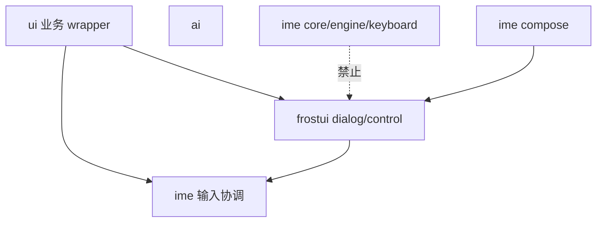

# IME Compose 重构设计

本文档描述将现有 **软键盘（IME / Input Method Editor）协调逻辑** 从 `com.lasercyber.lws.ui` 中抽离，在 **app 模块内** 以 `com.lasercyber.lws.ime` 包 + **Kotlin + Jetpack Compose** 逐步重构的设计方案。

**相关现状**：

- 现有实现位于 `app/src/main/java/com/lasercyber/lws/ui/component/dialog/FrostedGlassImeCoordinator.java`（约 400 行），由 `FrostedGlassTextInputDialog`、`FrostedGlassNumericInputDialog`、`FrostedGlassWifiPasswordDialog` 等 wrapper 手动 `attach` / `detach`。
- 项目已有 `com.lasercyber.lws.ai`、`com.lasercyber.lws.frostui`、`com.lasercyber.lws.ui` 三个逻辑包，均在同一 `:app` Gradle 模块内。
- `frostui` dialog 层（`FrostOverlayHost`）已实现 overlay 栈与 frozen backdrop；IME 弹出后需刷新 backdrop 以对齐可见页面区域（`refreshFrozenBackdropAfterIme`）。
- 设计规范见 `openspec/specs/frosted-glass-dialog/spec.md`（IME 不压缩宿主背景）、`openspec/specs/frosted-glass-numeric-input-dialog/spec.md`、`openspec/specs/wifi-password-connect-dialog/spec.md`（键盘 Connect 提交）。
- 姊妹文档：`docs/frostui-compose-refactor-design.md`（Phase 2 曾规划将 `FrostedGlassImeCoordinator` 迁入 frostui；现改为 **IME 与 frostui 同级**）。

---

## 1. 背景与动机

当前 HMI 输入场景以 **overlay 对话框 + 系统软键盘** 为主。`FrostedGlassImeCoordinator` 已验证以下策略在真机/模拟器上可行：

1. 弹窗显示期间将宿主 Activity `softInputMode` 临时设为 `SOFT_INPUT_ADJUST_NOTHING`，避免背景页面被 `adjustResize` 压缩。
2. 读取 IME bottom inset，仅对 **overlay 卡片** 应用 `translationY`，使输入区保持在键盘上方。
3. dismiss 时恢复 `softInputMode`、强制 hide IME、清理 residual inset。
4. 键盘完全弹出且卡片已抬升后，触发 frozen backdrop 重采样（与 `FrostOverlayHost` 协作）。

该实现工作良好，但存在以下问题：

1. **职责与 frost 视觉耦合**：IME 协调类放在 `ui.component.dialog` 且命名带 `FrostedGlass`，难以在非 frost 场景复用（例如未来全屏表单、设置页内联编辑）。
2. **样板代码分散**：每个输入 dialog wrapper 重复 `attach` / `detach` / `showKeyboardFor` / `hideKeyboard` 调用链。
3. **与 frostui 边界不清**：`FrostedGlassImeCoordinator` 直接 import `FrostOverlayHost`、`FrostCardView`，违反「横切能力应可注入」的分层原则。
4. **Compose 迁移缺位**：`frostui` 已有 Compose dialog/control，但无统一的 Compose IME Host / TextField 原语。

因此计划在 **不新建 Gradle 模块** 的前提下，参照 `ai` / `frostui` 包模式，引入与 `frostui` **同级** 的 `ime` 包，并以 Compose 提供可复用的输入协调层。

---

## 2. 目标与非目标

### 2.1 目标

- 在 `app` 模块内建立逻辑独立的 `com.lasercyber.lws.ime` 包（与 `frostui` 同级，**不**作为 `frostui` 子包）。
- 使用 **Kotlin + Jetpack Compose** 实现 **应用内自定义 IME 键盘**（三种键盘、长按 popup、可配置回车），API 对齐 `ImeInputConnection` / `ImeAction` 标准。
- 使用 **Kotlin** 平移并泛化 `FrostedGlassImeCoordinator` 为 `ImeController`（宿主不 resize、overlay 抬升、隐藏系统 IME）。
- `ime/core`、`ime/engine`、`ime/keyboard` **不依赖** `ui`；`ime/compose` 可依赖 **`frostui.button.FrostButton`** 渲染键帽；`ui` / `frostui` 单向依赖 `ime`。
- 通过 **`ImeRegistry` 注入钩子**，由 app 层注册 frost 特化副作用（backdrop 刷新、static backdrop matrix 同步），`ime` 核心不感知 Frost 实现细节。
- 采用渐进迁移（Strangler）：保留 View interop 路径，与现有 XML `EditText` body 并存，按场景逐步切换。

### 2.2 非目标

- **不** 首版注册系统 `InputMethodService`（交付形态为应用内键盘面板；API 预留后续升级）。
- **不** 首版实现完整中文拼音/组词引擎（中文全局键盘与英文同 QWERTY 键位，语言由设置驱动）。
- **不** 新建 `:ime` Gradle 库模块（源码根为 `app/src/main/kotlin`，与 `frostui` 一致）。
- **不** 将 WiFi 连接、工程师参数校验、Modbus 写入等业务逻辑迁入 `ime`。
- **不** 一次性重写全部输入 dialog wrapper 与 XML body layout。
- **不** 在 `ime` 内处理告警音、输入反馈音等非 IME 协调职责。
- **不** 在支持的 HMI 输入场景继续使用 OEM 系统软键盘（由自定义面板替代）。

---

## 3. 架构决策

### 3.1 物理形态：app 内包，与 frostui 同级

| 方案 | 路径 | 结论 |
|------|------|------|
| **选用** | `app/src/main/kotlin/com/lasercyber/lws/ime/` | 与 `frostui`、`ai` 同级；IME 为全 app 横切能力，非 frost 专属 |
| 不选用 | `frostui/ime/` | IME 语义与视觉解耦；未来非 frost 页面也可复用 |
| 不选用 | `ime/src/main/`（独立 Gradle 模块） | 本次不做；若未来跨项目复用再评估 |

`settings.gradle.kts` 保持现有 `include(":app", "library", ...)` 不变。

### 3.2 包命名

| 包 | 命名 |
|----|------|
| AI | `com.lasercyber.lws.ai` |
| IME（输入协调） | `com.lasercyber.lws.ime` |
| Frost 设计系统 | `com.lasercyber.lws.frostui` |
| UI（业务） | `com.lasercyber.lws.ui` |

目录名、包名统一使用 **`ime`**（全小写）。

### 3.3 源码目录

```
app/src/main/kotlin/com/lasercyber/lws/ime/
```

Compose 与 core 逻辑均放 Kotlin 源码树；Java 业务代码通过 `ImeController`（`@JvmStatic`）与 interop 桥接调用。

### 3.4 依赖方向

```
ui       ──依赖──▶  ime
frostui  ──依赖──▶  ime
ui       ──依赖──▶  frostui
ai       ──（通常不依赖 ime / frostui）
ime/core|engine|keyboard  ──不依赖──▶  ui / frostui
ime/compose  ──依赖──▶  frostui.card（键帽 FrostButton）
```

`ime` 允许依赖：AndroidX Core、Compose BOM、Material 等基础库；`ime/compose` 额外依赖 `frostui` 键帽组件。



---

## 4. 包结构

`ime` 顶层分 **`core`**、**`engine`**、**`keyboard`**、**`compose`**、**`interop`**，加根级 **`ImeRegistry`** 与 **`ImeAction`**。

```
app/src/main/
├── kotlin/com/lasercyber/lws/ime/
│   ├── core/                       # 平台无关协调逻辑（可无 Compose 依赖的纯 Kotlin + Android View API）
│   │   ├── ImeConfig.kt            # hostAdjustPolicy、liftPolicy、margin、threshold
│   │   ├── ImeHostPolicy.kt        # HostAdjustPolicy / CardLiftPolicy 枚举
│   │   ├── ImeInsets.kt            # 键盘高度、translationY 纯函数（可单测）
│   │   ├── ImeSession.kt           # per-Activity refcount session 状态
│   │   ├── ImeAnchor.kt            # applyLift / resetLift 抽象
│   │   └── ImeController.kt        # attach / detach / show / hide 入口
│   ├── engine/                     # IME 标准输入引擎
│   │   ├── ImeInputConnection.kt   # commitText / deleteBackward / performEditorAction
│   │   └── ImeEnterKeyConfig.kt    # 回车 label / icon / action
│   ├── keyboard/                   # 布局与交互（无 Compose）
│   │   ├── KeyboardKind.kt         # EnglishGlobal / ChineseGlobal / Numeric
│   │   ├── layout/GlobalQwertyLayout.kt
│   │   ├── layout/NumericLayout.kt
│   │   └── popup/ImeLetterPopupState.kt
│   ├── compose/                    # Jetpack Compose 键盘 UI
│   │   ├── rememberImeSession.kt
│   │   ├── ImeHost.kt              # overlay + 面板容器
│   │   ├── ImeKeyboardPanel.kt     # 主键盘（FrostButton 键帽）
│   │   ├── ImeKeyCap.kt            # 单键 + 角标 secondary
│   │   └── popup/ImeLetterPopup.kt  # 长按 大写|第二功能|小写
│   ├── interop/                    # View / XML 互操作（迁移期主力）
│   │   ├── ViewImeAnchor.kt        # 对 View 卡片应用 translationY
│   │   ├── ViewImeBridge.kt        # attach(activity, overlay, cardView)
│   │   └── ViewImeEditorAction.kt  # Done / Go / Custom label（WiFi Connect）
│   ├── ImeAction.kt                # Done / Go / Custom(actionId, label)
│   └── ImeRegistry.kt              # 可选副作用钩子（backdrop 等）
├── kotlin/com/lasercyber/lws/frostui/
│   └── dialog/                     # 消费 ime：FrostPromptConfig.imeConfig
└── java/com/lasercyber/lws/ui/
    └── component/dialog/           # 迁移期：FrostedGlass* wrapper 委托 ImeController
```

### 4.1 各层职责与依赖

| 包 | 职责 | 依赖 |
|----|------|------|
| `core` | session、softInputMode、面板高度抬升 | Android View / Window |
| `engine` | InputConnection、EditorAction | `core` |
| `keyboard` | 三种键盘 KeyDef、第二功能表、popup 状态 | 无 UI |
| `compose` | `ImeKeyboardPanel`、FrostButton 键帽、长按 popup | `core` + `engine` + `keyboard` + **frostui** |
| `interop` | View 卡片抬升、EditText 连接 | `core` + `engine` |

### 4.2 自定义键盘（产品需求摘要）

| 项 | 规格 |
|----|------|
| 键盘种类 | **中文全局**、**英文全局**、**数字 0–9** |
| 语言 | Common Settings 语言 → `zh*` 用中文全局，否则英文全局；数字 `inputType` → 数字键盘 |
| 全局上区 | 参照真机图一：QWERTY 三行 + Shift/退格；字母键角标第二功能（Q→1 … P→0 等） |
| 全局底行 | **5 键**（图三）：`123`/`abc`、空格、逗号/句点、`@`、**回车** |
| 数字键盘 | 参照真机：0–9 + 退格 + 回车 |
| 长按 | **任意字母**长按 → 悬浮三选一：**大写 \| 第二功能 \| 小写**（图二） |
| 回车 | `ImeEnterKeyConfig` + `ImeEnterKeyDisplay`（**文本 / 图标 / 二者**）；**始终 PRIMARY 橘黄**；action 可配置 |
| 普通键帽 | `FrostButton` DEFAULT，雾化玻璃 + 按下效果 + 点击音 |
| 系统 IME | 显示自定义键盘时 **隐藏** `InputMethodManager.showSoftInput` |

**第二功能对照（与图一一致）：**

| 行 | 键 | 第二功能 |
|----|-----|----------|
| 1 | Q–P | 1–0 |
| 2 | A–L | ~ ! @ # % " ' * ? |
| 3 | Z–M | ( ) - _ : ; / |

### 4.3 迁入 `ime` 的范围

| 类别 | 现有实现 | 说明 |
|------|----------|------|
| Session 管理 | `FrostedGlassImeCoordinator.attach/detach` | refcount + softInputMode save/restore |
| Inset / 抬升 | `computeCardTranslationY`、`resolveKeyboardHeight` | 抽为 `ImeInsets` 纯函数 |
| 键盘显隐 | `showKeyboardFor`、`hideKeyboard`、`hideKeyboardFromActivity` | `ImeController` |
| Dismiss 清理 | `restoreHostWindow`、`applyHostWindowInsetsReset` | `ImeSession` teardown |
| 自定义键盘 UI | （新增） | `ImeKeyboardPanel`、三种 layout、长按 popup |
| Editor action | 各 wrapper 重复逻辑 | `ImeEnterKeyConfig` + 自定义回车键 |

### 4.4 留在 `ui` / `frostui` 的范围

| 类别 | 示例 | 原因 |
|------|------|------|
| 业务输入 dialog | `FrostedGlassWifiPasswordDialog`、工程师参数 builder | 校验、Modbus、字符串资源 |
| Frozen backdrop 实现 | `FrostOverlayHost.refreshFrozenBackdropAfterIme` | frost 视觉特化；经 `ImeRegistry` 回调 |
| Static backdrop matrix | `FrostCardView.syncStaticBackdropMatrix` | frost 卡片特化；经 `ImeRegistry` 回调 |
| 对话框壳 / scrim | `FrostOverlayHost`、`FrostPromptDialog` | frostui 职责；仅 **消费** `ImeConfig` |

---

## 5. 核心行为：与现有 Java 实现的对应

`FrostedGlassImeCoordinator` 是当前唯一权威实现。迁移时 **行为等价优先**，再逐步 Compose 化。

### 5.1 Host window 策略

| 时机 | 行为 |
|------|------|
| 首个 IME session attach | 保存 `window.attributes.softInputMode`，设为 `(mode & ~SOFT_INPUT_MASK_ADJUST) \| SOFT_INPUT_ADJUST_NOTHING` |
| 最后一个 session detach | 恢复 saved mode；hide IME；对 content root 多次 `requestApplyInsets` + deep `requestLayout`（80ms / 200ms 延迟） |

refcount 按 **Activity** 维度计数，支持 overlay 栈叠（与现有 `Session.refCount` 一致）。

### 5.2 卡片抬升算法

1. 读取 IME inset：`WindowInsetsCompat.Type.ime()`；fallback 为 `getWindowVisibleDisplayFrame` 差值。
2. 键盘高度 &lt; 80px 阈值 → `translationY = 0`。
3. 否则 `computeCardTranslationY`：在可见区域（扣除键盘）内 **垂直居中**；空间不足则 **贴键盘上方 + 24dp margin**。
4. 对 anchor 应用 `translationY`；触发 `ImeRegistry.onAnchorLiftApplied`（app 层同步 Frost  static backdrop matrix）。

### 5.3 键盘弹出与 focus

`showKeyboardFor` 逻辑保留：

- 等待 `EditText` layout 完成后再 `requestFocus` + `InputMethodManager.showSoftInput`。
- 50 / 150 / 350 / 600 ms 重试（blur 重排可能清掉过早 focus）。

Compose 侧等价物：`ImeAutoFocusEffect` + `FocusRequester` + `LocalSoftwareKeyboardController`。

### 5.4 Frozen backdrop 刷新（注入，不进 core）

键盘可见且卡片已抬升、且尚未刷新时：

```kotlin
ImeRegistry.onKeyboardShown?.invoke(activity, keyboardHeightPx)
```

app 层注册（例如在 `FrostUiDialogBridge`）：

```kotlin
ImeRegistry.onKeyboardShown = { activity, _ ->
    FrostOverlayHost.refreshFrozenBackdropAfterIme(activity)
}
ImeRegistry.onAnchorLiftApplied = { view ->
    (view as? FrostCardView)?.syncStaticBackdropMatrix()
}
```

**禁止**在 `ime/core` 内 `import com.lasercyber.lws.frostui.*`。

---

## 6. 公共 API 设计

### 6.1 配置

```kotlin
data class ImeConfig(
    val hostAdjustPolicy: HostAdjustPolicy = HostAdjustPolicy.AdjustNothing,
    val cardLiftPolicy: CardLiftPolicy = CardLiftPolicy.TranslateCenterOrAboveKeyboard,
    val enterKey: ImeEnterKeyConfig = ImeEnterKeyConfig.default(),
    val keyboardMargin: Dp = 24.dp,
    val visibleThreshold: Dp = 80.dp,
)

enum class HostAdjustPolicy { AdjustNothing, PreserveHost }
enum class CardLiftPolicy {
    None,                              // 不抬升（全屏页可用 Modifier.imePadding）
    TranslateCenterOrAboveKeyboard,    // 对齐现有 FrostedGlassImeCoordinator
}
```

### 6.2 Controller（Java 可调用）

```kotlin
object ImeController {
    @JvmStatic
    fun attach(activity: Activity, sessionKey: Any, anchor: ImeAnchor, config: ImeConfig = ImeConfig())

    @JvmStatic
    fun detach(activity: Activity, sessionKey: Any)

    @JvmStatic
    fun hideKeyboard(focusOwner: View? = null)

    @JvmStatic
    fun showKeyboard(focusOwner: View, activity: Activity? = null)
}

interface ImeAnchor {
    fun applyLift(translationPx: Float)
    fun resetLift()
}
```

View 迁移便捷入口：

```kotlin
// interop/ViewImeBridge.kt
fun ImeController.attach(activity: Activity, sessionKey: Any, overlayRoot: View, cardView: View, config: ImeConfig = ImeConfig())
```

### 6.3 Compose

```kotlin
@Composable
fun rememberImeSession(config: ImeConfig = ImeConfig()): ImeSessionState

@Composable
fun ImeHost(
    session: ImeSessionState,
    modifier: Modifier = Modifier,
    content: @Composable BoxScope.(liftOffsetPx: Int) -> Unit,
)

@Composable
fun ImeTextField(
    value: String,
    onValueChange: (String) -> Unit,
    imeAction: ImeAction = ImeAction.Done,
    onImeAction: () -> Boolean = { false },
    autoFocus: Boolean = false,
    modifier: Modifier = Modifier,
)
```

### 6.4 IME 提交动作

```kotlin
sealed class ImeAction {
    data object Done : ImeAction()
    data object Go : ImeAction()
    data class Custom(val actionId: Int, val label: String) : ImeAction()  // WiFi Connect
}
```

| 场景 | 策略 |
|------|------|
| 文本 / 数字输入 | Compose：`KeyboardOptions(imeAction = ImeAction.Done)`；View：`IME_ACTION_DONE` |
| WiFi 密码 | View interop：`setImeActionLabel(connectString, actionId)`（OEM 键盘 custom label 不稳定，保留 View 路径） |
| 硬件 Enter | `KeyEvent.KEYCODE_ENTER` + `ACTION_DOWN`，与 Enter 键 action 同等触发 submit |

### 6.5 可自定义回车键（文本 / 图标，始终 PRIMARY）

Enter 键 **永远是 PRIMARY 橘黄按钮**；键面内容由 `ImeEnterKeyDisplay` 决定，支持 **仅文本、仅图标、或文本+图标**。

```kotlin
data class ImeEnterKeyConfig(
    val display: ImeEnterKeyDisplay,
    val action: ImeAction = ImeAction.Done,
) {
    companion object {
        fun default() = ImeEnterKeyConfig(display = ImeEnterKeyDisplay.Default)
    }
}

sealed interface ImeEnterKeyDisplay {
    data class Text(val label: String) : ImeEnterKeyDisplay
    data class Icon(@DrawableRes val iconRes: Int, val contentDescription: String? = null) : ImeEnterKeyDisplay
    data class TextAndIcon(val label: String, @DrawableRes val iconRes: Int, val contentDescription: String? = null) : ImeEnterKeyDisplay
    data object Default : ImeEnterKeyDisplay  // 内置 return 图标
}

@Composable
fun ImeEnterKey(config: ImeEnterKeyConfig, onClick: () -> Unit, modifier: Modifier = Modifier)
// 内部固定 FrostButtonVariant.PRIMARY；按 display 渲染 Text / Icon / 二者
```

| 场景 | `display` 示例 |
|------|----------------|
| 默认 Done | `Default` 或 `Icon(R.drawable.ic_ime_enter)` |
| WiFi 连接 | `Text(getString(R.string.wifi_dialog_connect))` |
| 图标确认 | `Icon(R.drawable.ic_chevron_right)` |
| 图文并存 | `TextAndIcon("OK", R.drawable.ic_check)` |

---

## 7. frostui 集成

`frostui` **单向依赖** `ime`，不在 frostui 内重复 IME 逻辑。

### 7.1 FrostPromptConfig 扩展

```kotlin
data class FrostPromptConfig(
    // ...existing fields...
    val imeConfig: ImeConfig? = null,
    val deferFrozenBackdropUntilIme: Boolean = false,  // 已有，保持不变
)
```

当 `imeConfig != null` 时，`FrostOverlayHost.attachOverlay` / `FrostPromptDialogController` 负责：

1. `ImeController.attach(activity, overlay, ViewImeAnchor(card), imeConfig)`
2. dismiss 回调中 `ImeController.detach`

输入类 wrapper（`FrostedGlassTextInputDialog` 等）不再手写 attach/detach。

### 7.2 control 层

`FrostNumericStepper` 内嵌 `EditText` 的 `imeOptions` 与 submit 回调，逐步改为复用 `ImeAction.Done` 约定或 Compose `ImeTextField`。

### 7.3 与 `deferFrozenBackdropUntilIme` 的关系

| 标志 | 行为 |
|------|------|
| `deferFrozenBackdropUntilIme = true` | 对话框打开时不立即全窗 frozen capture；待 IME 弹出且卡片抬升后，由 `ImeRegistry.onKeyboardShown` 触发 card-anchor capture |
| `imeConfig = null` | 只读 prompt，不 attach IME session |

---

## 8. ui 层 wrapper 迁移目标

### 8.1 迁移前后对比

**迁移前**（每个 wrapper 重复）：

```java
FrostedGlassImeCoordinator.attach(activity, overlay, card);
FrostedGlassImeCoordinator.showKeyboardFor(input, activity);
// onDismiss:
FrostedGlassImeCoordinator.hideKeyboard(input);
FrostedGlassImeCoordinator.detach(activity, overlay);
```

**迁移后（Phase 2+）**：

```kotlin
FrostPromptDialog.show(
    config.copy(
        imeConfig = ImeConfig(),
        deferFrozenBackdropUntilIme = true,
        body = { /* ImeTextField 或 XML interop */ },
    )
)
```

业务 wrapper 仅保留：标题、默认值、校验 lambda、submit/dismiss。

### 8.2 涉及 call site

| Wrapper | IME 特化 |
|---------|----------|
| `FrostedGlassTextInputDialog` | `IME_ACTION_DONE` / Enter 提交 |
| `FrostedGlassNumericInputDialog` | Done/Send + 步进按钮 |
| `FrostedGlassWifiPasswordDialog` | `ImeAction.Custom` + 无 on-screen Connect 按钮 |

### 8.3 兼容 facade

迁移期保留 `FrostedGlassImeCoordinator` 为 `@Deprecated` 薄委托：

```java
@Deprecated
final class FrostedGlassImeCoordinator {
    static void attach(...) { ImeController.attach(...); }
    // ...
}
```

无引用后删除。

---

## 9. Compose 技术要点

### 9.1 overlay 场景：**不用** root `imePadding`

对 in-window overlay（背景页面必须保持原高度），**禁止**在 overlay root 使用 `Modifier.imePadding()` 或依赖宿主 `adjustResize`。

正确模式：

```kotlin
Box(Modifier.fillMaxSize()) {
    // 背景 / scrim：不响应 IME inset
    FrostCard(
        modifier = Modifier
            .align(Alignment.Center)
            .offset { IntOffset(0, -liftOffsetPx) },
    ) {
        ImeTextField(...)
    }
}
```

`liftOffsetPx` 由 `ImeHost` / `rememberImeSession` 根据 `WindowInsets.ime` 与 `ImeInsets.computeLift` 计算，算法与 View 版一致。

### 9.2 全屏表单场景（未来）

非 overlay 的全屏 Compose 页可使用 `Modifier.imePadding()` 或 `imeNestedScroll`；通过 `ImeConfig(cardLiftPolicy = None)` 关闭卡片抬升。

### 9.3 Hybrid 迁移

现有 dialog body 仍为 XML + `EditText` 时：

- Session 走 `interop.ViewImeBridge.attach`
- 卡片为 `FrostCardView` 时 lift 仍用 `View.translationY`
- Compose body 就绪后切换为 `ImeHost` + `ImeTextField`

### 9.4 依赖 Blankj `KeyboardUtils`

新代码优先使用 `InputMethodManager` + `WindowInsetsControllerCompat`（与现有 Java 中 `hideKeyboardFromActivity` 一致）。`KeyboardUtils` 仅在迁移期 interop 保留，最终移除对 Blankj 的 IME 相关依赖。

---

## 10. Registry：ImeRegistry

与 `FrostUiClickSoundRegistry` 同模式——**框架定义契约，app 注册实现**。

```kotlin
object ImeRegistry {
    /** 键盘完全弹出且卡片已抬升；返回 value 忽略，仅 side effect */
    @JvmField
    var onKeyboardShown: ((Activity, keyboardHeightPx: Int) -> Unit)? = null

    /** 卡片 translationY 应用后；用于 Frost static backdrop matrix 同步 */
    @JvmField
    var onAnchorLiftApplied: ((View) -> Unit)? = null
}
```

注册时机：`LaserApplication.onCreate()` 或 `FrostUiDialogBridge` 静态初始化块（与现有 `FrostOverlayHostRegistry` 并列）。

未注册：`onKeyboardShown` / `onAnchorLiftApplied` 为 no-op，不影响非 frost 场景。

---

## 11. 迁移计划

采用 Strangler 模式，与 `frostui` 迁移 **可并行、可独立验收**。

```mermaid
flowchart LR
    subgraph phase1 [Phase 1 平移 core]
        P1A[建立 ime 包骨架]
        P1B[Kotlin 平移 FrostedGlassImeCoordinator]
        P1C[ImeInsets 单测]
        P1D[Deprecated Java facade]
    end
    subgraph phase2 [Phase 2 Registry + frostui]
        P2A[ImeRegistry + app 注册]
        P2B[FrostPromptConfig.imeConfig]
        P2C[wrapper 去掉手写 attach]
    end
    subgraph phase3 [Phase 3 Compose]
        P3A[ImeHost / ImeTextField]
        P3B[至少 1 个 Compose body 输入 dialog]
        P3C[FrostNumericStepper 统一 ImeAction]
    end
    subgraph phase4 [Phase 4 清理]
        P4A[删除 FrostedGlassImeCoordinator]
        P4B[OpenSpec ime-overlay-input]
    end
    phase1 --> phase2 --> phase3 --> phase4
```



### Phase 1 — 平移 core（行为等价）

1. 创建 `app/src/main/kotlin/com/lasercyber/lws/ime/` 包骨架。
2. 将 `FrostedGlassImeCoordinator` 逻辑逐行迁入 `ImeController` / `ImeSession` / `ImeInsets`。
3. `FrostedGlassImeCoordinator` 改为 `@Deprecated` 委托。
4. 单元测试：`ImeInsets.computeCardTranslationY`（纯函数，传入 mock 尺寸）。

**验收**：工程师模式整数/小数输入、WiFi 密码、文本输入 dialog 在 emulator 上行为与迁移前一致。

### Phase 2 — Registry + frostui 挂钩

1. 实现 `ImeRegistry`；在 `FrostUiDialogBridge` 注册 backdrop / matrix 钩子。
2. `ime/core` 删除对 `FrostOverlayHost`、`FrostCardView` 的直接 import。
3. `FrostPromptConfig.imeConfig`；`FrostOverlayHost` 内置 attach/detach。
4. 三个输入 wrapper 去掉手写 IME 样板。

**验收**：`deferFrozenBackdropUntilIme` + 键盘弹出后 blur 对齐仍正常；多 overlay 栈 softInputMode 恢复正确。

### Phase 3 — Compose 原语

1. `ImeHost`、`rememberImeSession`、`ImeTextField`、`ImeAutoFocusEffect`。
2. 新增或迁移至少一个输入 prompt 使用 Compose body。
3. `FrostNumericStepper` 复用 `ImeAction` 约定。

**验收**：Compose 路径与 View 路径 lift 算法一致；autoFocus 在 blur layout 后可靠弹出键盘。

### Phase 4 — 清理

1. 删除 `FrostedGlassImeCoordinator.java`。
2. 输入 wrapper 迁 Kotlin（可选）。
3. 新增 OpenSpec `ime-overlay-input`；更新 `frosted-glass-dialog` 引用 `ImeController`。

---

## 12. 测试与验收

| 类型 | 位置 | 说明 |
|------|------|------|
| 抬升算法 | `app/src/test/.../ime/ImeInsetsTest` | 纯函数：居中 / 贴键盘 / 阈值 / 边界 |
| Session refcount | `app/src/test/.../ime/ImeSessionTest` | 多 attach/detach 顺序 |
| 集成 / 视觉 | emulator `make sync` | 工程师参数、WiFi 密码、文本输入 |
| 回归 | 手动 | dismiss 后无 residual 空白；背景高度不变 |
| backdrop | 手动 | `deferFrozenBackdropUntilIme` 弹窗 blur 与键盘对齐 |

### 12.1 关键手动用例

1. 工程师模式 → 打开整数参数 dialog → 键盘弹出 → 背景不压缩 → Done 提交 → dismiss 无残留 inset。
2. 工程师模式 → 打开小数参数 + 步进 → ± 按钮与 IME 均正常。
3. WiFi 加密网络 → 密码 dialog → 无 Connect 按钮 → 键盘主键提交（或 Enter）。
4. 快速连续打开/关闭输入 dialog → softInputMode 正确恢复。
5. 输入 dialog 上再叠只读 prompt（若支持）→ refcount 正确。

---

## 13. 风险与规避

| 风险 | 规避 |
|------|------|
| Compose / View 双轨 lift 不一致 | Phase 1 先 Kotlin 平移；共享 `ImeInsets` 单测 |
| `ime` 反向依赖 `frostui` | Code review 禁止 `import com.lasercyber.lws.frostui.*`；副作用仅经 `ImeRegistry` |
| 多 overlay refcount 乱序 | 沿用 Activity 级 WeakHashMap + refcount；`sessionKey` 用 overlay 实例 |
| OEM 键盘高度不准 | 保留 IME inset + `getWindowVisibleDisplayFrame` 双源 |
| Blur backdrop 与抬升不同步 | 保留 double-post + 120ms retry；`ImeRegistry.onKeyboardShown` |
| WiFi custom IME label | Compose 路径保留 View interop / `AndroidView(EditText)` |
| Big Bang | Deprecated facade + 逐 wrapper 迁移 |

---

## 14. 与现有 OpenSpec 的关系

| 现有 Spec | 迁移后 |
|-----------|--------|
| `frosted-glass-dialog` — IME MUST NOT resize host | 实现载体改为 `ImeController`；**行为契约不变** |
| `frosted-glass-numeric-input-dialog` — 键盘不压缩背景 | wrapper 使用 `ImeConfig`；验收标准不变 |
| `wifi-password-connect-dialog` — IME Connect 提交 | 业务仍在 `ui` wrapper；`ImeAction.Custom` 在 `ime/interop` |
| （新增）`ime-overlay-input` | 泛化 IME session、lift、cleanup 要求 |

`docs/frostui-compose-refactor-design.md` Phase 2 中「`FrostedGlassImeCoordinator` 本阶段再迁」的表述，以 **本文档为准**：IME 迁入 **`com.lasercyber.lws.ime`**，而非 `frostui` 子包。

---

## 15. 待办清单（实施入口）

- [ ] `ime/core/ImeConfig.kt`、`ImeHostPolicy.kt`、`ImeInsets.kt`
- [ ] `ime/core/ImeSession.kt`、`ImeAnchor.kt`、`ImeController.kt`
- [ ] `ime/interop/ViewImeAnchor.kt`、`ViewImeBridge.kt`、`ViewImeEditorAction.kt`
- [ ] `ime/ImeAction.kt`、`ImeRegistry.kt`
- [ ] `FrostedGlassImeCoordinator` → `@Deprecated` 委托 `ImeController`
- [ ] `FrostUiDialogBridge`：注册 `ImeRegistry` 钩子
- [ ] `frostui/dialog/FrostPromptConfig`：增加 `imeConfig`
- [ ] `ime/compose/ImeHost.kt`、`ImeTextField.kt`、`rememberImeSession.kt`
- [ ] `app/src/test/.../ime/ImeInsetsTest.kt`
- [ ] OpenSpec：`openspec/specs/ime-overlay-input/spec.md`（Phase 4）
- [ ] 删除 `FrostedGlassImeCoordinator.java`（Phase 4）

---

## 修订记录

| 日期 | 说明 |
|------|------|
| 2026-06-17 | 初稿：IME 与 frostui 同级包；overlay 协调层 |
| 2026-06-17 | 补充：Enter API 支持文本/图标/二者键面，始终 PRIMARY 按钮 |
