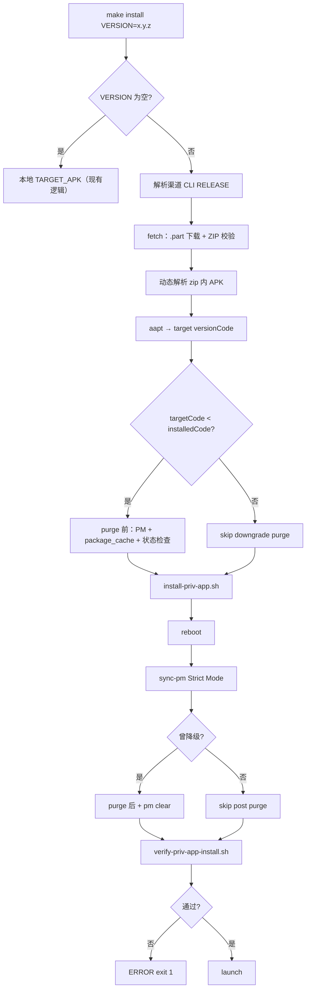

# `make install VERSION=` 云端指定版本安装方案

本文档描述如何通过 **`make install VERSION=x.y.z`** 从云端下载指定版本的 `lws-app` 发布包并安装到 adb 设备，以及在 **降级安装** 场景下清理 PackageManager 状态与 `package_cache` 的必要步骤。

与 [`ota-upgrade-flow.md`](ota-upgrade-flow.md)（设备端 OTA 用户流程）、[`system-run-summary.md`](system-run-summary.md)（模拟器 priv-app 运行）配套阅读。实现跟踪见 OpenSpec 变更 [`openspec/changes/make-install-cloud-version`](../openspec/changes/make-install-cloud-version/)。

| 项 | 值 |
|----|-----|
| 状态 | 已实现（OpenSpec: `openspec/changes/make-install-cloud-version`） |
| 影响范围 | `Makefile`、`scripts/ci/` |
| 不涉及 | 设备端 OTA 检查逻辑、`make publish` 发布流程变更 |

---

## 1. 背景与目标

### 1.1 问题

当前 `make install` 仅支持 **本地构建产物** 安装：

```text
make build  →  TARGET_APK（app-staging.apk 或 app-release.apk）
make install →  install-priv-app.sh TARGET_APK
```

开发与现场调试常见需求：

- 在真机/模拟器上快速验证 **历史 staging / release 版本**，无需 checkout 旧代码再完整 `make build`
- 将设备 **降级** 到某一云端已发布版本，复现旧版行为或回归问题

### 1.2 目标

实现后支持：

```bash
# 从云端安装 staging 1.0.35-beta
make install VERSION=1.0.35 ADB_SERIAL=<device>

# 从云端安装 release 1.0.17（RELEASE 必须显式写在 make 命令行）
make install VERSION=1.0.17 RELEASE=1

# 保持现有行为：本地 APK 安装
make build && make install
```

**成功标准**：

1. 给定合法 `VERSION`，能从 R2 下载对应 zip、**动态解析** zip 内 APK，并完成 priv-app 安装 + reboot + PM sync（Strict Mode）+ **verify** + launch
2. 降级时 **安装前后** 均清理 PackageManager 状态与 `package_cache`；安装后 `versionCode` / `versionName` / `pm path` 与目标 APK 一致
3. 版本不存在、校验失败、PM 状态异常、adb 未就绪时有明确错误信息与非零退出码

### 1.3 非目标

- 不改造设备端 `UpgradeActivity` / `OtaUpdateManifestService`（设备 OTA 仍只升不降）
- 不新增云端「按版本查 manifest」API（沿用可预测的 zip 文件名直链）
- 不通过 `make install` 刷写 zip 内固件 `.bin`（仅安装 APK；固件仍走 OTA 或 `make sync-firmware`）

---

## 2. 现有基础设施

### 2.1 发布与存储

`make pack` 将 APK + 固件 bin 打成 zip：

| 渠道 | zip 文件名 | Makefile 变量 |
|------|-----------|---------------|
| staging（默认） | `lws-app_v{version}-beta.zip` | `PACK_VERSION = {version}-beta` |
| release（`RELEASE=1`） | `lws-app_v{version}.zip` | `PACK_VERSION = {version}` |

发布上传至 R2，公开基址（`Makefile` 中 `PUBLISH_PUBLIC_BASE_URL`）：

```text
https://pub-3955e5ba2e5e40958c5eb9bc14cca6c0.r2.dev/lws-app/{pack_name}
```

**历史版本保留**：每次 `make publish` 使用带版本号的文件名，旧 zip 不会被覆盖。

zip 内容（`make pack-only` 规则，**当前** 典型布局）：

| 文件 | 说明 |
|------|------|
| `app-release.apk` | 当前打包脚本产出的 APK 名（**历史包可能不同**） |
| `*.bin` | 控制卡固件（本方案安装阶段忽略） |

> **P0**：实现时 **不得** 假设 zip 内 APK 固定为 `app-release.apk`，须动态识别（见 [§4.2.1](#421-scriptscifetch-lws-app-packagesh)）。

### 2.2 Manifest 与版本发现

设备端与 `make publish` 维护的 manifest（`staging.json` / `release.json`）**仅指向最新版**。

**结论**：指定历史版本安装不能依赖 manifest 查询，须按 **命名约定** 直接构造 zip URL。仅当请求版本等于 manifest 最新版时，可选用 manifest `sha512` 校验 zip。

### 2.3 现有安装链路（`make install`）

```text
install-priv-app.sh <apk>
    → adb root / remount
    → clear_user_update（pm uninstall-system-updates）
    → push APK → /system/priv-app/LwsUI/LwsUI.apk

reboot-and-wait-boot.sh

sync-pm-after-priv-app-install.sh <apk>
    → pm install -r -d /system/priv-app/LwsUI/LwsUI.apk
    → 失败时 fallback: adb install -r -d <host-apk>   ← 云端安装须禁用

launch SplashActivity
```

**云端安装与本地安装的差异**：本地 `make install` 可保留现有 streamed fallback；**`VERSION=` 云端路径必须 Strict Mode**（见 [§4.2.4](#424-scriptscisync-pm-after-priv-app-installsh-strict-mode)）。

### 2.4 versionCode 编码与渠道语义

与 [`scripts/make/app-version.sh`](../scripts/make/app-version.sh) 一致：

```text
versionCode = major * 1000 + minor * 100 + patch
例：1.0.27 → 1027
```

**P1 — patch 上界**：编码在 `patch ≥ 100` 时与下一 minor 冲突（例：`1.0.100` → `1100`，`1.1.0` → `1100`）。方案与 `version-bump` 校验对齐：**patch 限制为 0～99**（实现侧应将 `app-version.sh` 中「0～100」收紧为「0～99」，或至少在云端安装文档与校验中按 0～99 处理）。

**P1 — Beta / Release 与 versionCode**：

| 维度 | 说明 |
|------|------|
| `versionCode` | 同一 `x.y.z` 的 Beta 与 Release **通常相同**（均由 `versionName` 三元组编码） |
| 构建差异 | **渠道不同**：`staging.json` vs `release.json`、`RELEASE_CHANNEL`、默认 AI/功能开关等 Gradle 标志不同 |
| 安装判定 | 降级/升级以 **`versionCode` 整数** 为准；渠道用 **`RELEASE=1` make 参数** 选 zip，不靠 versionCode 区分 |
| verify | 除 `versionCode` 外，可选记录 `versionName`、APK 内 `applicationId` 与渠道预期是否一致 |

---

## 3. Beta 与正式版渠道区分

云端安装 **不靠 VERSION 数字猜渠道**。渠道由 **`make` 命令行上的 `RELEASE=1`** 决定（与 `make build` / `make pack` / `make publish` 语义一致）。

### 3.1 渠道对照表

| 渠道 | make 参数 | 云端 zip 文件名 | OTA manifest |
|------|-----------|-----------------|--------------|
| **Beta（staging，默认）** | 不写 `RELEASE=1` | `lws-app_v{x.y.z}-beta.zip` | `staging.json` |
| **正式版（release）** | `RELEASE=1` | `lws-app_v{x.y.z}.zip` | `release.json` |

### 3.2 命令示例

```bash
make install VERSION=1.0.36
make install VERSION=1.0.36-beta
make install VERSION=1.0.17 RELEASE=1
```

### 3.3 VERSION 解析规则

| 输入 | `RELEASE=1` on CLI | 结果 `PACK_VERSION` | 下载文件 |
|------|-------------------|---------------------|----------|
| `1.0.36` | 否 | `1.0.36-beta` | `lws-app_v1.0.36-beta.zip` |
| `1.0.17` | 是 | `1.0.17` | `lws-app_v1.0.17.zip` |
| `1.0.17-beta` | 是 | — | **报错**：渠道冲突 |
| `1.0.17` | 否 | `1.0.17-beta` | 尝试 beta 包；无则 404 |

### 3.4 RELEASE 必须显式传入（P1）

**不在方案中依赖 `.env` 隐式设置 `RELEASE=1`**：

- 当前 `WITH_DOTENV` 会 `source .env`，但云端安装的渠道选择应以 **用户本次 make 命令是否带 `RELEASE=1`** 为准
- `fetch-lws-app-package.sh` 内：`RELEASE` 仅当 **make 传入且为 `1`** 时视为 release；**不得**因 `.env` 中写了 `RELEASE=1` 而在 `make install VERSION=1.0.36` 时误走正式版
- 实现方式：Makefile 云端分支显式 `export INSTALL_RELEASE="$(INSTALL_RELEASE_FROM_CLI)"`（仅当命令行 `RELEASE=1` 时为 `1`）

---

## 4. 方案设计

### 4.1 总体流程（评审后主结构）

```text
VERSION
    ↓
解析渠道（CLI RELEASE=1，非 .env 隐式）
    ↓
下载历史包（.part + ZIP 校验）
    ↓
解析 zip 内 APK（动态识别，非固定文件名）
    ↓
读取 target versionCode / versionName（aapt）
    ↓
与设备已安装 versionCode 比较
    ↓
若 targetCode < installedCode → 降级清理（前）
    │   force-stop
    │   uninstall-system-updates
    │   pm clear
    │   清理 package_cache（前）
    │   PM 状态检查（pm path 不得指向 /data/app/）
    ↓
install-priv-app.sh（system priv-app 替换）
    ↓
reboot
    ↓
sync-pm-after-priv-app-install.sh（Strict Mode，无 streamed fallback）
    ↓
若曾降级 → 降级清理（后）+ pm clear（再次，与仓库实测回退流程一致）
    ↓
verify-priv-app-install.sh（versionCode + versionName + pm path）
    ↓
launch
```



### 4.2 新增 / 修改脚本

#### 4.2.1 `scripts/ci/fetch-lws-app-package.sh`

**职责**：解析渠道、下载 zip、校验、**动态提取 APK**。

**ZIP 内 APK 动态识别（P0）**：

```text
1. unzip -l 列出条目，筛选以 .apk 结尾且非目录的条目
2. 若恰好 1 个 → 使用该条目
3. 若多个：
   a. 优先名称含 release / staging / lws 的 .apk（按优先级列表）
   b. 否则取体积最大的 .apk
4. 若 0 个 → ERROR: zip contains no apk
5. 解压到 build/cache/lws-app/extracted-${PACK_VERSION}.apk
6. unzip 后用 aapt dump badging 验证为合法 APK（packageName、versionCode 可读）
```

**不得**写死 `unzip -jo ... app-release.apk`。

**下载与缓存（P1）**：

| 步骤 | 说明 |
|------|------|
| 存在性 | `curl -sfI` 或 GET Range 探活；404 → fail |
| 下载 | 写入 `${ZIP}.part`，完成后 `mv` 为 `${ZIP}`（原子替换） |
| ZIP 校验 | `unzip -t` 或 `zipinfo` 通过；失败则删除缓存并 exit 1 |
| APK 校验 | `aapt dump badging` 必须成功 |
| 缓存命中 | **禁止**仅用 HEAD `Content-Length` 判断完整性；须 ZIP 校验通过才可跳过 re-download |
| sha512 | 仅当版本 == manifest 最新版时，对照 manifest `sha512` 校验 zip 字节 |

**输出**：stdout 最后一行 = 解压后 APK 绝对路径。

#### 4.2.2 `scripts/ci/purge-pm-before-downgrade.sh`

**职责**：`targetCode < installedCode` 时，**安装前**清理。

**步骤**（`PKG=com.lasercyber.lws.ui`）：

| 顺序 | 操作 | 说明 |
|------|------|------|
| 1 | `am force-stop $PKG` | |
| 2 | `pm uninstall-system-updates $PKG` | 与 `clear_user_update` 一致 |
| 3 | `pm clear $PKG` | 清应用数据 |
| 4 | **清理 `package_cache`（前）** | 见 [§4.2.5](#425-package_cache-清理) |
| 5 | **PM 状态检查** | `pm path` 必须为空、或指向 `/system/priv-app/LwsUI/LwsUI.apk`；若仍指向 `/data/app/` → **ERROR exit 1** |

**刻意不做（P0）**：

- **不** `rm -rf /data/app/*/com.lasercyber.lws.ui-*` — 依赖 PackageManager 命令；清理后检查，异常则失败而非强行删目录
- **不** `pm uninstall $PKG`（priv-app 系统应用）

#### 4.2.3 `scripts/ci/purge-pm-after-downgrade.sh`

**职责**：降级安装 **sync-pm 成功之后、verify 之前** 再清一轮（P1，与仓库实测回退流程一致）。

| 顺序 | 操作 |
|------|------|
| 1 | 再次 `pm uninstall-system-updates`（幂等） |
| 2 | **清理 `package_cache`（后）** |
| 3 | 若 `pm path` 为空或仍指向 `/data/app/` → `resync-pm-from-priv-app-apk.sh` |
| 4 | PM 状态检查（同安装前） |

**不再**在安装成功后执行 `pm clear`（部分 ROM 会清空 priv-app 的 PM 登记，导致 `pm path` 为空）。

非降级路径（`targetCode >= installedCode`）跳过本脚本。

#### 4.2.4 `scripts/ci/sync-pm-after-priv-app-install.sh` Strict Mode

为云端安装增加环境变量，例如 `INSTALL_STRICT=1`（由 `make install VERSION=` 分支 export）：

| 模式 | `pm install -r -d` 失败时 |
|------|---------------------------|
| 默认（本地 install） | 允许 streamed `adb install -r -d` fallback（现有行为） |
| **Strict（云端 VERSION=）** | **禁止 fallback**；直接 `die`，避免在 `/data/app/` 产生 user update 覆盖层 |

Strict 模式下 streamed fallback 会使 `pm path` 偏离 `/system/priv-app/`，与 priv-app 部署目标冲突。

#### 4.2.5 `package_cache` 清理

Android PackageManager 在 `/data/system/package_cache/`（及 ROM 变体路径）缓存包解析/编译元数据。降级后旧缓存可导致 PM 仍报告高版本。

**推荐实现**（在 root/su 可用时）：

```bash
# 1. 设备侧：按包名清理 package_cache 条目（实现时封装为 purge_package_cache_for_pkg）
adb shell su 0 rm -rf /data/system/package_cache/*/com.lasercyber.lws.ui* 2>/dev/null || true
# 2. 触发 PM 刷新（ROM 相关，可选）
adb shell cmd package compile -f -m speed com.lasercyber.lws.ui 2>/dev/null || true
```

具体路径以目标 ROM 为准；脚本内对「清理 + 检查」封装为 `purge_package_cache_for_pkg`，**安装前、降级后各调用一次**。

与 `/data/app/` 不同：`package_cache` 清理针对 PM 元数据缓存，**不**替代 `uninstall-system-updates`；二者同时使用。

#### 4.2.6 `scripts/ci/verify-priv-app-install.sh`

**职责（P0）**：安装结束、launch 之前 **强制验证**。

**输入**：`$1` = 主机侧目标 APK 路径（用于读取期望 `versionCode` / `versionName`）

**检查项**：

| # | 检查 | 失败行为 |
|---|------|----------|
| 1 | `pm path com.lasercyber.lws.ui` 含 `/system/priv-app/LwsUI/LwsUI.apk` | exit 1 |
| 2 | `pm path` **不得**含 `/data/app/` | exit 1 |
| 3 | `dumpsys package` 中 `versionCode` == 目标 APK `versionCode` | exit 1 |
| 4 | `versionName` == 目标 APK `versionName`（或 semver 等价） | exit 1 |
| 5 | 设备上 `/system/priv-app/LwsUI/LwsUI.apk` 存在且非空 | exit 1 |

全部通过打印 `OK: verify passed (versionName+versionCode, priv-app path)`。

### 4.3 Makefile 改动

```makefile
install:
ifneq ($(VERSION),)
	@chmod +x scripts/ci/fetch-lws-app-package.sh \
	          scripts/ci/purge-pm-before-downgrade.sh \
	          scripts/ci/purge-pm-after-downgrade.sh \
	          scripts/ci/verify-priv-app-install.sh \
	          ...
	@$(call WITH_DOTENV,\
	  export INSTALL_STRICT=1; \
	  export RELEASE="$(RELEASE)"; \
	  CLOUD_APK=$$(./scripts/ci/fetch-lws-app-package.sh "$(VERSION)") && \
	  ./scripts/ci/purge-pm-before-downgrade.sh "$$CLOUD_APK" && \
	  ./scripts/ci/install-priv-app.sh "$$CLOUD_APK" && \
	  ./scripts/ci/reboot-and-wait-boot.sh && \
	  INSTALL_STRICT=1 ./scripts/ci/sync-pm-after-priv-app-install.sh "$$CLOUD_APK" && \
	  ./scripts/ci/purge-pm-after-downgrade.sh "$$CLOUD_APK" && \
	  ./scripts/ci/verify-priv-app-install.sh "$$CLOUD_APK" && \
	  ...)
	@... launch + emulator-forward
else
	@... 现有 TARGET_APK 逻辑（INSTALL_STRICT 未设置，保留 streamed fallback）
endif
```

`purge-pm-before-downgrade.sh` / `purge-pm-after-downgrade.sh` 内部根据 versionCode 比较自行决定是否执行清理逻辑。

### 4.4 与 `make sync` 的边界

| 目标 | 场景 | 安装方式 |
|------|------|----------|
| `make sync` | 日常 Java/Kotlin 本地改动 | `pm install` 到 `/data/local/tmp`，**不**写 priv-app |
| `make install VERSION=` | 云端版本回放 | `/system/priv-app/LwsUI/LwsUI.apk` + Strict + verify |

---

## 5. 降级为何需要额外清理

### 5.1 典型失败现象

- `pm path` 仍指向 `/data/app/...`
- `dumpsys package` 的 `versionCode` 仍为高版本
- `package_cache` 残留导致 PM 元数据未刷新

### 5.2 根因

```text
system priv-app APK
  + /data/app/ user update（versionCode 更高）
  + stale package_cache
  → PM 以 update / 缓存为准，低版本「装了不生效」
```

### 5.3 为何不用 `rm -rf /data/app/...`（P0）

强行删除 `/data/app/` 下目录可能导致 PackageManager 数据库与文件系统不一致。方案改为：

1. `pm uninstall-system-updates` + `pm clear`
2. 清理 `package_cache`
3. **检查** `pm path`；仍异常 → **失败退出**，由人工处理

### 5.4 为何禁止 streamed fallback（P0）

`sync-pm-after-priv-app-install.sh` 在 device-path `pm install` 失败时会 `adb install` 到 `/data/app/`，等价于创建 user update。云端 priv-app 回放必须 **Strict Mode** 失败即停，便于定位 ROM/权限问题。

### 5.5 与应用内 OTA 的差异

设备 OTA 只安装更高版本；`make install VERSION=` 为开发/运维调试通道，允许降级，且依赖 verify 保证最终状态。

---

## 6. 无线调试长期方案（push / resume）

无线 adb（`ADB_SERIAL=host:port`）在 **`adb reboot` 后连接会断开**，且 Android 11+ 可能需重新开启「无线调试」。长期推荐 **两阶段安装**，把「必断线的 reboot」和「主机侧脚本」拆开。

### 6.1 推荐工作流

```bash
# 阶段 1：有连接时推送 system priv-app（不 reboot）
ADB_SERIAL=192.168.1.50:5555 make install VERSION=1.0.30 INSTALL_SKIP_REBOOT=1

# 阶段 2：在设备上 reboot（或断电重启）→ 重新打开无线调试 → adb connect 同一地址
ADB_SERIAL=192.168.1.50:5555 make install-cloud-resume VERSION=1.0.30
```

`install-cloud-resume` 会：

1. `wireless-adb-wait.sh` — 长轮询 `adb connect`（默认最多约 3 分钟，可用 `WIRELESS_ADB_WAIT_ITER` 加大）
2. PM sync（Strict）→ verify → launch
3. 清除 `build/cache/lws-app/.install-state.env`

阶段 1 会把 `VERSION` / APK 路径写入 **`.install-state.env`**，resume 时校验版本一致。

### 6.2 一键完整安装（USB 或无线已能自动重连）

```bash
ADB_SERIAL=192.168.1.50:5555 make install VERSION=1.0.30
```

仍走 `push → reboot → wait_boot_after_reboot → resume`。无线若 reboot 后连不上，改用 §6.1 分步。

### 6.3 环境变量

| 变量 | 说明 |
|------|------|
| `INSTALL_SKIP_REBOOT=1` | 等同 `INSTALL_PHASE=push`，只推到 priv-app |
| `INSTALL_PHASE=push\|resume\|full` | 显式阶段（Makefile 默认 `full`） |
| `WIRELESS_ADB_WAIT_ITER` | 无线等待次数（默认 90，每次 sleep 2s） |

### 6.4 后续可增强（未实现）

- 设备端 boot 后自动重开无线 adb（需系统权限 / 厂商 API）
- `adb pair` 凭据持久化脚本
- `INSTALL_SKIP_REBOOT=1` 且 ROM 支持时免 reboot 的实验模式

---

## 7. 使用示例

```bash
# 无线两阶段
ADB_SERIAL=192.168.1.50:5555 make install VERSION=1.0.30 INSTALL_SKIP_REBOOT=1
# reboot + 重开无线调试后：
ADB_SERIAL=192.168.1.50:5555 make install-cloud-resume VERSION=1.0.30

ADB_SERIAL=192.168.1.100:5555 make install VERSION=1.0.35
ADB_SERIAL=emulator-5554 make install VERSION=1.0.36-beta
RELEASE=1 make install VERSION=1.0.17
make build && make install
```

---

## 8. 错误处理

| 条件 | 行为 |
|------|------|
| `VERSION` 格式非法 / patch > 99 | exit 1 |
| zip 404 | `ERROR: version not found` |
| `.part` 下载中断 / ZIP 校验失败 | 删除损坏缓存，exit 1 |
| zip 内无 APK / 多个 APK 无法判定 | exit 1 |
| `aapt dump` 失败 | exit 1 |
| 降级前 PM 状态检查失败（`pm path` → `/data/app/`） | exit 1，提示 PM 未清理干净 |
| Strict Mode 下 `pm install` 失败 | exit 1，**无** streamed fallback |
| verify 任一检查失败 | exit 1，**不** launch |
| `/system` 不可写 | 提示 `make prepare` / `make emulator` |

---

## 9. 风险与权衡

| 风险 | 缓解 |
|------|------|
| 历史包无 sha512 | `.part` + `unzip -t` + `aapt`；最新版可对 manifest sha512 |
| 渠道混用 | [§3.3](#33-version-解析规则) fail-fast |
| `pm clear` 清空现场数据 | 文档标明；仅调试/回放 |
| Strict Mode 在部分 ROM 上更易失败 | 失败信息明确；不静默 fallback 到错误路径 |
| zip 内 APK 命名变更 | 动态识别规则 |
| patch 编码冲突 | 限制 patch 0～99 |

---

## 10. 实现任务清单

- [ ] `scripts/ci/fetch-lws-app-package.sh`（动态 APK、`.part`、ZIP/APK 校验）
- [ ] `scripts/ci/purge-pm-before-downgrade.sh`（含 package_cache 前 + PM 状态检查）
- [ ] `scripts/ci/purge-pm-after-downgrade.sh`（含 package_cache 后 + 再次 pm clear）
- [ ] `scripts/ci/verify-priv-app-install.sh`
- [ ] `sync-pm-after-priv-app-install.sh` 增加 `INSTALL_STRICT=1`
- [ ] `Makefile` `install` 云端分支 + `RELEASE` 显式传递 + help
- [ ] （可选）`app-version.sh` patch 上界 100 → 99
- [ ] 真机 + 模拟器：升级、降级、verify 失败、Strict 无 fallback

---

## 11. 测试计划

| # | 场景 | 期望 |
|---|------|------|
| 1 | 云端 staging 安装 | verify 通过；`pm path` → priv-app |
| 2 | `RELEASE=1` release 安装 | 同上 |
| 3 | 降级 | 前后 package_cache 清理；最终 versionCode 匹配；**再次 pm clear** |
| 4 | 降级后 `pm path` 仍 `/data/app/` | 安装前检查失败，exit 1 |
| 5 | Strict：`pm install` 失败 | 无 streamed fallback；exit 1 |
| 6 | verify 失败 | 不 launch |
| 7 | zip 仅含非 `app-release.apk` 名的 apk | 动态识别成功 |
| 8 | 损坏 zip / 中断下载 | `.part` 清理，exit 1 |
| 9 | `.env` 含 `RELEASE=1` 但 CLI 未传 | 仍走 staging |
| 10 | 本地 `make install` 无 VERSION | 行为与改动前一致（可有 fallback） |
| 11 | 渠道冲突 `RELEASE=1` + `-beta` VERSION | exit 1 |

---

## 12. 相关文档与源码

| 资源 | 说明 |
|------|------|
| [`Makefile`](../Makefile) | `PACK_NAME`、`install` target |
| [`scripts/ci/install-priv-app.sh`](../scripts/ci/install-priv-app.sh) | priv-app 推送 |
| [`scripts/ci/sync-pm-after-priv-app-install.sh`](../scripts/ci/sync-pm-after-priv-app-install.sh) | PM sync（待加 Strict） |
| [`scripts/make/app-version.sh`](../scripts/make/app-version.sh) | versionCode 编码 |
| [`scripts/publish_lws_app.py`](../scripts/publish_lws_app.py) | 发布 manifest |
| [`docs/ota-upgrade-flow.md`](ota-upgrade-flow.md) | 设备端 OTA |
| [`docs/system-run-summary.md`](system-run-summary.md) | 模拟器 priv-app |
