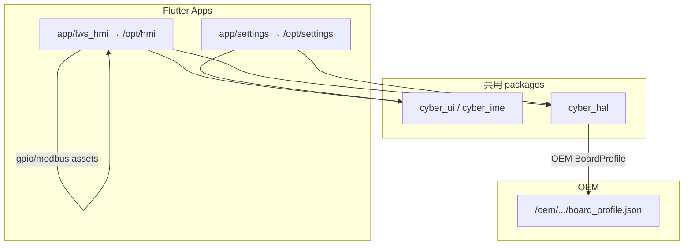

# Settings App 计划

> **状态（2026-08）：** 取代原 **Factory Test App** 计划。本计划落地独立 **Settings** Flutter 应用（`app/settings` → `/opt/settings`），作为平台级系统设置前端；**不**再规划 Factory Test / 产测 App。平台层以 [`platform-os-oem-sdk-plan.md`](platform-os-oem-sdk-plan.md) 为准：OEM `board_profile`；`gpio.json` / `modbus.json` 仍属产品 App（Settings **不**承载焊机寄存器图）。

目标：在 **lws-hmi** 仓库内并行开发通用 **Settings** Flutter 应用（观感对齐寻常操作系统 Settings），作为 **`cyber_hal` 的系统设置前端**；与产品 App（`app/lws_hmi`）共用 OEM profile / HAL，打入同一份 rootfs，**不必另刷镜像**，避免损坏用户数据（`/userdata` 等）。

配套阅读：主线 [`flutter-linux-hmi-plan.md`](flutter-linux-hmi-plan.md)；平台化 [`platform-os-oem-sdk-plan.md`](platform-os-oem-sdk-plan.md)；HAL 合同 [`hal-portability.md`](hal-portability.md)；包说明 [`packages/cyber_hal/README.md`](../packages/cyber_hal/README.md)；多 App 构建 [`openspec/specs/multi-app-build-select/spec.md`](../openspec/specs/multi-app-build-select/spec.md)。

状态图例：✅ 完成 · 🔄 进行中 · 🔲 未开始 · ⏸ 暂缓

---

## 1. 背景与结论

### 1.1 现状

| 项 | 现状 |
| ---- | ---- |
| 产品 App | `app/lws_hmi/`；`make build-app` → `/opt/hmi`；`hmi.service` 自启 |
| 平台设置 | 焊机 HMI 内嵌 Settings（Device Info / Common / Advanced / Custom Home）；平台项与产品项混在同一壳里 |
| 第二 App 槽位 | Make/scripts 已为非 HMI App 预留 `APP=<id>` → `/opt/<APP>`；曾规划 `factory_test` 自动进 rootfs，**源码尚未创建** |
| HAL | OEM `board_profile` + App `gpio`/`modbus`；Settings 只需 OEM profile + 平台 controllers（无需产品寄存器图） |
| Flutter pin | **3.41.9**（勿用旧文档中的 3.24.4） |

### 1.2 结论

1. **源码并行**：新增 `app/settings/`，path 依赖 `cyber_hal` + `cyber_ui` / `cyber_ime`，与 HMI 同 pinned Flutter **3.41.9** / 既有 `APP=` 打包路径（`make build-app`）。
2. **安装前缀**：非 HMI → `/opt/settings`；**不**进 `multi-user` 自启；与 `hmi.service` 互斥切换。
3. **取代原 Factory Test 槽位**：rootfs 自动附带的第二 App 从「计划中的 `factory_test`」改为 **`settings`**（`ensure-rootfs-apps` / verify / AGENTS 同步改名）。
4. **产品形态**：通用 OS Settings（横屏主从分栏 / 竖屏单栏推入）；**分组名仅用于本计划组织，不在 UI 显示**（顶层为按序扁平列表）。
5. **与 HMI 的功能关系**：已在 HMI 实现且本计划**未标迁移**的 → **拷贝**到 Settings（HMI 保留）；标了**迁移**的 → Settings 承接后 **从 HMI 移除**。
6. **进出**：HMI 显式入口（如 System Settings / 齿轮）→ `switch-to-settings`；Settings 内 **Exit** → `switch-to-hmi`。不采用隐藏「Kernel Version ×5」作为主入口（那是旧产测方案）。

---

## 2. 目标与非目标

**目标**

1. 仓库内可独立开发、分析、测试 Settings App。
2. ynh960 量产 rootfs **同时** 含 `/opt/hmi`（默认自启）与 `/opt/settings`（按需进入）。
3. Settings UI 覆盖 §5 所列平台项；竖屏 / 横屏均可导航。
4. 按 §5.4 **拷贝 / 迁移** 规则处理与 `lws_hmi` 的重叠功能。
5. Bluetooth 本机名称 = **Brand + `" "` + Model**（来自 Vendor Storage identity）。
6. Make / AGENTS / README / multi-app 约定说明完整，重建表可抄。

**非目标**

- 不做 Factory Test / 产测专用 App；不恢复 gpio/modbus 进 rootfs「主板 pack」。
- 不把 Settings 做成开机默认桌面或二选一向导。
- 不在同一显示会话并行跑两个 Flutter 客户端（`Conflicts=` / 切换脚本）。
- 不扩展 `cyber_hal` Android 后端。
- 不把焊机业务页（Advanced 阈值、Custom Home、工艺/监视器、控制板/相机版本、云服务等）搬进 Settings。
- 不以「改内核 `-o` / 中途旋转面板」为布局前提——横竖是 **App 自适应**。

---

## 3. 架构



| 层级 | 路径 / 角色 |
| ---- | ---- |
| 产品 HMI | `/opt/hmi`；`hmi.service` → `hmi-launch.sh`；保留产品 Settings + **拷贝项** |
| Settings | `/opt/settings`；**无** multi-user 自启；手势外的显式入口 / systemctl / CLI |
| 切换 | `switch-to-settings` / `switch-to-hmi` + unit 双向 `Conflicts=` |
| Engine / ICU | 仍仅 `/usr/lib` + `/usr/share/flutter`（两 App 共用；bundle 内禁止第二份 engine） |
| Profile | Settings 与 HMI 共用 OEM profile 解析；Settings **不**加载产品 gpio/modbus |

---

## 4. 信息架构（IA）

### 4.1 分组约定

下列 **分组名仅用于计划 / 实现分模块**，**不**作为 Settings 顶层 UI 的 section header。顶层呈现为 **单一有序列表**（寻常 OS 的 Settings 主列表观感：About、Operating System、Storage、Wi‑Fi…）。

### 4.2 顶层条目与子页

#### Basic Info（逻辑分组）

| # | 顶层行 | 列表摘要 | 子页内容 |
| ---- | ---- | ---- | ---- |
| 1 | **About** | （可空或短摘要） | Brand；Model；Serial Number |
| 2 | **Operating System** | `OS + version`（如 `lws-hmi 1.2.3` / `os-release` 展示名+VERSION） | 见下表 OS 明细 |
| 3 | **Storage** | `n GB of m GB used` | Storage 卡片；Secrets Seal（`software` \| `op-tee`） |

**Operating System 子页明细：**

| # | 行 | 数据源（实现时落到 HAL / 只读 probe） |
| ---- | ---- | ---- |
| 1 | Operating System | `/etc/os-release`（NAME/PRETTY + VERSION） |
| 2 | Linux Kernel | `uname -r`（已有 `SysInfo.kernelRelease`） |
| 3 | SELinux | `Disabled` \| `Permissive` \| `Enforcing`（`/sys/fs/selinux/enforce` 或 `getenforce`） |
| 4 | BusyBox Version | `busybox` 版本字符串 |
| 5 | Glibc Version | `ldd --version` / 等价只读 |
| 6 | WPA Supplicant Version | `wpa_supplicant -v` |
| 7 | BlueZ Version | `bluetoothd -v` / 包版本约定 |
| 8 | OpenSSL Version | `openssl version` |
| 9 | OpenSSH Version | `sshd -V` / `ssh -V` |
| 10 | GStreamer Version | `gst-inspect-1.0 --version` 或 pin 文件 |
| 11 | Flutter Version | 引擎/SDK pin（与 rootfs 一致，如 3.41.9） |
| 12 | Buildroot Version | `overlay/buildroot/BUILDROOT_VERSION` 烘焙进 os-release 或独立 stamp |

> 多数版本行今日 **无** Settings UI；需在 `cyber_hal` `SysInfo`（或专用 PlatformVersions reader）扩展只读字段。缺失时显示 `—`，不得崩溃。

#### Network（逻辑分组）

| # | 顶层行 | 与 HMI | 说明 |
| ---- | ---- | ---- | ---- |
| 1 | **Wi‑Fi** | **拷贝** | 自 HMI `wifi_settings_page` 等拷贝；HMI Common **保留** |
| 2 | **Ethernet** | **迁移** | 自 HMI（含 Demo 孤儿页）迁入；HMI **移除** |
| 3 | **Bluetooth** | **迁移** | 自 HMI 迁入；本机名称改为 **Brand + `" "` + Model`**；HMI **移除** |
| 4 | **Proxy** | **拷贝** | HTTP Proxy；HMI **保留** |
| 5 | **SSH** | **迁移** | LAN SSH debug；HMI **移除** |

#### 日期和时间

| # | 顶层行 | 与 HMI |
| ---- | ---- | ---- |
| 1 | **日期和时间** | **拷贝** |

#### 区域和语言

| # | 顶层行 | 与 HMI | 说明 |
| ---- | ---- | ---- | ---- |
| 1 | **Country/Region** | **拷贝** | HAL `LocaleSettings` / region |
| 2 | **Language** | **拷贝** | 两 App 均需响应 locale；持久化仍 `/var/lib/hal/locale.conf` |
| 3 | **Unit** | **拷贝** | HMI Advanced 显示依赖单位时继续读同一 HAL store |

#### 显示和声音

| # | 顶层行 | 与 HMI |
| ---- | ---- | ---- |
| 1 | **Display** | **拷贝** |
| 2 | **Sound** | **拷贝** |

#### 输入

| # | 顶层行 | 与 HMI | 说明 |
| ---- | ---- | ---- | ---- |
| 1 | **Keyboard** | **迁移** | 含布局应用 / 可能需重启当前前台 App 的策略改由 Settings 拥有 |
| 2 | **Mouse** | **迁移** | |
| 3 | **USB OTG** | **迁移** | debug / mtp / host |

### 4.3 拷贝 vs 迁移（总规则）

| 规则 | 含义 |
| ---- | ---- |
| **拷贝** | 功能已在 `lws_hmi` 实现 → 在 Settings 再实现一份（可抽 shared presentation 到 package，或先复制再收敛）；**HMI 不删** |
| **迁移** | Settings 承接后，**从 HMI Settings / Demo 导航与页面移除**（含死链、孤儿路由）；HAL 仍共用 |

**本计划明确迁移（HMI 须移除）：** Ethernet、Bluetooth、SSH、Keyboard、Mouse、USB OTG。

**本计划明确拷贝（HMI 保留）：** About 相关只读（Brand/Model/SN 等已在 Device Info）、Wi‑Fi、Proxy、日期和时间、Country/Region、Language、Unit、Display、Sound。

**HMI 独留（不进 Settings）：** Advanced（Modbus 阈值等）、Custom Home、云服务、产品外设版本（相机/控制板/送丝等）、工艺相关、HMI App OTA 入口等。

---

## 5. Settings App（`app/settings`）

### 5.1 工程形态

- 标准 Flutter 工程；`pubspec` path：`cyber_hal`、`cyber_ui`、`cyber_ime`。
- 构建：`APP=settings make build-app`（复用 `scripts/build-app.sh` / `hmi-bundle-common.sh`）；安装到 overlay `…/opt/settings`。
- 日迭代：`APP=settings make push-app`（不重启 `hmi.service`）；签名路径按需 `upgrade-app`。
- `make build-rootfs`：**自动 ensure** `/opt/settings`（取代原 `factory_test` 自动附带约定）。

### 5.2 UI 风格与横竖布局

| 项 | 约定 |
| ---- | ---- |
| 风格 | 寻常 OS Settings：分组列表观感、导航栏、disclosure、toggle、明细页；**不显示** §4 逻辑分组标题；用 CyberUI 令牌/组件 |
| 横屏 | 主从分栏（sidebar + detail） |
| 竖屏 | 单栏：根列表 → push 详情；断点切换，非两套 App |
| 退出 | 显眼 **Exit** / 「返回产品界面」（侧栏底或列表末） |

### 5.3 Bluetooth 本机名称

| 项 | 约定 |
| ---- | ---- |
| 显示名 / BlueZ Alias | `"{Brand} {Model}"`（中间一个空格）；Brand/Model 来自 `read-identity` / `ProductInfo` |
| 应用时机 | Settings 蓝牙栈启动、以及 identity 可读之后；写入既有 HAL `setAlias` / `/var/lib/bluetooth/adapter-alias` 路径 |
| 缺 identity | 回退到安全占位（如仅 Model，或既有默认）；不得用焊机产品文案硬编码 `lws-hmi` 作为最终目标行为 |
| HMI | 迁移后不再提供蓝牙设置页；别名策略由 Settings + HAL 拥有 |

### 5.4 Secrets Seal（Storage 子页）

| 项 | 约定 |
| ---- | ---- |
| UI | Storage 子页第二项：**Secrets Seal** = `software` \| `op-tee`（只读展示为主） |
| 数据 | HAL `KekProvider` / secrets 后端探测（已有 migrate 路径；Settings 补状态展示） |
| 非目标 | 不在本计划把 `make migrate-secrets` 做成完整向导（可后续加） |

### 5.5 与 P2 Demo 的关系

Ethernet 等今日仅挂在 Demo 的入口，随 **迁移** 进入 Settings 后：删除 HMI 中对应 Demo/孤儿路由；Phase 收尾可删除整个 P2 Demo（若已无剩余价值），不阻塞 Settings 主路径。

---

## 6. 构建与 Make

### 6.1 约定变更（相对 multi-app / factory_test 草案）

| 旧（草案） | 新 |
| ---- | ---- |
| `app/factory_test` → `/opt/factory_test` | `app/settings` → `/opt/settings` |
| `ensure-rootfs-apps` 自动附带 factory_test | 自动附带 **settings**（`app/settings/pubspec.yaml` 存在时） |
| `verify-rootfs-overlay` 可选 `/opt/factory_test` | 可选/要求 `/opt/settings`（与源码存在性一致） |
| 专用 `make build-factory-test` | **不需要**；统一 `APP=settings make build-app` |

### 6.2 常用命令

```text
APP=settings make build-app
APP=settings make push-app

make build-rootfs   # 自动 ensure settings + 默认 HMI
make upgrade
```

### 6.3 文档必改（落地时）

1. `Makefile` `help`、`README.md`、`docs/make-commands.md`、`AGENTS.md` 重建表：`app/settings/**` → `APP=settings make build-app` / `push-app`；rootfs auto-include。
2. `scripts/app-select.sh` / `ensure-rootfs-apps.sh` / `verify-rootfs-overlay.sh`：factory_test → settings。
3. `openspec/specs/multi-app-build-select` / `buildroot-lws-hmi-image`：同步能力描述。
4. `app/README.md`：双 App + 切换。

---

## 7. 板端启动与运维

### 7.1 启动器

| 组件 | 角色 |
| ---- | ---- |
| `/usr/libexec/hmi/settings-launch.sh` | 复用 `hmi-launch.sh` 前置；`BUNDLE=/opt/settings` |
| `/usr/bin/settings` | CLI：默认 **拒绝** 在 `hmi.service` active 时抢显；`--stop-hmi` 才 stop 后前台跑 |
| `settings.service` | **static**（无 `WantedBy=multi-user.target`）；与 `hmi.service` **双向 `Conflicts=`** |
| `/usr/bin/switch-to-settings` | `systemctl start settings` |
| `/usr/bin/switch-to-hmi` | `systemctl start hmi` |

开机默认仍只有 `hmi.service`。

### 7.2 推荐流程

**现场主路径：**

1. 产品 HMI → **System Settings**（或等价显式入口）  
2. `switch-to-settings`（Conflicts 停 HMI）  
3. 用完 **Exit** → `switch-to-hmi`

**SSH：**

```bash
systemctl start settings
systemctl start hmi
```

**前台调试：**

```bash
settings --stop-hmi
# Ctrl+C 不自动 start hmi
systemctl start hmi
```

### 7.3 HMI → Settings

| 项 | 约定 |
| ---- | ---- |
| UI | HMI 内显式入口（Home / 产品 Settings 壳上的「系统设置」等）；**非**隐藏五连击 |
| 动作 | `switch-to-settings` → `settings.service` |
| 失败 | bundle 缺失或 start 失败 → Toast，**留在 HMI** |

### 7.4 Settings → HMI

| 项 | 约定 |
| ---- | ---- |
| UI | **Exit** |
| 动作 | `switch-to-hmi` |
| CLI | 仅 UI Exit / `switch-to-hmi` 自动回 HMI；前台 Ctrl+C **不**自动恢复 |

---

## 8. 分阶段任务

### Phase A — 工程与 rootfs 槽位（🔲）

1. scaffold `app/settings`（最小壳：扁平列表 + Exit 占位）。
2. `APP=settings make build-app` 写入 `/opt/settings`；更新 `ensure-rootfs-apps` / verify / 文档（替换 factory_test 约定）。
3. Overlay：`settings-launch.sh`、`settings.service`、`switch-to-*`、`/usr/bin/settings`。
4. HMI：显式入口 → `switch-to-settings`；Settings：Exit → `switch-to-hmi`。

### Phase B — Basic Info（🔲）

1. About 子页：Brand / Model / SN（拷贝自 Device Info 数据源）。
2. Operating System：列表摘要 + 子页 12 行；扩展 HAL 版本 probe。
3. Storage：用量摘要 + 子页卡片 + Secrets Seal 状态。

### Phase C — Network（🔲）

1. **拷贝** Wi‑Fi、Proxy 到 Settings。
2. **迁移** Ethernet、Bluetooth、SSH：Settings 实现后从 HMI 移除页面/导航。
3. Bluetooth alias = Brand + `" "` + Model。

### Phase D — 日期时间 / 区域语言（🔲）

1. **拷贝** 日期和时间、Country/Region、Language、Unit。

### Phase E — 显示和声音（🔲）

1. **拷贝** Display、Sound。

### Phase F — 输入迁移（🔲）

1. **迁移** Keyboard、Mouse、USB OTG；HMI 移除。
2. Keyboard 应用后的重启策略：重启当前前台（Settings）或提示，**不**误伤已停的 HMI unit 语义写清楚。

### Phase G — 收尾（🔲）

1. 清理 HMI 中已迁移项的死代码 / Demo 孤儿入口。
2. 视情况删除 P2 Demo；更新相关 openspec。
3. 验收清单跑通；AGENTS 重建表定稿。

---

## 9. 验收标准

| # | 标准 |
| ---- | ---- |
| 1 | 仓库存在 `app/settings/`，`flutter analyze` 通过（Flutter **3.41.9** pin）。 |
| 2 | rootfs 含 `/opt/settings/lib/libapp.so` + `flutter_assets`；**无** bundle 内 engine/icu。 |
| 3 | `APP=settings make build-app` / `push-app` 与 `build-rootfs` 自动 ensure 已文档化。 |
| 4 | HMI 显式入口可进入 Settings；Exit 自动回 HMI；`/userdata` 不被要求格式化。 |
| 5 | 顶层列表含 §4.2 全部条目；**无** Basic Info / Network 等分组标题。 |
| 6 | About / OS / Storage 子页字段齐全；版本缺失显示 `—`。 |
| 7 | Storage 显示 Secrets Seal `software` \| `op-tee`。 |
| 8 | Bluetooth 本机名称为 Brand + 空格 + Model。 |
| 9 | HMI **不再**提供：Ethernet、Bluetooth、SSH、Keyboard、Mouse、USB OTG。 |
| 10 | HMI **仍**提供拷贝项：Wi‑Fi、Proxy、日期时间、区域/语言/单位、Display、Sound，以及产品 Advanced / Custom Home 等。 |
| 11 | 竖屏 / 横屏均可完成主导航。 |

---

## 10. 风险与缓解

| 风险 | 缓解 |
| ---- | ---- |
| 两 App 争用显示 | 双向 `Conflicts=`；CLI 默认拒绝抢显 |
| 拷贝页双份漂移 | 优先抽 shared feature package；短期可复制，tasks 标明收敛 |
| 迁移后 HMI 深链断裂 | 全局搜路由 / `pushSettingsPage`；Demo 一并删 |
| Language/Unit 双 App | 共用 HAL persist；切回 HMI 时重新读 store |
| Keyboard 重启 | 只重启 Settings 进程或 document `systemctl restart settings`；勿 `start hmi` 抢显 |
| 版本 probe 脆弱 | 软失败；字符串解析单测；禁止在 UI isolate 硬依赖 |
| rootfs 体积 | Settings 无焊机素材；禁 bundle 打 engine；盯 ext2 预算 |
| 旧文档仍写 factory_test | 本计划 + platform 计划交叉替换；实现时改 scripts/spec |

---

## 11. 重建速查（实现完成后）

```text
# Settings App
APP=settings make build-app
APP=settings make push-app

# 首次进 rootfs / 改启动器
make apply-overlay
make build-rootfs
make upgrade

# 焊机 HMI（迁移删页后）
make build-app
make push-app

# 全量
make build
```

板端：

```text
HMI → System Settings  →  Settings App
Settings → Exit        →  HMI

systemctl start settings
systemctl start hmi
```

---

## 12. 决议

### 12.1 命名与槽位

**决议：** App id = `settings`；设备路径 `/opt/settings`；取代原 Factory Test 作为 rootfs 第二 App 自动附带对象。不创建 `app/factory_test`。

### 12.2 分组标题

**决议：** §4 逻辑分组名 **不**渲染为 UI section header；顶层为扁平有序列表。

### 12.3 拷贝 / 迁移

**决议：** 以 §4.2 / §4.3 表格为准。未标迁移且 HMI 已有 → 只拷贝；标迁移 → Settings 完成后从 HMI 删除。

### 12.4 入口

**决议：** 显式 System Settings 入口 + `settings.service`；**不**使用 Kernel Version 五连击作为主路径。

### 12.5 CLI / Exit 与 HMI

**决议：** 与旧产测相同安全语义——无参 CLI 拒抢显；`--stop-hmi` 前台；Ctrl+C 不自动回 HMI；仅 Exit / `switch-to-hmi` 自动恢复。

### 12.6 Board / gpio

**决议：** Settings **不**迁 gpio/modbus 进 rootfs pack；只用 OEM profile + 平台 HAL。产品寄存器图继续留在 `lws_hmi`。

### 12.7 Bluetooth 名称

**决议：** Alias = `Brand + " " + Model`（Vendor Storage identity）。

---

## 13. 文档索引（落地时维护）

| 文档 | 变更要点 |
| ---- | ---- |
| 本文 | 计划与验收 |
| `platform-os-oem-sdk-plan.md` | W6 / 外链改为 Settings App |
| `AGENTS.md` | 重建表 + `/opt/settings`；factory_test → settings |
| `README.md` / `docs/make-commands.md` | `APP=settings` |
| `openspec/specs/multi-app-build-select` | auto-include settings |
| `openspec/specs/buildroot-lws-hmi-image` | verify `/opt/settings` |
| `app/README.md` | 双 App + 切换 |
| HMI settings / navigation openspec | 迁移项从产品 Settings 规格中删除或改指向 |
