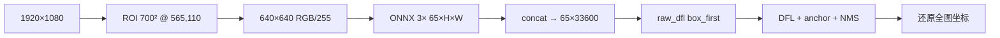

# ONNX 污点检测推理框问题归档

> **模型**：`det_raw_head.onnx`（3× `[1, 65, H, W]` raw DFL 头，nc=1，reg_max=16）
> **脚本**：`check/infer.py det`（实现于 `onnx_infer.py`）+ `check/det_postprocess.py` + `check/yolov8_dfl_decode.py`
> **预处理**：1920×1080 → ROI 700×700@(565,110) → resize 640×640 → RGB `/255`（与 `ModelManager::infer_stain` 一致）

---

## 现象速查

| 你看到的现象 | 根因 | 处理 |
|-------------|------|------|
| 左上角 OSD 旁一簇**极小红点**，坐标约 `(565,110)` | 把 **65 通道 raw DFL** 当成 **decoded nc=61** | `num_classes=1`，确认日志 `head=raw_dfl nc=1` |
| 亮斑右缘**月牙形**大量扁框，score≈0.99 | **`cls_first` 通道顺序错误** | `--raw-channel-order box_first` |
| **`total_boxes=0`**（424 张全无框） | **`conf=0.65` 高于模型实际最高分**（全库 max≈0.63） | 降至 `0.25`（训练对齐）或 `0.5`～`0.55` |

---

## 问题一：左上角假框簇

### 现象

- 可视化图左上角（时间戳 / `AGDevice` 附近）出现极小、重叠红框。
- 日志示例：`box[0] xyxy=(565.0, 110.0, 565.4, 112.3) score=1.0`。

### 根因

ONNX 输出为 **YOLOv8 raw DFL**：`C = 4×reg_max + nc = 4×16 + 1 = 65`。

错误逻辑将 `65` 解释为 **decoded** 布局：`nc = 65 - 4 = 61`，把 DFL 通道当 `xywh`+多类分数 → 乱坐标 + 假高分 → ROI 还原后堆在 **裁剪原点 (565, 110)**。

### 解决

1. **显式** `--num-classes 1`（勿用 `-1` 走旧版 `decoded nc=61` 路径）。
2. 后处理识别 `nf==65` → `raw_dfl, nc=1, reg_max=16`（已写入 `det_postprocess.py` / `cpp/postprocess/det_postprocess.cpp`）。
3. 日志必须为：

   ```text
   head=raw_dfl nc=1
   ```

   **不能**出现 `head=decoded nc=61`。

---

## 问题二：亮斑边缘大量假框（修复问题一之后）

### 现象

- 框不再在左上角，而是沿镜头**亮斑右缘**呈月牙分布。
- 框极扁、高度 1～3px，score 0.8～0.99，NMS 后仍剩 ~100 个。
- 日志：`using cls_first channel order (auto)`，`score_ge_conf=30000+`。

### 根因

`--raw-channel-order auto` **误选 `cls_first`**：把前 1 通道当 class、后 64 通道当 DFL（与 Ultralytics 导出相反）。DFL 数值经 sigmoid 后几乎全锚点 > conf → 假阳性。

### 解决

| 项 | 推荐值 |
|----|--------|
| 通道顺序 | **`box_first`**（64 DFL + 1 cls） |
| CLI | `--raw-channel-order box_first` |
| 默认 | `onnx_infer.py` 已改为默认 `box_first` |
| auto 防护 | `cls_first` 若 >5% 锚点 conf≥0.65 则回退 `box_first` |

**单图对比（`0000000ms`，conf=0.65）**

| 顺序 | max_best_score | 结果 |
|------|----------------|------|
| box_first | 0.534 | 0 框 |
| cls_first | 0.999 | 100 假框 |

---

## 问题三：正确后处理下 424 张 0 框

### 现象

```text
done  images=424  total_boxes=0
```

日志中 `head=raw_dfl nc=1`，`max_best_score` 多在 0.02～0.53。

### 根因

**不是后处理坏了**，而是 **置信度阈值设过高**。

全库扫描（`box_first` + ROI，sigmoid 后最高分）：

| 统计 | 值 |
|------|-----|
| 全库 max | **0.630** |
| 中位数 | 0.30 |
| conf≥0.65 的图片数 | **0 / 424** |

`config.yaml` 中 `stain_conf_thresh: 0.65` 与当前 **ONNX fp32** 输出不匹配；`训练推理后处理对齐说明.md` 中 PyTorch 对照常用 **conf=0.25**。

### 阈值与检出量（参考）

| conf | 有框图片 | 总框数 |
|------|----------|--------|
| 0.25 | 213/424 | 213 |
| 0.50 | 131/424 | 131 |
| 0.55 | 18/424 | 18 |
| **0.65** | **0/424** | **0** |

### 解决

- **对齐训练 / 调试可视化**：`--conf 0.25`
- **折中**：`--conf 0.5` 或 `0.55`
- **产线 0.65**：需确认 RKNN 分数是否高于 ONNX；若设备也无检出，应下调 `stain_conf_thresh` 或重新标定

---

## 推荐命令

```bash
~/miniconda3/envs/tips/bin/python check/infer.py det \
  --model /Users/ah0lic/models/det_raw_head.onnx \
  --source /Users/ah0lic/Datasets/images/ \
  --save-vis runs/onnx_vis \
  --conf 0.25 \
  --iou 0.55 \
  --num-classes 1 \
  --raw-channel-order box_first \
  --score-mode logits
```

**自检清单**

- [ ] 日志：`head=raw_dfl nc=1`
- [ ] 无：`head=decoded nc=61`、`using cls_first`
- [ ] `max_best_score` 合理（通常 <0.7），非普遍 0.99
- [ ] 若需有框：`conf` ≤ 0.55（本 ONNX 全库 max≈0.63）

---

## 数据流（正确路径）



---

## 相关代码改动

| 文件 | 改动要点 |
|------|----------|
| `check/det_postprocess.py` | `nf==65` → raw_dfl nc=1 rm=16 |
| `cpp/postprocess/det_postprocess.cpp` | 同上（设备 libai 需重编） |
| `check/onnx_infer.py` | 默认 `num_classes=1`、`raw_channel_order=box_first` |
| `check/yolov8_dfl_decode.py` | 修复 `n is not defined`；auto 拒绝饱和 cls_first |

---

## 设备端注意

- JNI / `ModelManager::infer_stain` 使用相同 ROI 与 raw 头拼接逻辑。
- 若 `num_classes` 自动推断未合入 **65 通道特判**，设备上仍可能出现**左上角假框**。
- `stain_conf_thresh: 0.65` 在 ONNX 验证集上**无法触发检出**；设备阈值需与 RKNN 分数分布一并评估。

---

## RKNN 离线推理与 parity

- **CLI**：`tools/rknn_infer`（构建目标 `rknn_infer`，需 `RKNN_RT_PATH`）
- **对比**：`check/compare.py parity` + `--dump-dir` / `--parity-stage`（Python 与 C++ 均支持）
- **说明**：`tools/rknn_infer/README.md`、`训练推理后处理对齐说明.md` § RKNN parity 工具链

---

## 关联文档

- [训练推理后处理对齐说明.md](训练推理后处理对齐说明.md) — conf=0.25、DFL/NMS、RKNN parity
- [config.yaml](../config.yaml) — `stain_conf_thresh`、`stain_score_mode`
- [LENS_GUARD_APP_INTEGRATION.md](LENS_GUARD_APP_INTEGRATION.md) — App / 设备对齐
- [openspec/changes/onnx-to-rknn-infer-parity/](../openspec/changes/onnx-to-rknn-infer-parity/) — 变更设计与任务
